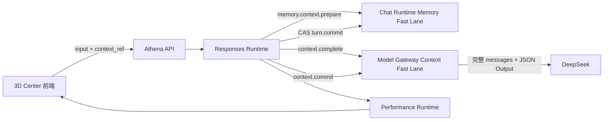

# Athena 3D Center Incremental Responses Context v1

状态：Implemented Draft  
协议版本：`1.0`  
入口：`POST /api/3d-center/sessions/:sessionId/responses`

## 1. 目标与边界

该协议把 3D Center 的客户端输入缩减为当前用户输入、幂等键和上一轮 `context_ref`。Chat Runtime 仍是 Session Memory 的唯一持久化权威；Model Gateway 只维护可丢弃的 15 分钟进程内热槽。Cursor 是普通 JSON 引用，不签名、不加密，也不携带权限。Session、Workspace、Thread 和 User 的归属仍由服务端认证上下文校验。

DeepSeek Chat Completions 是无状态调用。Gateway 热槽命中不会让 Provider 变为有状态：Gateway 必须在进程内按固定顺序重建合法完整消息，再通过相同前缀获得 Provider 缓存收益。模型输出仍是一次完整、强制 `json_object` 的 Character v2 结果，本版本不解析半成品 JSON。

## 2. 权威与数据流

固定 Provider 前缀顺序为：角色协议与 JSON Schema、Active Checkpoint、Checkpoint 后 User/Assistant 语言、`previous_state/transition/current_state`、当前用户输入。Memory Point 内部固定使用 `dialogue_memory` 在前、`performance_state_memory` 在后。

## 3. Cursor

`context_ref` 包含 `cursor_id`、Memory/State/Checkpoint 三种 revision、最后提交 Turn ordinal 和 `expires_at`。成功提交 Turn 时 Memory 与 State revision 递增并轮换 Cursor；Checkpoint CAS 切换时 Checkpoint revision 递增并轮换 Cursor。

Cursor 字段必须出现在新入口请求中，值允许为 `null`。未知、陈旧、过期或 Checkpoint 已推进的 Cursor 不返回冲突；Runtime 从 Memory Point 重建并继续同一轮，响应使用 `resynced` 与明确 warning 保留证据。Cursor 不参与授权。

## 4. 热槽

Model Gateway 私网 Fast Lane 默认监听 `3118`，只接受普通 HTTP JSON：

- `context.install`
- `context.complete`
- `context.commit`
- `context.status`
- `context.invalidate`

热槽采用进程内 LRU，默认 16 个槽、总计 192 MiB、单槽 32 MiB、闲置 TTL 15 分钟。模板以 SHA-256 digest 共享，Session 槽保存模板引用和动态 Memory。槽缺失时 Responses Runtime 在调用 Provider 前安装完整 Memory Point 后只重试 Gateway 查槽；模型只调用一次。

## 5. 提交与失败

Responses、Performance Plan 和候选 Memory Commit 先持久化；随后 Chat Runtime 对 ordinal、Memory revision 和 State revision 执行 CAS。提交成功才签发下一个 Cursor，并尽力推进 Gateway 热槽。Gateway 更新失败不回滚持久记忆，下一轮从 Memory 重建。

Memory Commit 失败时已生成帧可以展示，但 Turn 进入 `memory_pending`，`current_ref` 仍为上一份已提交引用。下一轮必须先幂等重放该 Commit，仍失败则返回 503，不调用模型。

同一 Session 的生成锁沿用 Character Conversation 的 `currentTurnId` 条件更新；并发请求返回 409。相同幂等键返回已保存 Response、Frame 关联证据和原 Cursor，不再次调用模型。

## 6. 兼容性

旧 `/turns` 入口保留，并由服务端采用最新权威 Cursor 调用同一流程。Character Responses v2、Frame v1、Performance Plan 和 WebSocket wire format 均未改变；新增 Context 证据只位于 3D Center Response 外层。

机器契约见 `docs/schemas/athena-3d-center-incremental-responses-v1.schema.json`。

## 7. Provider 依据

- DeepSeek 多轮请求必须由调用方持续携带历史消息：[Multi-round Conversation](https://api-docs.deepseek.com/guides/multi_round_chat/)
- 相同完整前缀可自动复用缓存，并通过 `prompt_cache_hit_tokens` 与 `prompt_cache_miss_tokens` 观测：[Context Caching](https://api-docs.deepseek.com/guides/kv_cache/)
- Character Planner 使用 `response_format={"type":"json_object"}`，固定协议中包含 json 字样、完整 Schema 与格式样例：[JSON Output](https://api-docs.deepseek.com/guides/json_mode/)
