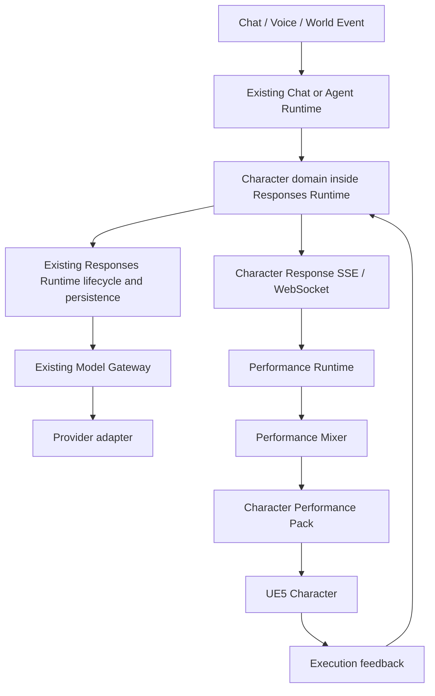
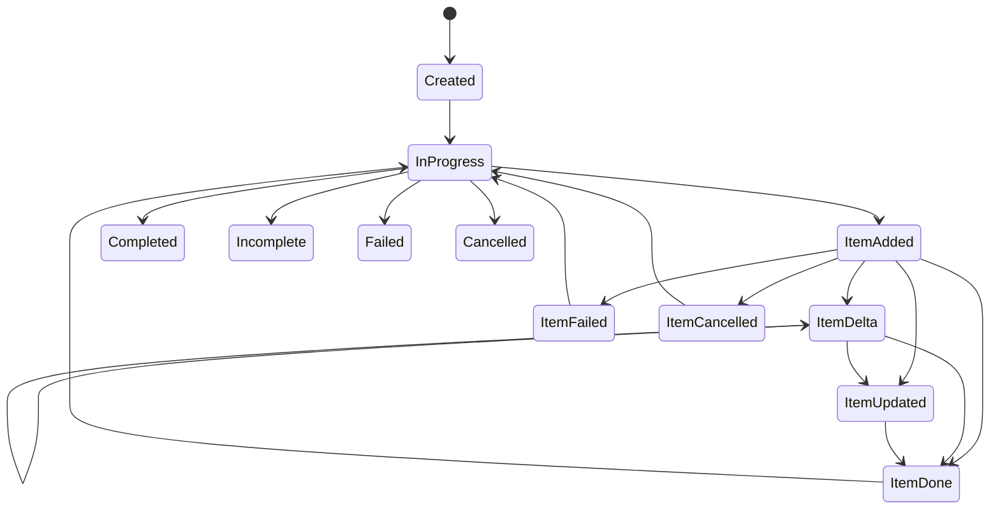

# Athena Character Responses API v1

状态：Phase 0 已定稿，供内部实现与评审使用  
协议简称：Character Responses  
协议版本：`1.0`  
Schema：`docs/schemas/athena-character-responses-v1.schema.json`  
Capability Manifest Schema：`docs/schemas/athena-character-capability-manifest-v1.schema.json`

## 1. Problem Statement

Athena 当前 Chat 与 Agent 主链路最终以文本、工具调用和通用 Responses item 为主要输出。未来的 3D Character 需要在说话的同时表达神态、眼神、手势、姿态和世界动作，并且必须允许这些表现先于完整语言到达。

直接让模型输出 UE5 Animation Montage、骨骼、Morph Target、Control Rig 或供应商 TTS 参数，会把模型、角色资产和运行时实现永久耦合，并使第三方 Character/Performance Pack 无法安全演进。因此需要一个稳定的 Athena 语义协议：模型只表达角色“要表现什么”，Performance Runtime 决定“如何表演”。

Character Responses 不是 OpenAI Responses 的兼容实现。它只参考 typed output、生命周期和 typed SSE 的组织方式；OpenAI 官方文档同样要求流消费方按 event `type` 分支处理，但 Athena 在其上定义完全独立的 Character 对象、item 和状态机：<https://developers.openai.com/api/docs/guides/migrate-to-responses#7-update-streaming-consumers>。

## 2. Goals

- 在一个 Response 内统一表达 Performance Intent、Expression、Gaze、Gesture、Posture、Action 和 Speech。
- 让原子表现 item 可以在完整语言之前完成和执行。
- 用一个跨 Face、Voice、Body、Gaze 的 Performance Intent 保持情绪一致性。
- 保持 Provider、Character Asset、Performance Pack、TTS 和 UE5 实现可替换。
- 通过 Character Capability Manifest 限制模型只能使用当前角色真实支持的能力。
- 从第一天支持命名空间、版本、fallback 和第三方扩展。
- 明确生成生命周期、播放执行生命周期、取消和抢占的差异。
- 复用现有 Responses Runtime、Model Gateway、Conversation、Memory 和 Tool Runtime。

## 3. Non-goals

v1 不实现：

- UE5 项目、MetaHuman 或具体动画资产。
- Performance Pack 的 Montage/Control Rig 映射。
- 具体 Cloud/Local TTS 或 Viseme 供应商。
- 本地 Realtime Reaction Model。
- Persistent Character State 数据库。
- MOD Marketplace、完整 Sandbox Runtime、Story Runtime 或 Multiplayer。
- 对外公开开发者 API 的鉴权、配额或长期兼容承诺。
- 对现有 Chat SSE、Agent WebSocket 或通用 Responses wire format 的替换。

## 4. Core Concepts

### 4.1 Agent、Character 与 Character Instance

- Agent 是长期认知主体，拥有 Personality、Relationship 和 Memory。
- Character 是视觉/表现能力配置，不等于 Agent 身份。
- Character Instance 是某个世界会话中的具体身体实例，可被销毁和重建。

### 4.2 Character Response

`character.response` 是一次角色语义输出。它可以由 Main Agent、Realtime Reaction 或高优先级事件触发，但不包含具体动画实现。

### 4.3 Performance Intent

每个 `completed` 或 `incomplete` Response 的第一个 output item 必须是 `performance_intent`。它是该 Response 的统一情绪真源；其他 item 通过 `intent_id` 引用它。

### 4.4 Capability Manifest

Manifest 是服务端验证过、按版本和 digest 固定的能力集合。模型提示和结构化输出约束从 Manifest 编译，客户端声明不能扩大服务端允许的能力。

### 4.5 Generation 与 Execution

- Generation lifecycle：语义 item 是否已经生成、校验和定稿。
- Execution lifecycle：Performance Runtime/UE5 是否已经开始、完成、失败或取消实际表演。
- `output_item.done` 不代表动画播放完成。

## 5. Architecture



### 5.1 当前代码落点

Phase 1 的纯协议代码位于：

```text
server/utils/responsesRuntime/character/
├── contract.js
├── validator.js
├── manifestResolver.js
├── streamReducer.js
└── index.js
```

未来 HTTP/SSE adapter 由 `server/responses-runtime.js` 托管。Character domain 不直接实例化 Provider，不写 Chat/Agent 数据表，不复制 Conversation 或 Model Gateway。

### 5.2 未来内部路由

| Method | Route | Purpose |
| --- | --- | --- |
| POST | `/internal/v1/character/responses` | 非流式创建 |
| POST | `/internal/v1/character/responses/stream` | SSE 创建与流式返回 |
| GET | `/internal/v1/character/responses/:responseId` | 按 scope 查询 |
| POST | `/internal/v1/character/responses/:responseId/cancel` | 幂等取消 |
| GET | `/internal/v1/characters/:characterId/capabilities` | 获取服务端固定 Manifest |
| WS | `/internal/v1/character/sessions/:sessionId` | 双向事件、恢复和执行反馈 |

这些路由未在 Phase 0 注册，不影响现有运行时。

## 6. API Request Schema

### 6.1 Top-level

```json
{
  "protocol_version": "1.0",
  "character": {
    "character_id": "athena.default",
    "instance_id": "char_inst_01",
    "capability_manifest": {
      "id": "athena.default",
      "version": "1.0.0",
      "sha256": "..."
    }
  },
  "conversation": {
    "id": "ath_conv_01",
    "previous_response_id": null
  },
  "input": [],
  "context": {},
  "generation": {
    "mode": "main_agent",
    "channels": ["performance", "speech", "action"],
    "latency_class": "interactive"
  },
  "metadata": {}
}
```

稳定请求不接受 `provider`、API key、任意 tool definition 或 UE5 参数。Provider/Model 由现有策略层选择；客户端最多引用服务端授权的 `tool_profile`。

### 6.2 Input items

#### `user_message`

支持 `input_text` 与受控 `input_audio_ref`。音频必须先进入 Athena 授权的对象/媒体层，不能在协议中内嵌任意供应商 URL 或凭据。

#### `world_event`

包含 namespaced event name、发生时间、actor、target 和受限 data。目标必须是 World Registry 中可解析的 entity reference。

#### `interaction_prediction`

用于几十至几百毫秒的预测性交互，包含 interaction、body region、confidence 和 ETA。它是预测信号，不是事实事件；长期 Memory 不得直接采信。

### 6.3 Scope

`workspaceId`、`threadId`、`userId`、调用者身份和权限不属于客户端稳定 payload，由 Athena API/内部 RPC 从认证主体注入。查询、取消和恢复必须使用与创建时相同的 scope。

## 7. API Response Schema

```json
{
  "id": "chr_resp_01",
  "object": "character.response",
  "protocol_version": "1.0",
  "status": "completed",
  "character": {},
  "conversation": {},
  "capability_manifest": {},
  "output": [],
  "warnings": [],
  "usage": {},
  "error": null
}
```

Response status：`queued`、`in_progress`、`completed`、`incomplete`、`failed`、`cancelled`。

`output_text` 不属于 Character Responses。兼容 Chat 的 adapter 可以从所有 `speech` item 派生文本投影，但不得把文本投影反向作为 Character contract 的真源。

## 8. Output Item Types

### 8.1 Common envelope

```json
{
  "id": "gaze_01",
  "type": "gaze",
  "status": "completed",
  "intent_id": "perf_01",
  "required": false,
  "timing": {
    "start": "immediate",
    "after_item_id": null,
    "offset_ms": 0,
    "duration_hint_ms": 800
  },
  "interruptibility": "blend_out"
}
```

`timing` 只表达相对语义时序，不提供骨骼帧、绝对 UE clock 或供应商音频时间轴。

### 8.2 `performance_intent`

包含 affect、source、channel modulation、transition、persistence 和 revision。它不能拥有 `intent_id`。

### 8.3 `expression`

包含 namespaced expression capability 与 intensity。面部区域和 Morph Target 由 Performance Pack 决定。

### 8.4 `gaze`

包含 entity/semantic target、gaze style、intensity 和 tracking。`away`、`none` 等抽象目标不绑定世界坐标。

### 8.5 `gesture`

包含 gesture capability、intensity、handedness 和可选 target。handedness 是语义偏好，Runtime 可因资产或占用情况改用另一侧。

### 8.6 `posture`

包含 posture capability 与语义 transition。

### 8.7 `action`

包含 action capability、受验证 target 和 Manifest 参数 Schema 允许的 arguments。`required=true` 的动作无法解析时使 item 失败；optional 动作可被忽略并产生 warning。

### 8.8 `speech`

包含 text、language 和 delivery：emotion、emotion source、intensity、rate、volume、voice style、pause before/after。`emotion_source` 在 v1 固定为 `performance_intent`。

### 8.9 `extension`

只用于核心协议尚未定义的新 channel/item。扩展 action、gesture 等仍使用核心 item type 加 namespaced capability，避免为每个 MOD 发明新 discriminator。

## 9. Streaming Event Protocol

### 9.1 Common envelope

```json
{
  "type": "character.response.output_item.delta",
  "event_id": "chr_evt_07",
  "sequence_number": 7,
  "created_at": 1786406400000,
  "response_id": "chr_resp_01",
  "output_index": 2,
  "item_id": "speech_01",
  "revision": 3,
  "delta": {
    "kind": "speech_text_append",
    "text": "你怎么现在才告诉我？"
  }
}
```

### 9.2 Event types

- `character.response.created`
- `character.response.in_progress`
- `character.response.output_item.added`
- `character.response.output_item.delta`
- `character.response.output_item.updated`
- `character.response.output_item.done`
- `character.response.output_item.failed`
- `character.response.output_item.cancelled`
- `character.response.completed`
- `character.response.incomplete`
- `character.response.failed`
- `character.response.cancelled`
- `character.error`
- `character.stream.ping`

### 9.3 State machine



规则：

- Response 内 `sequence_number` 从 0 严格连续递增。
- 同一 `event_id`、同一 sequence 的重放是幂等；同 ID 不同 sequence 是冲突。
- `output_index`、`item_id`、item type 创建后不可改变。
- item revision 必须递增；terminal item 不能再接收 delta/update。
- Response 终止前所有已创建 item 必须 terminal。
- 多个 item 允许交错；原子 gaze/expression 可先 done，speech 后续 append。
- `updated` 是完整 item 替换；`delta` 是固定 kind 的增量，不接受通用 JSON Patch。

### 9.4 SSE

SSE frame 使用：

```text
id: 7
event: character.response.output_item.delta
data: { ...event JSON... }
```

客户端通过 `Last-Event-ID` 恢复。服务端按已持久化 `sequence_number` 重放，不重新生成语义 item。

### 9.5 WebSocket

WebSocket 传输与 SSE 使用完全相同的 server event JSON。客户端恢复消息携带 `response_id` 和 `after_sequence`。未来 create/cancel/input append 是 client event，不改变 server event contract。

### 9.6 Execution feedback

实际播放反馈使用独立对象：

- `character.execution.started`
- `character.execution.completed`
- `character.execution.failed`
- `character.execution.cancelled`

反馈必须携带 response ID、item ID、Character Instance、Runtime name/version 和发生时间。它不修改已经完成的生成结果，只更新执行状态与可观测性。

## 10. Error Model

统一错误字段：

```json
{
  "type": "capability_error",
  "code": "required_capability_unavailable",
  "message": "Required capability is unavailable.",
  "param": "output[2].action",
  "retryable": false,
  "details": {}
}
```

错误类型：invalid request、capability、permission、state conflict、provider、runtime、safety。对外错误不得包含 Provider 原始响应、系统 prompt、API key、私有工具参数或 MOD 沙箱内部状态。

有安全部分输出时可以 `incomplete`；无法形成安全输出时 `failed`。

## 11. Cancellation and Interruption

v1 cancel scope 固定为 `generation_and_playback`：停止 Provider stream，逐项取消未终止 item，并通知 Performance Runtime blend out，最终发 `character.response.cancelled`。

用户插话、Story Event 抢占和 Character Instance 销毁使用 cancellation reason `interrupted`。未来 `playback_only` 只影响 execution lifecycle，不改变已完成的 Character Response。

对 terminal Response 重复取消返回当前快照，保持幂等。

## 12. Character Capability Manifest

Canonical capability ID：

```text
<namespace>:<kind>/<name>
athena.core:action/sit
com.example.xianxia:action/meditate
```

Manifest 声明：

- 独立 SemVer、Character ID、minimum runtime version 和 digest。
- capabilities、parameters JSON Schema、channels、resource claims。
- available、fallback、safety class、interruptibility。
- Performance Pack references，但不包含动画映射。
- permissions 默认 deny、请求权限和永不暴露的数据域。
- integrity、签名算法、签名和 publisher key ID。

### 12.1 Namespace 和碰撞

- `athena.*` 仅供 Athena 官方发布者。
- 第三方 namespace 与签名发布者身份绑定。
- Manifest 内 capability namespace 必须与 Manifest namespace 相同。
- 同一 Manifest 不允许重复 capability ID。
- 安装时 registry 以 namespace + manifest ID + version + digest 为唯一键；同版本不同 digest 拒绝覆盖。

### 12.2 Fallback

解析顺序：直接支持 → capability fallback → Manifest fallback map。最大深度 4，检测循环。

- unknown optional：忽略并 warning。
- unknown required：item failed。
- Runtime 向客户端发送 resolved capability，并在 `resolution` 保留 requested/resolved/depth 供审计。

## 13. Performance Intent

Performance Intent 是统一情绪真源：

```json
{
  "affect": {
    "primary": "athena.core:emotion/shy",
    "secondary": null,
    "intensity": 0.55,
    "valence": 0.35,
    "arousal": 0.42
  }
}
```

有意的跨 channel 差异只能写入 `channel_modulation.face/voice/body/gaze`。例如悲伤但礼貌微笑属于显式 face modulation，不允许 Speech、Expression 各自偷偷输出不同 emotion。

Validator 要求 `speech.delivery.emotion` 与 primary intent 一致；intentional difference 由 voice modulation 表达并由 Runtime 解析成最终 delivery。

## 14. Performance Runtime Boundary

```text
Character Responses semantic items
        ↓
Manifest validation and resolution
        ↓
Performance Mixer
        ↓
Character Performance Pack
        ↓
UE5 animation / face / gaze / voice implementation
```

Performance Runtime 可以选择 variant、处理 IK、碰撞、资产缺失、blend 和 reduced motion，但不能改变角色说话的文字或偷偷提升动作权限。

Performance Mixer 的优先级固定为：

```text
Base Idle < Local Reaction < Main Agent < High Priority Event
```

优先级按 channel/resource claim 生效，不允许一个只需要 gaze 的事件抢占全身和语音。

## 15. Provider Adapter

Character domain 不直接调用 OpenAI、DeepSeek 或本地模型。它把 Character contract 编译为现有 Responses Runtime 可执行的结构化约束：

1. 优先使用 Provider 原生 structured output/item stream。
2. 否则使用 Athena 管理的 `emit_character_response` typed tool。
3. 仍不支持时使用受限 JSON parser + 一次 bounded repair。
4. 输出必须经过 Character Schema、Manifest 和 coherence validation。
5. required semantic item 无法恢复时 fail closed；不得把未校验 JSON 发送给 UE5。

Provider adapter 可声明 `early_semantic_items` 能力。没有该能力时协议仍正确，但不能承诺 100–300ms 的神态首包。

## 16. Realtime Reaction Future Architecture

Realtime Reaction 输入仅包括短期 Character Context、World Event、距离/注视/接触预测和当前 channel leases。它输出相同 Character Responses item，但 `performance_intent.source=local_reaction`。

Realtime Model 不拥有工具调用、长期推理或 Memory 写权限。Main Agent 的高层语义仍可覆盖 Local Reaction，除非 High Priority Event 明确抢占。

## 17. Persistent Character State Future Architecture

未来 `Character State` 至少包含：Mood、Attention、Gaze、Posture、Activity、Current Performance、Current Action、Environment Awareness 和 Relationship Context reference。

State 使用 `id + revision`，输入只传 reference。未来 state patch 必须带 expected revision，冲突时重新读取，不采用 last-write-wins 覆盖正在执行的高优先级 lease。

Mood/relationship 可以长期存在；Gaze/current performance 等是短期执行状态，不能全部写进长期 Memory。

## 18. Memory Boundary

- Realtime Reaction 禁止直接写长期 Memory。
- Raw World/Interaction Event 可以进入受限 episodic event log。
- 高级 Cognition 层判断重要性并通过专用 consolidation capability 写长期 Memory。
- 重复事件应凝练为趋势或关系变化，不保存为十条同质流水。
- Character Context 是 Memory 的受限投影，不包含完整用户私有记录。
- Character Responses 不改变现有会话 capsule、RAG 或 prompt/context 排序。

## 19. Voice and TTS Future Architecture

Speech item 是 TTS 的供应商中立输入。未来 TTS Runtime 输出独立的 audio stream、phoneme/viseme timing 和 execution feedback。

```text
speech item + resolved Performance Intent
        ↓
replaceable Streaming TTS provider
        ↓
audio + phoneme/viseme timeline
        ↓
UE5 lip sync
```

Character Responses 不包含 voice provider 名称、SSML 方言、供应商 voice ID 或底层音频 buffer。打断先终止 execution，再通知 TTS provider 取消。

## 20. MOD Architecture

未来包类型：Character、Performance、Animation、Voice、World、Story。

官方内容原则上使用与第三方相同的 Package/Manifest/Capability 基础协议。质量差异来自资产与 Performance Pack 深度，而不是私有协议特权。

MOD 默认 deny：Athena Core、User Memory、Files、Browser、Finance、API Keys、Private Tools。权限申请必须独立于 capability registration，经用户/管理员授权后由 Sandbox Broker 发放短期 capability token。

## 21. UE5 Integration Boundary

UE5 Bridge 负责：

- Character/World entity ID 映射。
- SSE/WS event 传输和断线恢复。
- 本地时钟与服务端相对 timing 对齐。
- 向 Performance Runtime 提交 resolved semantic items。
- 回传 execution lifecycle。

UE5 Bridge 不负责模型选择、Memory consolidation、工具授权或 capability fallback 决策。

## 22. Security and Permissions

- 内部 HTTP/RPC 继续使用 Athena service identity、mTLS 和 caller capability。
- 未来外部 WebSocket 使用一次性 realtime ticket，不在 query 中长期携带主会话凭据。
- Manifest reference 由服务端 registry 固定，客户端不能上传 Manifest 来扩大权限。
- action target 必须在当前 World Registry 存在且调用主体有权交互。
- privileged action 需要独立 policy/approval，模型输出不等于授权。
- 所有 extension payload 受大小、深度和 Schema 限制。
- Operations 只记录低基数状态、延迟、fallback 和错误代码，不记录 speech、Memory 或世界私有内容。
- 原始 UE5/Provider/TTS 实现字段由 validator fail closed。

## 23. Versioning

- 路由 major version：`/v1/`。
- payload `protocol_version`：`1.0`。
- Capability Manifest、每个 capability 和 Performance Pack 使用独立 SemVer。
- Manifest reference 必须包含 exact version + SHA-256。
- v1 minor 版本只允许新增 optional 字段、event 或 capability kind；不得改变已存在字段语义。
- 客户端遇到未知 optional event 可忽略并保留 sequence；未知 required item 使 Response incomplete/failed。
- 新的核心 item discriminator 或状态转换需要协议 major version。

## 24. Backward Compatibility

- 现有 Chat SSE、Agent WebSocket、Responses Runtime event 和数据库保持原样。
- Character domain 是 opt-in 内部入口，不对当前模型调用自动切流。
- Chat compatibility adapter 只能从 Character Response 投影 speech text；普通 Chat Response 不伪装成 Character Response。
- Character persistence 未来可复用 response/item/event 表，但必须用独立 object/type 和 contract validator，不能改变旧记录解释。
- 当前 provider/model 选择策略、Conversation State Capsule 和 Memory 注入顺序不变。

## 25. MVP Scope

v1 推荐核心词表：

- Emotion：neutral、happy、amused、sad、angry、surprised、confused、concerned、embarrassed、serious、shy。
- Gaze target：player、entity/object、away、none；style：direct、brief_glance、avoid、follow。
- Gesture：nod、shake_head、head_tilt、shrug、arms_crossed、small_wave、point、thinking、look_away。
- Action：sit、stand、walk_to、turn_to、stop。
- Speech：text、language、emotion、intensity、rate、volume、style、pause。

MVP 的成功标准是 contract、streaming、Manifest 和边界正确，不以动作数量为目标。

## 26. Future Roadmap

1. Phase 0：RFC、Schema、十组 fixtures、纯 validator/resolver/reducer。
2. Phase 1：在 Responses Runtime 内加入 Character execution adapter、持久化和 mock provider。
3. Phase 2：真实 SSE、WebSocket resume 和 Mock Character Client。
4. Phase 3：UE5 Bridge 与 execution feedback。
5. Phase 4：Performance Runtime、Performance Pack、Mixer 和 channel lease。
6. Phase 5：Local Realtime Reaction Model，实测 100–300ms 首个原子表现。
7. Phase 6：Persistent Character State、revision 和 lease conflict。
8. Phase 7：Streaming TTS、audio/phoneme/viseme 和 interruption。
9. Phase 8：Character/Performance MOD SDK、签名和 Sandbox。
10. Phase 9：Story/AI Drama Runtime。
11. Phase 10：Social/Multiplayer authority、时钟和状态同步。

## 27. Field Ownership Summary

| Data | Owner | Character client may write? |
| --- | --- | --- |
| User/world input | Athena API / UE5 Bridge after auth | Limited typed input |
| Provider/model | Existing model policy | No |
| Performance Intent | Character model/runtime | No direct override |
| Capability Manifest | Signed server registry | No |
| Performance implementation | Performance Pack/Runtime | No model access |
| Long-term Memory | High-level cognition | No |
| Execution feedback | Performance Runtime/UE5 | Yes, typed feedback only |
| Private tools/data | Athena permission layer | No default access |

## 28. Five Primary Risks

1. Provider structured streaming differences may delay early semantic items.
2. A revised early intent may cause a visible expression snap.
3. Main Agent, Reaction, Story and Idle may contend for the same channel.
4. Manifest, MOD and Performance Pack versions may drift or form fallback cycles.
5. Clients may confuse generation done, execution done, cancellation and playback interruption.

Mitigations are respectively: adapter capability negotiation; revisions plus blend policy; channel/resource leases; exact version/digest plus depth/cycle checks; separate event families and state machines.

## 29. What Is Fixed vs Extensible

Fixed in v1：wire naming、ID prefixes、status、event ordering、Performance Intent ownership、capability ID grammar、Manifest digest、generation/execution separation、security boundary。

Intentionally extensible：emotion/action/gesture vocabulary、Provider、model policy、Performance Pack、TTS、new input/output item、Character State、transport、Viseme 和 multiplayer authority。

## 30. Verification and Implementation Order

1. 使用 Draft 2020-12 校验两个 Schema。
2. 十组 fixtures 必须全部通过，并覆盖 request、response、event stream、Manifest 和 MOD。
3. 纯 validator 必须拒绝非法版本、区间、情绪冲突和低层实现字段。
4. Manifest resolver 必须覆盖成功、optional ignore、required reject、fallback depth 和 cycle。
5. Stream reducer 必须覆盖 gaze-before-speech、interleaving、revision、replay、gap、terminal ordering 和 delta-after-done。
6. 保持现有 Responses Runtime、Chat、Agent 测试通过。
7. 只有以上 contract 测试稳定后，才注册 mock route；真实 Provider 与 UE5 接入排在其后。

验证命令：

```bash
python3 scripts/validate-character-responses-contract.py
npx jest --runInBand --runTestsByPath server/__tests__/utils/characterResponsesContract.test.js
```
