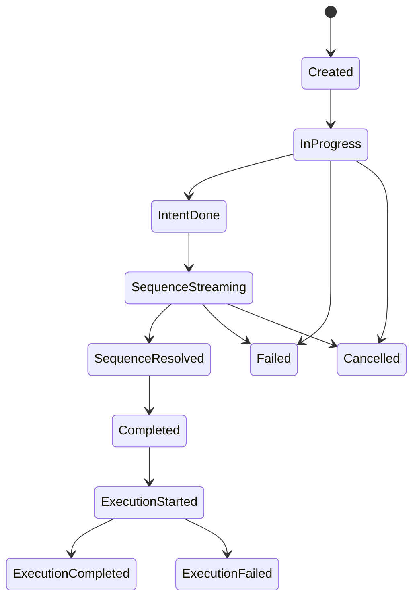

# Athena Character Responses API v2：五官与四肢多轨表演协议

状态：内部实现版，v1 保持兼容  
协议简称：Character Responses v2  
协议版本：`2.0`  
Response Schema：`docs/schemas/athena-character-responses-v2.schema.json`  
Manifest Schema：`docs/schemas/athena-character-capability-manifest-v2.schema.json`

## 1. 目标

v2 把角色回复表达为一个统一毫秒时钟上的多轨表演。语言、五官、注视、头身、四肢与世界动作都是语义 cue；模型决定它们是否出现、何时开始、持续多久以及是否并行，Runtime 只负责验证、能力解析、时间校正和执行反馈。

v2 不复制任何 Provider 的 wire format，也不允许模型输出 Morph Target、骨骼角度、Control Rig、Montage、UE5 或 TTS 供应商参数。具体资产继续由 Performance Pack 解析。

## 2. v1 兼容边界

- v1 路由、Schema、fixtures 和 item 语义保持原样。
- v2 使用 `/internal/v2/character/...` 与 `protocol_version="2.0"`。
- v2 Response 固定且仅包含 `performance_intent`、`performance_sequence` 两个 output item。
- Chat SSE、Agent WebSocket、Conversation、Memory、Model Gateway 与 Provider 选择策略不改变。

## 3. 非目标

本阶段不接入真实 UE5、角色资产、Morph、骨骼、TTS、Viseme、本地 Reaction Model、公开 MOD SDK 或多人 authority。Mock Performance Client 只证明 planned、resolved、actual 三套时间证据不会混淆。

## 4. 内部 API

| Method | Route                                                 | Purpose                       |
| ------ | ----------------------------------------------------- | ----------------------------- |
| POST   | `/internal/v2/character/responses`                    | 创建完整 Response             |
| POST   | `/internal/v2/character/responses/stream`             | 以 typed SSE 返回同一语义结果 |
| GET    | `/internal/v2/character/responses/:responseId`        | 查询 Response、解析和执行证据 |
| POST   | `/internal/v2/character/responses/:responseId/cancel` | 幂等取消                      |
| GET    | `/internal/v2/characters/:characterId/capabilities`   | 返回服务端固定 Manifest       |
| WS     | `/internal/v2/character/sessions/:sessionId`          | 事件恢复和执行回传通道        |

稳定请求没有 `provider`。`athena.cold_tsundere.expressive.v2` 在服务端绑定 Flash；客户端不能选择模型、提交 API key 或扩张 capability。Character v2 的所有模型生成必须由服务端强制启用 DeepSeek JSON Output；`response_format` 属于 Provider Adapter 配置，不能由 Character 客户端覆盖。

## 5. Request

```json
{
  "protocol_version": "2.0",
  "character": {
    "character_id": "athena.test.cold_tsundere",
    "instance_id": "char_inst_01",
    "capability_manifest": {
      "id": "athena.cold_tsundere.expressive",
      "version": "2.0.0",
      "sha256": "<server-pinned-digest>"
    }
  },
  "conversation": {
    "id": "ath_conv_01",
    "previous_response_id": null
  },
  "input": [
    {
      "id": "input_01",
      "type": "user_message",
      "content": [{ "type": "input_text", "text": "我爱你。" }]
    }
  ],
  "generation": {
    "mode": "main_agent",
    "channels": ["performance", "face", "gaze", "body", "action", "speech"],
    "latency_class": "interactive",
    "performance_profile": "athena.cold_tsundere.expressive.v2"
  }
}
```

workspace、user、thread、调用者权限和 tool scope 必须由认证上下文注入，不接受客户端自报所有权。

## 6. Response 不变量

```json
{
  "id": "chr_resp_01",
  "object": "character.response",
  "protocol_version": "2.0",
  "status": "completed",
  "output": [
    { "type": "performance_intent" },
    { "type": "performance_sequence" }
  ]
}
```

第一项是 Face、Voice、Body、Gaze 共用的情绪真源。第二项引用第一项的 `id`。Speech delivery 的 emotion 必须与 intent 主情绪一致；系统拒绝冲突，不替模型改写。

## 7. 表演阶段

Sequence 序列化四个连续阶段：`reaction`、`orientation`、`delivery`、`recovery`。阶段必须按此顺序声明并完整覆盖 `planned_duration_ms`，用于说明 cue 所处的叙事区间。

阶段名不是轨道优先级，也不规定语言必须位于 delivery。模型可以让 Speech 在 reaction 开始，让 Face 与 Speech 同时发生，或者先说话再改变注视。`phase_id` 是模型对 cue 叙事作用的语义标注，不约束 cue 的毫秒起止；时间合法性只看完整 Sequence 边界和排他资源 claim。这避免为了阶段边界机械切断或挪动一句语言、一个表情或一个持续动作。

## 8. 轨道与模型时间权威

十三轨固定按下列顺序序列化：

1. `face`
2. `gaze`
3. `head_neck`
4. `shoulders`
5. `torso`
6. `left_arm`
7. `right_arm`
8. `left_hand`
9. `right_hand`
10. `left_leg`
11. `right_leg`
12. `action`
13. `speech`

该数组顺序只保证 Schema、Reducer 和客户端有稳定索引，绝不表示执行先后。跨轨 cue 可以同起、同止或任意交叠；语言、神态、动作可以处在同一时间区块。

模型独立决定：

- 每个 cue 的 `planned_start_ms` 与 `planned_duration_ms`；
- 语言、五官、注视、身体和动作的先后或并行关系；
- 头身、四肢、手部与 Action 是否需要变化；
- 是否用 `deliberate_stillness` 表达刻意僵住。

Sequence 的 `interruptibility`、`revision` 和 `deliberate_stillness` 是可选辅助字段。interruptibility 省略时执行层继承 Performance Intent；其余字段缺失不改变轨道与 cue 事实。若模型显式给出，仍须通过受控类型。这不是系统补写模型表演，而是明确的继承语义。

Validator 不以“丰富度”为理由补写、挪动或强制增加肢体动作。未使用轨道必须是 `enabled=false, cues=[]`。Face 维持完整 baseline，Speech 至少有一个 cue；高冷傲娇 Profile 仍要求细致面部变化，但允许全身保持不动。

### 8.1 Presentation 时间区块框架

所有 Runtime 新生成的 Character v2 Response 必须包含顶层 `presentation`。Provider 原始 content 本身是经过 DeepSeek JSON Output 约束并由 Adapter 严格解析的 JSON；`presentation` 则由 Athena 对该模型 JSON 做确定性索引编译，不生成或修改表演语义。

结构固定为：

```text
character.response
└── presentation
    ├── clock / module_order / conflict_policy
    ├── planned
    │   └── time_blocks[]
    │       └── modules.{face,gaze,...,speech}
    └── resolved
        └── time_blocks[]
            └── modules.{face,gaze,...,speech}
```

每个时间区块提供 `start_ms`、`end_ms`、`duration_ms`、`phase_ids` 以及完整十三模块。每个模块固定包含：

- `state=idle|active`；
- `entering`：本区块开始时应启动的 cue；
- `active`：整个区块内保持生效的 cue；
- `exiting`：本区块结束时完成的 cue。

模块使用 `cue_id` 和 JSON Pointer `cue_ref` 引用 `output[1].tracks` 中的完整模型参数，避免复制台词、五官 state、target 和 action arguments。实时客户端按时间块调度，只有在需要具体表现参数时解引用 cue。`planned` 永远保留模型计划；`resolved` 排除 `first_wins` 抑制项并使用 Runtime 校正后的时长。旧 v2 fixtures 可以没有该 additive 字段，但所有新 Runtime Response 必须生成它。

## 9. Cue 公共字段

每个 cue 包含 `cue_id`、`phase_id`、`planned_start_ms`、`planned_duration_ms`、`easing`、`intensity`、`amplitude` 与 `required`。单 cue 时长为 40–360000ms，Sequence 最长 600000ms。

不同轨道允许 cue 同起、同止或任意时间重叠，因而语言、眉眼、头部、手部和 Action 可以处于同一时间块。同一排他资源不能真实执行两个状态：同一 Gaze 轨不能同时注视两个目标，同一 Speech 轨不能同时说两段话，同一肢体或 Action 轨不能同时执行两个语义 cue；Face 不同区域可以并行，但同一 `region + side` 不能同时处于两个状态。

模型仍应避免排他资源冲突。若合法 JSON 中确实出现冲突，协议采用保守的 `first_wins` 降级：按 `planned_start_ms` 和数组顺序保留第一个 cue，后来的冲突 cue 保留在原始 planned Sequence 中但不进入 resolved/execution cues。Response 继续 completed，并在 `warnings` 与 `character.performance.sequence.resolved.suppressed_cues` 中记录 `cue_id`、`kept_cue_id`、track、resource 和 policy。系统不移动、截短或删除模型原始计划；动画交叉淡化由 Runtime 根据第一个 cue 的 easing 处理。

## 10. 五官状态

Face baseline 必须覆盖 `brow`、`eyelid`、`eye_shape`、`pupil`、`cheek`、`nose`、`lip`、`jaw`。baseline 是持续神态，不代表发生了动作；Face cue 只列变化区域。

```json
{
  "region": "brow",
  "side": "left",
  "state": "athena.core:face_brow/single_raise",
  "intensity": 0.42
}
```

`side` 是 `left | right | both | center`。state 的 capability kind 必须与 region 一致。Profile 使用高细节密度、低动作幅度，丰富来自眉眼、眼睑、瞳孔、脸颊、鼻部、嘴唇和下颌的细微节奏，不来自夸张强度。

## 11. 身体与动作

身体轨只输出语义 motion：头颈、肩部、躯干、左右手臂、左右手和左右腿。手部只允许语义手型，不输出逐指骨骼。Action 只引用服务端 Manifest 中的 capability、语义 target 和受参数 Schema 约束的 arguments。

身体或 Action 是否出现由模型判断。`enabled=false` 是合法、有意义的规划结果，不是缺失数据。

## 12. Speech

Speech cue 包含完整文本、语言和 delivery。`delivery.emotion_source` 固定为 `performance_intent`。Speech 可以与任意轨并行，也可以出现在 reaction、orientation、delivery 或 recovery，只要模型的叙事判断合理且时间合法。

## 13. Planned、Resolved 与 Actual

- `planned_*`：模型原始计划，永久保留。
- `resolved_*`：Manifest Resolver 根据能力资产允许时长得到的执行计划。
- `actual_*`：Performance Client 实际开始与持续时间。

Runtime 不能静默覆盖 planned 值。每次校正产生 `character.performance.sequence.resolved` 和 warning。执行事件属于独立生命周期，`output_item.done` 不代表动作已经播放完成。

## 14. Streaming

SSE 与 WebSocket 使用同一 typed envelope，并在一个 Response 内严格递增 `sequence_number`。核心 sequence 事件为：

- `character.performance.sequence.phase.added|done`
- `character.performance.sequence.track.added`
- `character.performance.sequence.cue.added|updated|done`
- `character.performance.sequence.speech_text.append`
- `character.performance.sequence.resolved`

SSE 使用 `id: <sequence_number>`；WS 使用 `after_sequence` 恢复。Reducer 忽略已处理的重复序号，终止事件后拒绝新事件。当前 Adapter 在完整结构化结果完成后规范化为这些事件；真正 Provider 增量到达前，不承诺“早期 Face 已实际先到”。

## 15. Capability Manifest

Capability ID 使用 `<namespace>:<kind>/<name>`。Manifest 规定允许轨道/侧别、资源 claim、参数 Schema、时长范围、可混合性、interruptibility、最小 runtime 版本与 fallback。

Manifest digest 是对去掉 `integrity.sha256` 后的 canonical JSON 计算 SHA-256。请求引用、Response 引用和服务端 Manifest 必须一致；Resolver 在解析 cue 前再次验证 digest。fallback 最大四层并检测循环；required 无法解析时失败，optional 产生 warning。

## 16. Flash 结构化生成边界

`FlashCharacterV2Adapter` 通过现有 Model Gateway 调用服务端绑定的 DeepSeek Flash Profile。该调用固定走 DeepSeek Chat Completions JSON Output，并强制传递 `response_format={"type":"json_object"}`；不得回退为普通文本、原生 Responses 消息或 function call。Prompt 必须明确包含 `json`、完整 Planner JSON Schema 和一个合法 JSON 格式样例，同时声明样例只说明字段形状，模型不得照抄其中的情绪、动作、轨道开关、台词或时间。`max_tokens` 固定为 32768，以降低大型十三轨 JSON 被中途截断的风险。

JSON Output 只保证 JSON 语法，不代表符合 Athena Schema。Adapter 必须先验证 effective protocol 为 `chat_completions_json`，再执行严格 `JSON.parse`、Character Schema、领域 Validator 和 Manifest Resolver。空 content、非对象顶层、非法字段、capability、cue 排序错误或时间越界均直接失败；排他资源重叠不使 Response 失败，而由 Resolver 使用 `first_wins` 产生可审计降级 warning。系统不得提取代码围栏、补闭合括号、重排 cue、修改时间或发起隐藏重试。

模型输出中的 `performance_sequence.tracks` 使用十三个轨名键控对象，避免数组中重复或漏轨。编译器只按固定顺序把模型原值序列化成稳定 API 的 tracks 数组并添加 `name`；系统只添加 Response/Intent/Sequence ID、状态、引用和使用量，不补写或修正模型的五官、动作、台词与计划时间。

若模型结果未通过 Schema、纯 Validator、Manifest 或 capability 检查，本次结果直接失败；五场景实测不得重试挑选。

## 17. 危险场景

疑似临终、自伤或严重危险输入必须切换 `source=high_priority_event`，安全 Speech 在 300ms 内开始并明确要求急救与身边可信任的人介入。安全规则只约束必须及时提供的语言，不强制模型同时制造 Gaze、头身、四肢或 Action；这些仍由模型按现场语义自主判断。

## 18. 取消与错误

生成失败、协议校验失败、Manifest 不匹配和执行失败保持不同错误类别。错误不得包含 Provider 原文、私有 prompt、API key 或 MOD 沙箱信息。已终止 Response 的取消是幂等操作。当前内存实现只支持已登记 Response 的查询和幂等终止；持久化与真正 in-flight cancellation 属后续 Runtime 接线范围。

## 19. 状态机



Generation 与 Execution 是相互关联但独立的生命周期；客户端不能把二者压成一个 completed 标记。

## 20. 五场景验收

Flash 必须在不预写表演答案、不修复、不重试的条件下独立处理五个输入。每组检查：Schema、Validator、Manifest、四阶段、十三轨、时间边界、cue 排序、排他资源 first-wins 证据、完整五官 baseline、面部区域丰富度、统一 intent、模型自主动作选择及 Speech 内容。

第一场允许拒绝直接道歉。第五场必须进入 high-priority safety flow。人工报告必须按毫秒区块列出同时发生的语言、五官和动作，避免用轨道数组顺序误读播放顺序。

## 21. 风险与固定边界

主要风险是 Provider 结构化能力差异、早期 intent 修订导致跳变、跨来源通道争抢、Manifest/Pack 漂移以及生成/解析/执行生命周期混淆。

v2 固定 wire naming、两项 output、完整 Face baseline、轨道序列化顺序、模型计划时间权威、Manifest digest 与生命周期分离；能力词表、模型、Performance Pack、TTS、未来 transport、Viseme 与多人 authority 保持可扩展。

## 22. 实施顺序

1. Schema、fixtures、纯 Validator、Manifest Resolver、Timeline Reducer。
2. Flash 强制结构化 Adapter 与 Mock Performance Client。
3. Responses Runtime 的 HTTP/SSE/WS adapter 和恢复语义。
4. 通过正式迁移修复开发安全表并验证 Model Gateway readiness。
5. 由 Flash 独立执行五场景，保存原始 fixtures 与观察报告。
6. 保持 v1、Chat SSE、Agent WS 和 Responses Runtime 回归通过后，才进入 UE5/Performance Runtime 集成。
