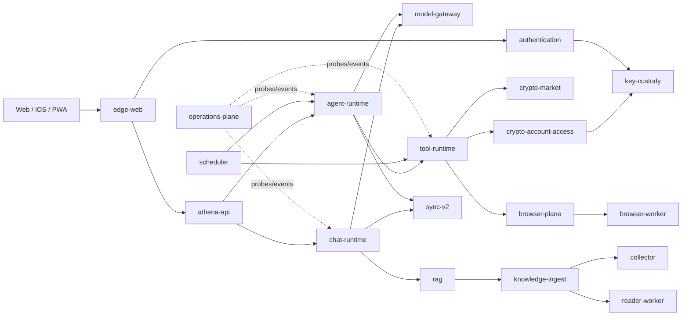

# Athena 微模块 MCP 化运维能力审计与 AICP Phase 0–1 报告

日期：2026-08-01  
范围：当前工作区代码、模块清单、Operations、MCP/Tool/Plugin、五大统一中心、AICP 只读协议及真实影子观测  
结论口径：`事实`、`推断`、`未发现`、`待验证`严格分开

## 1. 执行摘要

**结论：Athena 适合改造成“内部 AICP + 标准 MCP Adapter”的微模块运维系统，不适合让所有内部调用直接改走标准 MCP。**

- **事实**：当前已有 22 个通过校验的 `ModuleManifest v1`，39 个 RPC 提供契约、39 个 RPC 消费契约、30 类发布事件、30 类订阅事件、17 个独占数据 Schema、64 条声明路由，模块依赖图未发现环。
- **事实**：Operations 已从 Manifest 动态建立服务目录，并能叠加模块探针、基础设施探针、语义事件和 Agent 状态；但当前 `stateGraph` 只把 `dependsOn` 变成边，没有把 RPC、Event、Route、Data、Key Domain 和 allowed caller 变成一等 Link。
- **事实**：外部 MCP 已有 Hypervisor、Tool 转换、能力策略、短期凭据、混合签名和持久 nonce 防重；它是外部工具运行边界，不是内部模块总线。
- **事实**：任务、数据、缓存、恢复和乐观加载已有不同成熟度的统一入口，但其中只有任务调度和数据访问具备较强服务端权威性；缓存、恢复和乐观状态仍主要在前端进程内。
- **本轮落地**：新增 AICP Envelope、只读 Capability Registry、确定性 Describe/SelfTest、8 类 Link 投影、Runtime Topology、5 份 JSON Schema、MCP 只读适配器，以及旁路的 Semantic Event 和内部 RPC 影子观测。Operations 已可查询实际 Event/Link/Trace，但没有开放任何 AICP 控制能力。
- **严格评分**：当前综合成熟度为 **75/100**。适合立即推进 Phase 1 试点，不适合立即开放通用 Debug/Control 或全系统协议强制切换。

## 2. 当前架构事实清单

### 2.1 已注册模块

`agent-runtime`、`athena-api`、`authentication`、`background-worker`、`browser-plane`、`browser-worker`、`chat-runtime`、`collector`、`crypto-account-access`、`crypto-forecast`、`crypto-market`、`edge-web`、`key-custody`、`knowledge-ingest`、`model-gateway`、`operations-plane`、`operations-shadow-agents`、`rag`、`reader-worker`、`scheduler`、`sync-v2`、`tool-runtime`。

证据：`server/module-manifests/*.json`；加载与完整性校验位于 `server/utils/modulePlatform/manifestRegistry.js::validateManifest/loadManifests`。

### 2.2 真实边界

| 领域                | 当前主边界                                                                   | 判断                                              |
| ------------------- | ---------------------------------------------------------------------------- | ------------------------------------------------- |
| Chat                | `server/utils/chats/*`、`server/chat-runtime.js`、`chat-runtime` Manifest    | 边界较清晰，仍保留兼容 API                        |
| Agent               | `server/utils/agents/*`、`server/agent-runtime.js`、`agent-runtime` Manifest | 已有持久 ledger、工具批准和超时                   |
| Knowledge/RAG       | `knowledge-ingest`、`rag`、`collector`、`reader-worker`                      | 已形成多模块链路                                  |
| Search              | RAG、SearchModels、公开工具内部能力                                          | **未发现**独立 Search Manifest                    |
| Communication       | `sync-v2`、Realtime Gateway、Chat SSE、Agent WS                              | 能力存在，但边界分散                              |
| Quant               | Crypto Forecast、Gold Analysis、候选信号等                                   | **未发现**独立 Quant Manifest；不能宣称是独立模块 |
| Crypto              | Market、Account、Forecast 三个 Manifest                                      | 边界最清晰，适合试点                              |
| Browser             | Plane + Worker 两个 Manifest                                                 | 控制面/执行面已分离                               |
| Files               | Collector、Reader、Knowledge、文件安全工具                                   | 能力分散，未形成单一 Files 模块                   |
| Security/Auth       | Authentication + Key Custody +安全工具集                                     | 边界强，风险高，不宜首批改造                      |
| Operations          | Operations Plane + Shadow Agents                                             | 具备事件、图、探针和控制编排                      |
| Plugin/MCP          | MCP Hypervisor、Compatibility Layer、Plugin Security                         | 外部扩展边界明确                                  |
| Workflow/Task       | Agent Flows、Scheduler、Background Workers                                   | 多种任务模型并存但职责可解释                      |
| Cache/State         | ServerStateCache + 多个领域缓存                                              | 缓存治理尚未服务端统一                            |
| Recovery/Optimistic | 前端 RecoveryCenter/OptimisticActionCenter + 服务端领域恢复                  | 有统一入口，但跨进程恢复仍分散                    |

### 2.3 当前硬性契约

- Manifest 校验：ID、版本、类型、关键性、依赖、路由、RPC、事件、数据、SPIFFE 服务身份、允许调用者、故障策略、探针与 drain。
- Principal Assertion：最长 60 秒、audience 绑定、请求哈希、nonce，支持经典签名与 ML-DSA-65 混合签名。证据：`server/utils/modulePlatform/principalAssertion.js`。
- Event Envelope：64 KiB 上限、payload hash、敏感字段拒绝。证据：`server/utils/modulePlatform/eventEnvelope.js`。
- 内部服务：分布式拓扑下要求 mTLS，并按 Manifest `allowedCallers` 验证 SPIFFE 调用者。证据：`server/utils/microModules/serviceHost.js::internalPeerAuthorized`。
- Tool capability：目标服务、工具、参数哈希、Manifest 哈希、TTL 和 nonce 绑定；nonce 可持久原子消费。证据：`server/utils/plugins/capabilityBroker.js::issueInvocationCredential/authorizeInvocation`。

## 3. 当前模块与依赖图

**事实**：Operations 的服务目录来自 `loadManifests()`，见 `server/utils/operations/serviceCatalog.js::serviceCatalog`。节点状态优先叠加模块健康、Sync 状态、基础设施健康和语义事件，见 `server/utils/operations/stateGraph.js::buildStateGraph`。  
**限制**：现有边只来自 `dependsOn` 和 Agent `runs_on`；运行调用链尚未成为 Link。

## 4. 五大统一中心现状

| 中心     | 权威实现与调用链                                                                                                                          | 成熟度 | 主要限制                                                                         |
| -------- | ----------------------------------------------------------------------------------------------------------------------------------------- | ------ | -------------------------------------------------------------------------------- |
| 任务调度 | 前端 `TaskScheduler.schedule → lane/resource budget → flush`；服务端 `SchedulerRuntime → BackgroundService → scheduled job/run`           | 3.5/5  | 前端任务在内存；交互任务、持久任务和 Agent run 还没有统一 lineage                |
| 数据调度 | `DataAccessCenter → repository facade → policy/instrumentation`；Sync 使用 `transaction/outbox → claim lease → lane dispatch → retry/DLQ` | 3.5/5  | **未发现**独立通用 Data Scheduling Center；DataAccess 是访问治理，不等同任务调度 |
| 缓存调度 | `ServerStateCache.refresh/ensure → TaskScheduler`，含 TTL、SWR、dedupe、revision 和 scope；Crypto/Knowledge 另有缓存                      | 2.5/5  | 主要是前端内存；跨设备、服务端缓存预算、统一失效图不足                           |
| 错误恢复 | `RecoveryCenter.handle → classify → retry/rollback/toast`；服务端另有 Outbox、Operations lease reconciliation、Agent/Chat 恢复            | 3/5    | 跨模块恢复策略没有统一注册，前端恢复状态不可持久回放                             |
| 乐观加载 | `OptimisticActionCenter.run → cache patch → TaskScheduler → RecoveryCenter → confirm/rollback`                                            | 3/5    | 使用范围有限；跨标签/跨设备确认依赖业务广播，未进入统一运行拓扑                  |

### 4.1 保留原则

五个中心应继续作为核心，不应由 AICP 替换。AICP 只增加统一 `moduleId/linkId/correlationId/taskId/cacheKeyHash/actionId` 上下文和 Describe/Inspect 投影。

## 5. MCP、Tool、Plugin、Skill 现状

### 5.1 MCP

- `MCPHypervisor` 管理 stdio、SSE、Streamable HTTP MCP Client，支持启动、重载、停止、连接超时和进程排空。
- `MCPCompatibilityLayer.convertServerToolsToPlugins` 用 `listTools()` 将外部 MCP Tool 转换为 AIbitat function。
- 远程 URL、重定向、环境变量、Secret 引用、容器隔离和网络域由 `plugins/securityPolicy.js` 约束。
- **限制**：Tool handler 虽创建 `AbortController`，当前 `callTool()` 调用未显示把 signal 传入远程传输；上层超时可能结束 Agent 等待，但不能据此证明底层远程调用已经取消。

### 5.2 Tool

- 内置工具由 AIbitat 注册并受统一执行超时保护。
- `tool-runtime/broker.js` 当前是信任域 Broker，重点路由 Crypto Account 和 Browser；不是所有工具的通用 RPC 总线。
- 私有 Crypto 调用先读取持久 approval context，再签发混合签名 capability，然后经 mTLS 内部服务调用。

### 5.3 Plugin

- Capability Manifest 定义 tools、networkDomains、filesystem、secrets、isolation、cost、accountPrivateRead。
- Capability credential 绑定 audience、tool、argsHash、capabilityHash、TTL 和 nonce。

### 5.4 Skill

- Skill 是 Agent 选择和装配层，不是运行服务注册层。
- 默认 Skill、配置 Skill、导入 Skill、MCP Tool 已存在多套注册入口；它们服务不同抽象层，不能简单合并为一个表。

### 5.5 结论

采用 **AICP Registry 为内部模块权威源，Tool/Skill/MCP 通过 Adapter 读取投影**。不得让外部 MCP 配置文件成为内部模块事实源。

## 6. 当前日志、指标、事件和 Trace 现状

- 结构化语义事件：`server/utils/observability/semanticEvents.js`，支持 sink、敏感级别、关联字段。
- HTTP 关联：`middleware/communicationMetrics.js` 与 `observability/context.js` 维护 operation/request/trace/span。
- Trace：OpenTelemetry Node SDK，可通过 OTLP 输出。
- Metrics：Prometheus registry 覆盖 HTTP、Golden Journey、数据库、Operations、NATS、Sync Outbox、Tool、Plugin 决策等。
- Operations Store：ClickHouse 保存脱敏语义事件；NATS JetStream 支持消费、ACK、lag、redelivery 和 DLQ。
- 模块探针：`ModuleHealthMonitor` 校验 moduleId、version、manifest fingerprint 和 readiness。
- **缺口**：Link 级 latency/error/queue/last-success 没有统一模型；Trace 存在，但没有稳定 `linkId`；缓存与乐观状态没有进入服务端 Operations 权威投影。

## 7. 改造可行性评分

| 维度              |    权重 |              得分 | 说明                                              |
| ----------------- | ------: | ----------------: | ------------------------------------------------- |
| 模块边界清晰度    |       8 |               7.5 | 22 个清单；Quant/Search/Files 等仍未完全显式化    |
| 接口稳定性        |       6 |                 5 | RPC/事件/路由已声明，输入输出 Schema 不完整       |
| 依赖解耦程度      |       7 |                 5 | 无声明依赖环，但仍有兼容单体和跨域内部导入        |
| 统一通信能力      |       7 |                 5 | mTLS HTTP、NATS、SSE/WS 已有，尚无统一调用语义    |
| 结构化日志能力    |       6 |               4.5 | 语义事件较强，普通模块日志仍不完全结构化          |
| Metrics 能力      |       6 |                 5 | 基础完善，Link/Cache/Recovery 指标需补齐          |
| Tracing 能力      |       6 |                 4 | OTEL 已接入，跨异步链稳定 linkId/causation 仍不足 |
| 事件体系          |       7 |                 5 | Envelope、NATS、Outbox 可用，8 个订阅无清单发布者 |
| 任务调度能力      |       7 |                 5 | 前后端均有调度，缺少统一 lineage                  |
| 数据调度能力      |       6 |                 4 | DataAccess/Outbox 成熟，但不是完整数据任务编排    |
| 缓存治理能力      |       5 |               2.5 | 前端中心较好，服务端缓存仍分散                    |
| 错误恢复能力      |       6 |                 4 | 多种恢复已存在，尚未统一声明和回放                |
| 状态一致性        |       6 |                 4 | Outbox/幂等/版本检查可用，部分 UI 状态仅内存      |
| MCP/Tool 复用能力 |       5 |               3.5 | 外部 MCP/Plugin 强，内部模块尚无适配协议          |
| AI 运维接入能力   |       6 |                 5 | Operations/Shadow Agent/动作编排已存在            |
| 渐进迁移能力      |       6 |               5.5 | Manifest、兼容 API、独立运行角色适合旁路迁移      |
| **总计**          | **100** | **74.5，取整 75** | 适合渐进改造，不适合一次性切换                    |

## 8. 可直接复用能力

1. `ModuleManifest v1` 与 fingerprint。
2. `PrincipalAssertion v1`、mTLS SPIFFE allowed callers。
3. Event Envelope、Semantic Event、OTEL correlation。
4. Operations Service Catalog、State Graph、Module/Infrastructure Health Monitor。
5. NATS JetStream、Sync Outbox、lease/retry/DLQ。
6. Operations Action 的 propose → preflight → approval → canary → execute → validate → rollback。
7. Plugin Capability Broker 的 audience/args/manifest/TTL/nonce 绑定。
8. 前端 TaskScheduler、ServerStateCache、RecoveryCenter、OptimisticActionCenter。
9. MicroModuleServiceHost 的 live/ready/drain/inflight 生命周期。

## 9. 必须补齐的基础能力

1. Module Manifest 的输入、输出、配置、feature flag、debug entry、self-test 声明。
2. RPC/Event/Route/Data/Key/Caller 的一等 Link 与稳定 linkId。
3. Link 运行观测：latency、error rate、queue depth、last success/failure、trace refs。
4. Describe/Health/Inspect 的运行提供器及心跳。
5. 8 个未解析事件发布契约：`background.requested`、`sync.client.*`、`crypto.connection.*`、`model.artifact.*`、`deployment.slot.*`、`model.configuration.*`、`operations.semantic.*`、`reader.requested`。
6. Task/Data/Cache/Recovery/Optimistic 的统一 lineage 字段，不改变各中心决策权。
7. AICP Principal Assertion 的实际验证 Adapter；当前 Phase 0 Registry 会拒绝未由调用方确认的 principal。
8. JSON Schema 的运行时编译校验器；本轮保留现有风格的手写 fail-closed 校验和可审查 Schema。
9. Runtime topology 历史快照与 diff/replay 存储。

## 10. 不建议采用的设计

- 不让所有进程内函数都序列化后走网络。
- 不把每个 capability 做成独立容器。
- 不把标准 MCP 当作数据库、事件总线或内部身份协议。
- 不让大模型生成基础健康事实、模块版本或拓扑边。
- 不把原始日志、Prompt、余额、交易、Root、DEK、凭据写入 NATS/ClickHouse/AICP。
- 不创建第六套任务调度器或第二个权限审批系统。
- 不在 Phase 0/1 开放通用 restart、clear-cache 或 shell Debug。
- 不先改 Authentication、Key Custody、Chat 主链路；它们风险和爆炸半径过高。

## 11. AICP 协议草案

本轮实现：`server/utils/modulePlatform/aicp/*`。

### 11.1 调用类型

| 类型     | 推荐进程内                | 推荐跨进程                          |
| -------- | ------------------------- | ----------------------------------- |
| Call     | 直接 Adapter              | mTLS HTTPS；极高吞吐时再评估 gRPC   |
| Task     | 本地 executor             | NATS JetStream + 持久 checkpoint    |
| Event    | 本地 EventEmitter Adapter | NATS JetStream + Outbox             |
| Stream   | AsyncIterator             | SSE/WS；服务间可用 NATS consumer    |
| Query    | 只读函数                  | mTLS HTTPS                          |
| Command  | 本地受控 Adapter          | Operations Action Orchestrator      |
| SelfTest | 无副作用函数              | mTLS HTTPS                          |
| Describe | 确定性函数                | mTLS HTTPS / MCP Adapter            |
| Debug    | 临时采样器                | 授权后的 mTLS 流，禁止公共 MCP 直连 |

### 11.2 Phase 0 能力

- `module.describe`：Describe，scope `module:describe`。
- `module.self-test`：SelfTest，scope `module:self-test`。
- `topology.query`：Query，scope `topology:read`。

所有 Phase 0 capability 都是只读；Registry 不暴露 Command/Debug。

## 12. Module Manifest Schema

Schema：`server/utils/modulePlatform/aicp/schemas/module-manifest.schema.json`。  
权威运行校验：`manifestRegistry.validateManifest`。  
Phase 1 应 expand/contract 增加 `description/domain/inputs/outputs/configuration/featureFlags/healthChecks/debugEntries`，不直接破坏现有 1.0 清单。

## 13. Describe Schema

Schema：`server/utils/modulePlatform/aicp/schemas/module-describe.schema.json`。  
生成器：`aicp/describe.js::moduleDescription`。

Describe 由 Manifest + 白名单动态字段 + 规则模板组成：

- 静态：ID、版本、owner、能力、RPC、事件、路由、数据、密钥域、生命周期。
- 动态：只接受 status、ready、startedAt、inflight、lastErrorCode、检查时间和数值 counters。
- 规则摘要：由 ready/status/failureMode 生成，不调用 LLM。
- 未提供运行快照时明确写“registered; live readiness not supplied”，不伪造 healthy。

## 14. Health Schema

Schema：`server/utils/modulePlatform/aicp/schemas/module-health.schema.json`。  
当前可直接适配 `ModuleHealthMonitor.snapshot()` 和各服务 `/ready`。

规则：

- health 不等于 process alive；必须同时表达 live、ready、contract/version/fingerprint。
- unknown、unmonitored、degraded 不得折叠为 healthy。
- security service `fail-closed`，非关键 worker 可 `isolated-degraded`。

## 15. Edge/Link Schema

Schema：`server/utils/modulePlatform/aicp/schemas/module-link.schema.json`。  
实现：`aicp/links.js::buildDeclaredLinks/applyLinkObservations/buildRuntimeTopology`。

本轮从 Manifest 确定性生成 8 类 Link：

1. dependency
2. rpc
3. event
4. route
5. data
6. object-store
7. key-domain
8. allowed-caller

静态声明与运行观测分开。无观测时状态为 `declared`，不得写成 healthy。

## 16. 统一 Envelope Schema

Schema：`server/utils/modulePlatform/aicp/schemas/aicp-envelope.schema.json`。  
实现：`aicp/envelope.js::createAicpEnvelope/validateAicpEnvelope`。

字段包括：protocol/schema version、message/envelope ID、correlation、causation、operation、trace、source、target、capability、operation type、timestamp、deadline、priority、idempotency key、auth context、data classification、flags、payload、result、error、telemetry、payload/result hash。

安全约束：

- 128 KiB payload + result 上限。
- Task/Command 必须提供 idempotency key。
- Command/Debug 必须提供 approval ID。
- password/secret/token/private key/Root/DEK/账户余额/持仓/交易内容等字段 fail-closed。
- MCP Adapter 必须提供真实授权回调；仅在 Envelope 中声明 scope 不构成授权。

## 17. 深度观测流方案

### 17.1 分层

- L0 Registry：存在、版本、能力。
- L1 Describe：确定性摘要与健康。
- L2 Inspect：聚合 Metrics、近期事件、任务、依赖。
- L3 Debug：临时、限时、采样的日志/Trace/队列/缓存元数据。
- L4 Control：只能经 Operations Action。

### 17.2 L3 开启条件

`incident/correlationId + target module/link + TTL + sample rate + field allowlist + approver + purpose`。到期自动关闭；输出只含 metadata 和 evidence reference，不含原始敏感业务数据。

## 18. Runtime Topology 方案

### 18.1 当前可生成

- Manifest 节点、依赖、RPC、事件、路由、Schema、对象前缀、密钥域和调用者策略。
- Module Health、Infrastructure Health、Agent Registry、Sync 状态、语义事件。

### 18.2 Phase 0 静态投影

`yarn check:aicp` 结果：22 模块、73 总节点、357 Link、8 条未解析事件 Link、0 重复 Link。  
Phase 0 的 `observedLinks=0` 是静态基线，不能把声明边当作实际调用。

### 18.3 Phase 1 真实影子观测

- Operations Plane 消费到的既有 Semantic Event 会投影为真实 Event Link，并通过已有 `traceId/operationId/eventId` 形成 Trace 证据。
- `requestInternalService/requestInternalStream` 在不读取请求体和响应体的前提下记录真实 RPC Link、耗时、状态码和安全错误码。
- 成功 RPC 默认确定性采样 10%，失败 RPC 100%观测；可通过 `ATHENA_AICP_SHADOW_SAMPLE_RATE` 调整。观测失败被吞掉，不改变业务返回。
- Operations 新增管理员只读查询：`/api/operations/aicp/topology`、`/api/operations/aicp/traces/:traceId`；分布式模式通过原有 mTLS Operations Access 代理。
- 实时窗口有界保存 5,000 个事件 ID、1,000 条 Trace、每条 Trace 100 个条目；Operations 持久时间线可按 `traceId` 回读，进程重启后仍能恢复元数据证据。
- `yarn check:aicp-shadow` 真实启动内部 HTTP 服务并完成一次调用，同时发送业务 Semantic Event：业务响应保持不变，同一 Trace 在 Operations 侧同时出现 RPC 与 Event，投影为 357 条声明 Link + 2 条运行 Link，其中 3 条 Link 获得实际证据。

### 18.4 后续运行图

在内部客户端、NATS publish/consume、Outbox、Tool Broker 和缓存/恢复中心统一附加 `linkId`；Operations 按时间窗聚合 Link 状态并存储 topology snapshot/diff。故障回放只读取快照、事件和 Trace 引用。

## 19. 五大统一中心适配方案

| 中心       | 新增上下文                                             | AICP 角色        | 保留权威决策              |
| ---------- | ------------------------------------------------------ | ---------------- | ------------------------- |
| Task       | moduleId、capability、taskId、parentTaskId、linkId     | Task/Describe    | TaskScheduler/Scheduler   |
| Data       | dataDomain、schemaOwner、operation、linkId             | Query/Event      | DataAccessCenter/Outbox   |
| Cache      | cacheNamespace、keyHash、ownerScope、revision          | Describe/Inspect | ServerStateCache/领域缓存 |
| Recovery   | failureId、classification、retryOf、rollbackOf、linkId | Event/Inspect    | RecoveryCenter/领域恢复器 |
| Optimistic | actionId、targetKeyHash、confirmEvent、rollbackReason  | Event/Describe   | OptimisticActionCenter    |

不得传输原始 cache key 中的敏感标识；使用稳定哈希与 owner scope。

## 20. 安全和权限边界

| 层级      | 默认主体                       | 约束                                   |
| --------- | ------------------------------ | -------------------------------------- |
| L0/L1     | 已认证 Operations、受限 Agent  | audience 绑定 assertion + read scope   |
| L2        | Admin/Operations Shadow Agent  | metadata-only，速率限制                |
| L3        | 受批准的人类管理员             | TTL、采样、字段白名单、审计            |
| L4 低风险 | 人类批准后的 Operations Action | dry-run、canary、validate、rollback    |
| L4 高风险 | 多人/高权限审批                | Key/Auth/Data destructive 操作默认拒绝 |

Key Custody、User Root、Envelope、格密码和混合签名保持现有边界。AICP 只传 assertion 引用和 scope，不传 JWT、私钥、Root、DEK 或 capability credential。

## 21. 性能影响

- 同进程：直接 Adapter，不做 JSON 往返；只在边界生成 metadata envelope。
- 跨进程同步：复用 mTLS HTTPS；不为当前规模引入 gRPC 复杂度。
- 异步：复用 NATS/Outbox，不建新 Module Bus。
- 流：复用 SSE/WS/NATS，客户端流与业务进程保持解耦。
- Describe/Health：缓存 fingerprint 对应静态部分，只刷新小型动态快照。
- Link telemetry：聚合后上报，禁止每个 token、缓存 hit 或 DB row 生成完整事件。
- 128 KiB envelope 上限，详细日志和制品只保存引用。

推断：按上述方式，进程内主链开销应接近一次上下文对象构造；跨进程开销主要仍由现有网络和业务 I/O 决定。真实 P95 需在 Phase 1 试点测量。

## 22. 渐进迁移路线

### Phase 0（本轮已完成代码级部分）

- 现状审计、AICP 草案、Envelope、Manifest/Describe/Health/Link Schema。
- 只读 Registry、Describe、SelfTest、静态 Topology、MCP Adapter。
- 未接公网、未接控制、未改变业务路径。

### Phase 1

- 试点 `crypto-market`。
- 注册真实 runtime provider、health、metrics、self-test、Operations adapter。
- 通过现有 Tool Runtime 暴露，不复制行情逻辑。

### Phase 2

- 接入 Browser → Knowledge Ingest → Reader/Embedding → RAG 链路。
- 打通 trace/correlation/link/task lineage 与错误恢复。

### Phase 3

- 五大中心增加统一上下文和 Describe/Inspect 投影。

### Phase 4

- AI Operations 只读巡检、拓扑 diff、按需 L3 深度观测。

### Phase 5

- 仅开放 self-test、retry、reconnect、无状态 worker restart、可丢弃缓存清理；全部复用 Operations Action 审批与回滚。

## 23. MVP 范围

MVP 只包含：

1. Crypto Market 的 Manifest 1.x 扩展。
2. `Describe/Health/SelfTest/Inspect`。
3. 一条真实 Link 的 latency/error/last-success。
4. Operations 展示节点 + Link。
5. Agent/标准 MCP 只读 Adapter。
6. 运行基准、故障注入和敏感数据扫描。

不包含：通用 Debug、通用 Control、Key Custody、Authentication、Chat 核心改写。

## 24. 风险清单

| 风险                   | 等级 | 控制                                                           |
| ---------------------- | ---- | -------------------------------------------------------------- |
| 把声明边误判成实际调用 | 高   | `declared` 与 `observed` 分离                                  |
| Envelope scope 被伪造  | 高   | 真实 Principal Assertion verifier 必须在 Adapter 外层完成      |
| 运维事件泄露私有数据   | 高   | 字段拒绝、hash/reference、扫描测试                             |
| 与现有调度中心竞争     | 高   | AICP 不拥有队列或 retry 决策                                   |
| 过度服务化             | 高   | 同进程 Adapter 默认，物理拆分按故障域决定                      |
| 事件量膨胀             | 中   | 聚合、采样、TTL、payload 上限                                  |
| 8 条事件契约未闭合     | 中   | Phase 1 前补 Manifest producer 或标注 external/system producer |
| MCP 远程取消不彻底     | 中   | 增加 AbortSignal 传播与 transport cancellation 证据            |
| 当前工作区并行修改冲突 | 中   | 本轮未改现有 Operations endpoint 和聊天文件                    |

## 25. 验收标准

- Manifest/AICP/边界审计 0 error。
- 所有 Describe 基础事实由代码确定生成。
- 未观测 Link 不得显示 healthy。
- AICP 未验证 principal 必须 401；scope 不足必须 403。
- Command/Debug 无 approval ID 必须拒绝。
- 敏感字段、超大 envelope、hash 篡改必须拒绝。
- Crypto Market 试点发布时 Chat/Auth/Agent 无重启。
- Link 观测 P95 开销不超过基线 1%，事件量有预算。
- Operations 可从异常 Link 下钻至关联事件/Trace，但看不到敏感结果。
- L4 只能经现有 Operations Action 的审批、canary、验证和回滚。

## 26. 建议修改的具体目录和文件

后续阶段建议修改：

- `server/module-manifests/crypto-market.json`：扩展输入输出、自检、调试入口。
- `server/utils/operations/stateGraph.js`：合并 AICP Link，不替换现有 nodes/depends_on。
- `server/utils/operations/moduleHealthMonitor.js`：接入 Describe/Health provider。
- `server/utils/microModules/internalClient.js`：生成/传递 linkId 和 AICP correlation metadata。
- `server/utils/broadcast/transports/natsJetStreamTransport.js`：附加 causation/link metadata。
- `server/utils/toolRuntime/broker.js`：消费 Registry 投影，不改变现有批准逻辑。
- 五大中心现有文件：只增加上下文和 snapshot，不改变调度策略。

## 27. 本轮新增的目录和文件

- `server/utils/modulePlatform/aicp/constants.js`
- `server/utils/modulePlatform/aicp/envelope.js`
- `server/utils/modulePlatform/aicp/describe.js`
- `server/utils/modulePlatform/aicp/links.js`
- `server/utils/modulePlatform/aicp/registry.js`
- `server/utils/modulePlatform/aicp/mcpAdapter.js`
- `server/utils/modulePlatform/aicp/schemas/*.json`
- `server/__tests__/utils/aicpProtocol.test.js`
- `scripts/audit-aicp-phase0.mjs`
- `package.json` 中 `check:aicp`

## 28. 推荐开发优先级

1. **P0**：补齐 8 条未解析事件的 producer 契约。
2. **已完成**：Semantic Event、内部 RPC 和 Crypto Account 事件已接入真实只读 Link/Trace 观测；Crypto Market runtime provider 仍待独立接入。
3. **P0**：把 Identity Principal Assertion verifier 接入 AICP transport adapter。
4. **P1**：Operations State Graph 增量展示 RPC/Event/Data Link。
5. **P1**：五大中心加入统一 lineage 字段。
6. **P1**：Topology snapshot/diff/replay。
7. **P2**：Browser → Knowledge 真实链路试点。
8. **P2**：受控 L3 深度观测。
9. **P3**：低风险 L4 自动化。

## 附录 A：十个最终判断

1. **是否适合改造？** 适合，已有 Manifest、独立运行角色、Operations、NATS、mTLS 和能力安全底座。
2. **标准 MCP 还是 AICP + MCP Adapter？** AICP + MCP Adapter。MCP 用于北向工具兼容，不作为内部总线。
3. **最佳试点？** `crypto-market`；公开只读、无账户 Secret、边界清楚、故障可隔离。
4. **最大阻碍？** 当前短窗口观测已经打通，但长期 topology snapshot/diff、业务 NATS consumer ACK Link 和剩余事件契约漂移尚未收口。
5. **五大中心是否保留？** 必须保留；AICP 只统一上下文和观测。
6. **是否需要 Capability Registry？** 需要，但应建立在现有 Manifest Registry 上，本轮只读原型已实现。
7. **是否需要独立 Module Bus？** 暂不需要。复用进程内 Adapter、mTLS HTTP、NATS JetStream 和 Outbox。
8. **能否自动生成实时 Runtime Topology？** 能。静态图和实时影子 Link 已可合并生成；长期历史图仍需 snapshot/diff 持久化。
9. **AI 运维能否按需下钻？** 能，现有 Operations/Trace/Action 足以承接，但需 L1-L3 标准接口和 TTL 深度观测。
10. **第一阶段最小交付？** Phase 0 契约与只读原型、Phase 1 Semantic Event/RPC/Trace 影子观测和 Operations 只读查询已经完成。

## 附录 B：本轮验证证据

- `yarn check:aicp`：成功；22 模块、5 Schema、357 Link、0 duplicate、0 hard finding。
- `yarn check:micro-modules`：成功；22 manifests、39 RPC contracts、20 public route owners、17 schema owners、0 error。
- `yarn check:modules`：成功；2585 files、8207 local imports、0 error、0 warning。
- Jest：`aicpProtocol`、`modulePlatform`、`operationsStateGraph` 共 3 suites / 18 tests 全部通过。
- Phase 1 定向回归：AICP Observer、真实内部 HTTP、Operations Plane、远程 Access 和管理员端点共 10 suites / 48 tests 全部通过。
- `yarn check:aicp-shadow`：成功；业务响应未改变，Operations 同时观测 RPC 与业务 Event，同一 Trace 可回查，359 条总 Link 中 2 条为运行时 Link、3 条带真实证据。
- ESLint：使用 `server` 锁定的 ESLint 9 校验 AICP 生产目录为 0 error；测试文件按仓库既有规则由 Jest 执行。

## 附录 C：尚未完成与待验证

- **未部署**：本轮已接入服务器运行路径，但尚未发布云端，也未修改 Operations UI。
- **待验证**：云端真实业务流量下的 P95 开销、10%采样预算、ClickHouse Trace 回读和故障注入。
- **待验证**：MCP SDK 是否能在当前版本完整传播 Tool AbortSignal；静态代码不足以证明。
- **待验证**：Topology 历史快照的 ClickHouse/PostgreSQL 存储成本。
- **未宣称**：本地影子验证通过不等于生产覆盖率 100%；未出现证据的声明 Link 仍保持 `declared`，不会被推断成健康或已调用。

## 附录 D：Phase 1 安全边界

- 只保留模块 ID、声明路由模式、事件类型、Trace/Operation/Event 引用、耗时、状态码和安全错误码。
- 不保存 URL 主机、查询参数、请求体、响应体、用户 ID、账户数据、余额、凭据、Root、DEK 或密文。
- 参数化内部路由使用 Manifest 模式，不将资源 ID 写入 Capability；本地通用 lifecycle 路径无法确定目标时拒绝猜测。
- 运行观测不会调用 `emitSemanticEvent` 形成递归；只有内部 Client 产生一次 `aicp.rpc.observed` 元数据事件，Operations Observer 只消费。
- 影子 Observer、远程 Operations Access 和公开管理员端点均为只读；控制调用仍必须经过原有 Operations Action 审批链。
