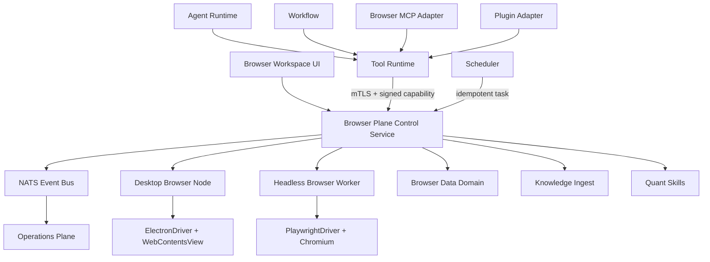

# Athena Browser Plane Upgrade Proposal

> 状态：MVP 本地候选已实现并通过定向验收；生产尚未切换，Agent Browser Tool 保持 Shadow。
>
> 调查基线：`codex/v2.5@fdd856475da4128942902ea93e8482082917a441`，2026-07-31。
>
> 机器可读清单：[`docs/research/athena-browser-plane-current-capabilities.json`](./research/athena-browser-plane-current-capabilities.json)。

## 2026-07-31 实施检查点

本文件最初记录的是实施前调查；其后的“当前能力调查”保留为历史基线。当前代码已经完成以下向前增量：

- 新增 `browser-plane` 和 `browser-worker` 两个独立 Manifest、运行时、Docker target、Compose service、mTLS 身份、readiness、drain、Prometheus target 与 Operations 元数据事件，独立模块拓扑由20个增加为22个。
- 新增 `athena.browser.result.v1`、统一动作合同、域名与SSRF防护、三级权限矩阵、页面语义高风险复检、Tool Invocation Ledger、幂等Browser Task和Agent九个高层工具；生产默认仍以 `ATHENA_BROWSER_AGENT_ENABLED=false` 保持Shadow。
- 云端Worker使用Playwright Chromium，限制1个活动会话、每用户1个会话和8个标签页；主机低于1GiB可用内存或768MiB容器剩余不足256MiB时拒绝新会话。两个闸门独立计算，避免容器上限小于主机门槛时永久误拒绝。短时单用WSS票据提供CDP画面流，控制帧、截图和DOM不进入NATS或Operations。
- 云端Profile使用独立DEK、AES-GCM和Key Custody封装后归档到Content Store；活动目录使用排他租约，检查点前删除浏览器缓存。下载先在Worker以0600权限短暂分段，再流式转换为加密Content Object，路径不进入公开结果。
- 桌面端锁定Electron 42.7.1，使用隔离持久partition与`WebContentsView`，继续启用sandbox、context isolation并禁用Node集成和`webview`。Browser Center已具备标签页、地址/搜索、历史、书签、页面查找、缩放、滚动、触摸映射、文字输入、截图、PDF和站点级Cookie/权限管理。
- `/browser` 已作为独立一级入口接入网页；网页和移动网页使用云端画面流，桌面端直接使用本机Chromium。登录态不会在桌面与云端之间静默迁移。
- 本地真实Chromium回归完成导航、正文读取、滚动、缩放、PDF、WSS画面与输入确认；完整用时约3.2秒。22/22模块拓扑、SQLite/PostgreSQL迁移与schema、前端生产构建和定向安全测试均已通过。
- 云端Worker使用独立`browser-worker-build`镜像，生产Compose必须显式提供`ATHENA_PROD_BROWSER_WORKER_IMAGE`；禁止回退到不含Chromium的通用后端镜像。容器以非root用户、`cap_drop: ALL`、Chromium sandbox及Playwright官方seccomp运行，不再授予`SYS_ADMIN`。

当前尚未宣称完成的边界：

- 本机没有Docker，因此尚未生成并运行最终Linux候选容器；生产切换必须在云端隔离构建、seccomp/Chromium sandbox和资源闸门通过后执行。
- macOS/Windows正式安装包、Developer ID公证、Windows代码签名以及跨平台视频E2E仍属于发布门禁。打包依赖已升级到`electron-builder 26.15.7`以清除critical项，但上游仍报告build-time high advisories，正式签名发布前必须重新审计或更换打包链。
- 桌面节点的人机浏览已可用；Agent控制桌面同一tab的持久任务派发、Workflow/MCP公开适配和WebRTC画面流仍保持Shadow/V2。当前Agent自动化只允许受治理的云端会话。
- Widevine/DRM、支付免审、Cookie值读写和任意Playwright/CDP访问不在本项目边界内。

### 2026-07-31 生产资源闸门结论

本轮没有把Browser Plane切换到生产。切换前只读检查显示云主机总内存约3.6GiB、可用内存约750MiB、Swap已使用约2.8GiB，根卷仅余约7.9GiB。该状态低于云端会话的1GiB主机可用内存硬门槛，也不足以安全构建并保留独立Chromium Worker镜像。现有20模块业务容器保持原样，未因Browser候选发生重建。

后续生产切换必须重新满足并记录以下条件：

1. 主机可用内存稳定高于1GiB，且Browser Worker的768MiB cgroup内至少保留256MiB余量。
2. 完成镜像构建、回滚镜像和临时层核算后仍保留不少于12GiB磁盘空间。
3. 在Linux容器中以非root、`cap_drop: ALL`、`no-new-privileges`、官方Playwright seccomp和Chromium sandbox完成真实导航、滚动、输入、截图与关闭检查。
4. 只有上述条件通过，才可应用PostgreSQL迁移、启动第21/22个模块并开放人工云端浏览；Agent能力继续保持Shadow。

## 实施前执行结论（历史基线）

Athena 已经通过桌面端 Electron 拥有 Chromium 内核，但还没有 Browser Plane。当前 Electron 只是一个受到严格限制的 Athena 应用外壳；Collector 的 Puppeteer 是一次性的网页内容抓取器；Agent 的 `web-browsing` 实际是搜索，`web-scraping` 实际是 URL 到文本的采集。现有代码不存在共享浏览器会话、标签页、浏览器工作区、下载管理、浏览器任务恢复或交互式 Agent 自动化。

推荐的长期形态不是把网页直接加载进现有 Athena 渲染器，也不是让 Agent 直接调用 Playwright，而是建设一个与 Knowledge、Quant、Operations 同级的逻辑 Browser Plane：

```text
Agent / Workflow / MCP / Plugin / User UI
                    |
                Tool Runtime
                    |
     signed capability + approval + mTLS
                    |
          Browser Plane control service
             /                    \
 Desktop Browser Node       Headless Browser Worker
 Electron WebContentsView       Playwright Chromium
 shared user session          isolated public session
```

Browser Plane 遵循当前 Athena 微模块合同：独立 Manifest、独立进程和生命周期、独立 readiness/drain、mTLS 工作负载身份、DataAccessCenter 边界、Scheduler 持久任务、Operations 元数据观测。桌面浏览器节点属于 Browser Plane 的设备执行端，负责持有本机 Electron 会话；服务端不能读取或复制用户 Cookie。

这一原则已经落实：两个Manifest与各自独立运行时、镜像目标、mTLS证书、健康探针和Operations注册同时提交，没有通过空Manifest虚增拓扑数字。

## 1. 当前 Browser 能力调查

| 能力 | 当前状态 | 位置 | 判断 |
|---|---|---|---|
| Chromium Browser Engine | 已有 | `desktop/package.json` | Electron 自带，可复用 |
| Browser Runtime | 缺失 | 无 | 当前只有应用壳生命周期 |
| BrowserWindow | 部分 | `desktop/main.cjs` | 仅一个 Athena 应用窗口 |
| WebContents | 部分 | `desktop/main.cjs` | 仅承载本地 Athena UI |
| WebContentsView | 缺失 | 无 | 推荐作为未来页签承载层 |
| BrowserView | 缺失 | 无 | Electron 上游已弃用，不应新增 |
| `<webview>` | 明确禁用 | `desktop/security-policy.cjs` | 保持禁用 |
| DevTools Manager | 缺失 | 无 | 不存在受策略管理的调试面 |
| Download Manager | 缺失 | 无 | 无队列、隔离目录或审计 |
| Cookie Manager | API 可用、未产品化 | Electron `session` | 无 Browser Profile 边界 |
| Session Manager | 缺失 | 无 | `defaultSession` 只做权限检查 |
| Storage Manager | 部分 | `desktop/runtime.cjs` | 仅应用数据目录，不是网页存储 |
| History Manager | 缺失 | 无 | 无持久历史模型 |
| Bookmark Manager | 缺失 | 无 | 无模型或 UI |
| Permission Manager | 部分 | `desktop/main.cjs` | 只允许可信 UI 的媒体、通知和剪贴板写入 |
| Cache Manager | 缺失 | 无 | 未提供按 Profile 清理和配额 |
| Browser Workspace | 缺失 | 无 | 无标签页恢复模型 |
| Browser Memory | 缺失 | 无 | 无任务上下文或知识关系模型 |

当前浏览器扩展是 Knowledge 导入桥：它获取页面正文或选中文本并上传到工作区。它没有导航、点击、输入、截图、下载、会话共享或 Agent 控制能力。现有长期 `brx-*` API Key 也不适合作为 Browser Plane 的设备身份，未来应迁移到 Athena Client Identity 加短期能力凭证。

## 2. 当前 Electron 能力调查

调查时 `desktop/package.json` 仍是Electron 35；实施后已经固定到Electron `42.7.1`，并通过桌面安全配置测试。Browser Plane使用`WebContentsView`，未引入已弃用的`BrowserView`或`webview`。正式发布仍以Electron官方最近三个稳定大版本支持策略为升级门禁。[Electron支持策略](https://www.electronjs.org/docs/latest/tutorial/electron-timelines)

当前安全边界是正确的，应保留：

- `contextIsolation: true`
- `nodeIntegration: false`
- `sandbox: true`
- `webSecurity: true`
- `allowRunningInsecureContent: false`
- `webviewTag: false`
- 非本地 Athena 地址禁止在当前窗口导航
- 外部 HTTPS 交给系统浏览器
- `will-attach-webview` 一律拒绝

它说明现有窗口是“受信任应用 UI”，不能直接改造成任意网页容器。Browser Plane 应在同一个 Electron Chromium 中创建隔离的 `WebContentsView`，但使用专用持久分区 `persist:athena-browser:<accountHash>:<profileId>`；Athena UI 继续使用原来的默认会话。Electron 已将 `BrowserView` 标记为弃用，并推荐 `WebContentsView`；`<webview>` 也被官方建议避免使用。[BrowserView 弃用说明](https://www.electronjs.org/docs/latest/api/browser-view)、[webview 官方建议](https://www.electronjs.org/docs/latest/api/webview-tag)

“Agent 与用户共享 Browser Session”应解释为两者操作同一 Browser Node、同一 Browser Profile 和同一标签页对象，而不是把任意网页和 Athena UI 混在同一 Session。Electron 的持久 `partition` 能让多个页面共享同一会话，同时保持与应用默认会话隔离。[Electron Session](https://www.electronjs.org/docs/latest/api/session)

## 3. 当前 Playwright 与自动化能力调查

### 3.1 已有能力

- Collector 使用 Puppeteer `21.5.2`：每次抓取启动临时浏览器，校验所有网络目的地，获取 HTML 后转 Markdown，随后关闭。
- `frontend/scripts/audit-runtime-client-storage.mjs` 与 `local-production-perf-check.mjs` 可选加载 Playwright，用于本地审计和性能测试。
- `.playwright-mcp` 是开发环境状态，不是 Athena 产品能力。
- 没有产品级 Selenium、WebDriver 或 CDP Adapter。

Collector 的 URL 安全检查、请求拦截、页面大小上限和 Chromium 沙箱自检值得复用到 Browser Provider Policy；其“一次调用一个临时浏览器”的模型不适合共享 Session、Workspace 或交互式任务。

### 3.2 Playwright 的正确定位

Playwright 适合作为首个标准 Driver，尤其适用于云端隔离 Worker、公开网页任务和自动化一致性测试。但官方把 Electron 自动化标记为实验能力；连接已有 Chromium 的 `connectOverCDP` 也被官方明确说明比 Playwright 原生协议低保真。因此不能把“通过 CDP 附着现有 Electron”当成唯一生产路径。[Playwright Electron](https://playwright.dev/docs/api/class-electron)、[Playwright connectOverCDP](https://playwright.dev/docs/api/class-browsertype)

推荐：

- 桌面共享会话：`ElectronDriver`，由 Electron 主进程持有 `WebContentsView`、Session 和导航历史。
- 云端隔离会话：`PlaywrightDriver`，由 Browser Worker 启动受限 Chromium。
- 两者实现同一个 Browser Driver Contract，并接受同一套合规测试。
- CDP 仅作为开发诊断或受控兼容适配器，不作为安全和可靠性根基。
- Puppeteer 保留为 Collector 兼容适配器，不继续扩张为 Browser Plane 主驱动。

## 4. Browser Plane 总体架构



### 逻辑组件

- Browser Runtime：管理浏览器节点、标签页、Profile、页面生命周期和崩溃恢复。
- Browser Session：用不透明 Session Handle 表示 Cookie/Storage 所在会话，不导出密钥材料。
- Browser Workspace：保存标签页布局、历史引用、书签、任务和知识关系。
- Browser Memory：保存可审计观察、任务状态和关系，不保存 Cookie、密码或表单秘密。
- Browser Automation：执行经过策略编译的动作计划。
- Browser Knowledge：把页面快照送到 Collector/Reader/Knowledge Ingest。
- Browser Tool：Athena Tool Contract 的高层动作集合。
- Browser Scheduler：持久化定时任务和离线等待。
- Browser Events：业务事件、生命周期和低基数运维信号。
- Browser Plugin/MCP：只做代理，不获取底层 Driver。
- Browser Agent：不是新超级 Agent；它是现有 Agent Runtime 的受治理 Browser 能力包。

## 5. Browser Runtime

### 5.1 桌面 Browser Node

桌面节点是用户共享会话的唯一权威。建议在 `desktop/browser-plane-host/` 中建立独立生命周期组件，但保留 Electron 主进程对 `WebContentsView` 的所有权：

- `BrowserNodeHost`：启动、注册、心跳、drain、恢复。
- `BrowserProfileManager`：创建持久或临时 partition。
- `BrowserTabManager`：创建、关闭、切换、冻结和恢复标签页。
- `BrowserPermissionBroker`：按来源和能力处理媒体、通知、剪贴板、地理位置等请求。
- `BrowserDownloadManager`：隔离路径、大小限制、病毒/类型检查、用户确认和审计。
- `BrowserCrashRecovery`：监听 renderer-gone、保存检查点、重新挂载标签页。
- `ElectronDriver`：把标准动作转换为 Electron/WebContents 操作。

远程网页必须继续禁用 Node 集成，不暴露 Electron API，不允许任意 preload。Electron 官方安全基线要求远程内容关闭 Node 集成并避免向不可信页面暴露 Electron 能力。[Electron Security](https://www.electronjs.org/docs/latest/tutorial/security)

### 5.2 云端 Browser Worker

只处理云端Profile明确承载的任务：公开网页采集、周期检查、公共报表下载和网页/移动端远程浏览。Playwright Persistent Context在活动时只存在于Worker临时目录；休眠或退出后清除缓存并加密归档。它绝不读取或接管桌面节点的本机登录态。

严禁在本机节点离线时静默切换到云端 Worker，因为这会把“共享用户 Session”偷偷变成另一个浏览器。需要登录态的任务进入 `waiting_for_browser_node`，待设备上线恢复。

### 5.3 资源边界

- 默认最多 8 个活动标签页、4 个后台活跃页面；其余冻结。
- 每个用户/Profile 独立配额和缓存。
- Headless Worker 按任务启动，MVP 不常驻大型浏览器池。
- 页面、截图、下载和 trace 均有大小、时长和保留期上限。
- Browser Plane 故障模式为 `isolated-degraded`，不得拖垮 Chat、登录、Knowledge 或 Quant API。

## 6. Browser Driver

Driver Contract 不包含 Playwright 类型：

```ts
interface BrowserDriver {
  capabilities(): Promise<BrowserDriverCapabilities>;
  createSession(input: CreateSessionInput): Promise<SessionHandle>;
  attachSession(handle: SessionHandle): Promise<void>;
  listTabs(handle: SessionHandle): Promise<TabSummary[]>;
  openTab(input: OpenTabInput): Promise<TabHandle>;
  closeTab(tab: TabHandle): Promise<void>;
  navigate(input: NavigateInput): Promise<NavigationResult>;
  act(input: BrowserAction): Promise<ActionResult>;
  extract(input: ExtractInput): Promise<ExtractionResult>;
  capture(input: CaptureInput): Promise<ArtifactRef>;
  checkpoint(input: CheckpointInput): Promise<CheckpointRef>;
  cancel(runId: string): Promise<void>;
  drain(): Promise<void>;
}
```

统一错误码至少包括：`target_closed`、`navigation_timeout`、`selector_ambiguous`、`permission_denied`、`approval_required`、`download_blocked`、`browser_node_offline`、`driver_crashed`、`destination_forbidden`、`session_expired`、`content_too_large`。

Driver Registry 记录：驱动版本、支持能力、可用运行时、沙箱等级、Profile 支持、下载能力、网络观察能力、健康状态和兼容测试 SHA。Scheduler 只根据能力和策略选择 Driver，不根据字符串硬编码 Playwright。

## 7. Browser SDK

所有调用方只使用 `@athena/browser-sdk`：

```ts
browser.open()
browser.goto()
browser.back()
browser.click()
browser.type()
browser.select()
browser.keypress()
browser.scroll()
browser.wait()
browser.extract()
browser.capture()
browser.download()
browser.upload()
browser.printPdf()
browser.session()
browser.workspace()
browser.history()
browser.console()
browser.network()
```

SDK 负责 schema 校验、请求 ID、幂等键、取消、超时、结果 SHA 和错误归一化。它不导出 `page`、`webContents`、CDP Session、Cookie 值或任意 Electron 对象。

`evaluate()` 不属于普通 SDK 默认面。它进入 `browser.debug.evaluate` 高危能力，只允许管理员开发会话、显式审批、来源白名单和短时凭证；Agent、普通 Plugin 和 MCP 默认不可见。

## 8. Browser Tool

Browser Tool 对 Agent 暴露高层意图，而不是几十个低层鼠标指令。建议首期工具：

| Tool | 输入摘要 | 输出 | 审批 |
|---|---|---|---|
| `browser_open` | URL、workspaceRef、sessionPreference | tabRef、navigation | 公开站点可免审 |
| `browser_read` | tabRef、selector/region、format | text/table/DOM ref、citations | 敏感页面需审 |
| `browser_interact` | tabRef、目标、动作、值引用 | action result、page state | 输入/点击按风险分级 |
| `browser_capture` | tabRef、区域、格式 | screenshot/PDF artifactRef | 敏感页面需审 |
| `browser_transfer` | download/upload spec | artifactRef、scan state | 始终显式审批 |
| `browser_workspace` | create/list/restore/checkpoint | workspace state | 自有工作区可免审 |
| `browser_knowledge_save` | tabRef、workspace/knowledge target | ingest jobRef、citation | 写入前确认目标 |
| `browser_task` | plan、schedule、recovery policy | durable taskRef | 写操作逐级审批 |

能力分级：

- `browser.public.read`：公开页面导航和读取。
- `browser.session.read`：已登录页面观察，结果需脱敏。
- `browser.interact`：点击、输入、滚动、选择。
- `browser.form.submit`：提交表单或触发外部副作用。
- `browser.transfer`：上传或下载。
- `browser.session.manage`：清除会话、退出登录；Cookie 永不返回给 Agent。
- `browser.debug`：网络、控制台、DevTools、evaluate。

现有 `toolInvocation` 仅为账户私有读取实现了专用审批合同。Browser Plane 应先把它泛化为 `ToolCapabilityManifest v2`，复用 owner、scopeHash、argumentHash、resultHash、nonce、TTL 和 durable approval ledger，而不是再写一套 Browser 审批表。

## 9. Browser Workspace

Browser Workspace 是可恢复的用户状态，不等同于业务 Workspace：

```json
{
  "workspaceId": "bw_uuid",
  "owner": {"authUserId": "opaque", "deviceId": "opaque"},
  "profileRef": "profile_opaque",
  "tabs": [{"tabId": "tab_uuid", "urlRef": "encrypted-ref", "pinned": false}],
  "activeTabId": "tab_uuid",
  "bookmarks": [],
  "downloadRefs": [],
  "currentTaskRef": null,
  "knowledgeLinks": [],
  "projectLinks": [],
  "chatLinks": [],
  "checkpointVersion": 1
}
```

恢复只恢复页面、标签布局和安全的任务检查点，不自动重放表单提交、购买、发帖、删除或上传等副作用。URL、标题和历史可能包含敏感数据，应按 S2/S3 分类加密；查询参数默认剥离或加密。Cookie、LocalStorage、IndexedDB 和 Service Worker 状态由本机 Electron partition 持有，服务器只保存不透明 Profile 引用。

## 10. Browser Memory

Browser Memory 分四层：

1. `ephemeral observation`：当前 DOM 观察、选择器、页面版本，只活到任务结束。
2. `task memory`：动作结果、检查点、失败原因和恢复游标。
3. `workspace memory`：标签页、书签、知识/项目/聊天关系。
4. `learned site memory`：经过验证的站点结构、稳定定位器和恢复策略，按来源版本化。

禁止进入 Browser Memory：Cookie 值、Authorization、密码、一次性验证码、信用卡字段、私钥、完整表单秘密、隐藏页面文本和未获授权的跨站历史。

Agent 获得的是经过 Policy Filter 的 `BrowserContextProjection`，包含当前站点类别、页面标题、可交互目标摘要、任务进度和证据引用；不是完整 Session Dump。

## 11. Browser Automation

Browser Automation 由确定性的 Action Plan 执行：

```text
Intent -> Plan Compiler -> Policy Check -> Approval Gate
       -> Driver Actions -> Checkpoint -> Assertion -> Result
```

每一步包含前置条件、目标定位策略、动作、成功断言、超时、可重试性和副作用等级。读取步骤可重试；表单提交、支付、发帖、删除和下载触发不能自动重放。页面改变时优先重新观察和重新定位，不用坐标盲点。

动作定位优先级：可访问性角色/名称 → 稳定业务属性 → 文本 → CSS；绝不把临时坐标作为长期工作流。OCR 只能作为截图观察的降级证据，不能在没有 DOM/可访问性确认时自动执行高风险点击。

## 12. Browser Scheduler

现有 Scheduler 是 Browser 定时和后台任务的唯一入口：

- Scheduler 保存计划与幂等键，不保存 Cookie。
- Browser Plane 持有任务状态、租约和检查点。
- Browser Node 通过设备身份领取需要本机 Session 的任务。
- Browser Worker 领取公开、隔离、无登录态任务。
- 节点离线进入 `waiting_for_browser_node`，上线后恢复。
- 任务取消进入显式终态，未完成副作用不自动重放。
- 同一个 `taskId + stepId + attempt` 只能提交一次结果。

状态机：

```text
queued -> waiting_for_node -> running -> checkpointed -> completed
                             |              |
                             +-> paused     +-> failed
                             +-> cancelled
```

## 13. Browser Event Bus 与统一 AI 运维中心

所有 Browser Plane 事件通过现有 Semantic Event/NATS/Operations 链进入日志、指标、Trace 和时间线；只上传低基数元数据。

推荐事件：

- `browser.session.started|attached|detached|expired`
- `browser.workspace.checkpointed|restored|restore_failed`
- `browser.task.queued|started|checkpointed|completed|failed|cancelled`
- `browser.task.waiting_for_node|recovered`
- `browser.action.started|completed|denied|failed`
- `browser.permission.requested|approved|denied`
- `browser.download.started|completed|blocked`
- `browser.driver.crashed|recovered`
- `browser.knowledge.capture_completed|capture_failed`

低基数指标：

- 活跃 Node、Session、标签页和任务数。
- 队列深度、最老租约年龄、节点离线时长。
- action latency、navigation latency、extract latency。
- 按 `driver/action_class/outcome` 聚合的成功率。
- crash、recovery、permission denial、blocked navigation。
- 下载数量和字节直方图，不使用文件名标签。
- artifact 占用和过期清理量。

Trace 关联字段：`browserRunId`、`browserTaskId`、`browserSessionId`、`browserWorkspaceId`、`tabId`、`agentRunId`、`toolInvocationId`、`requestId`。不得把完整 URL、查询参数、DOM、截图、Cookie、表单值、认证头、控制台正文或下载文件名写入 Operations。来源只记录规范化站点类别、脱敏 origin hash 和 route class。

Operations readiness 必须动态检查：数据库、NATS、可用 Driver、节点租约、队列延迟、对象存储和熔断状态；不能只判断进程启动。

## 14. Browser Plugin、MCP 与 Agent

### Plugin

Plugin Manifest 声明需要的 Browser capabilities、允许域名、最大动作数、最大下载量、是否允许登录态和审批等级。Capability Broker 发放短时、绑定 `tool + arguments + scope + owner + audience` 的签名凭证。Plugin 不能获得 Driver、Cookie 或原始 WebContents。

### MCP

Browser MCP 只做现有 Tool Runtime 的协议适配：

```text
External MCP Client -> Browser MCP Adapter -> Tool Runtime -> Browser Plane
```

不允许启动一个拥有任意 Playwright 代码执行权的 MCP Server。MCP 工具列表也必须经过管理员启用、能力签名、域名白名单和结果脱敏。

### Agent

不新增拥有特殊系统权限的“Browser Super Agent”。现有 Agent Runtime 根据 Tool Catalog 获得 Browser Tool；Browser 专用 Agent 只是预设的计划器、权限策略和报告模板。方向、审批和执行权仍由 Tool Runtime 与 Browser Plane 决定。

### Hot Reload

当前 Athena 没有安全的任意运行时代码热替换合同。Browser Plane 首期的 Hot Reload 定义为：

- 原子刷新 Driver/Plugin/Capability Registry。
- 配置生成号切换，新任务使用新配置，旧任务完成后 drain。
- 失败时回退上一份已签名 Registry。
- 不在运行中替换任意 JS 代码或 Electron 主进程模块。

## 15. 与其他中心的完整链路

### Knowledge

```text
Browser tab -> DOM snapshot -> content policy -> Collector/Reader
            -> Knowledge Ingest -> chunk/embedding -> RAG/graph
            -> citation linked back to browserRunId + page snapshot SHA
```

“保存网页”创建持久 Capture Job，保存可审计内容快照、来源、时间和 SHA。GitHub、论文和文档优先走已有专用导入器；Browser Capture 是兼容或动态页面通道，不覆盖更可靠的 API/文件路径。

### Quant

Browser 可读取 TradingView、CoinGlass、Glassnode、Gate、Binance 的公开 DOM、表格和截图，但这些只能作为旁证。已有 API/K 线/资金费率/OI/盘口 Provider 继续是 Quant 的权威来源。OCR 图表必须标记 `supporting_only`、时间范围和误差，不得冒充精确行情或直接制造方向结论。

### Communication

通知、用户确认、上传选择、下载完成和外部消息发送统一通过 Communication 能力投影。Browser Plane 负责浏览器动作与 artifact，Communication 负责触达；两者用任务引用连接，不共享凭证。

### Operations 与 Workflow

后台登录、报表下载、上传和表单流程进入 Browser Task。Workflow 只声明目标和步骤依赖；Browser Plane 负责执行、检查点、恢复和审计。所有外部副作用必须留下 Tool Invocation、Approval 和 Browser Action 三层可追溯记录。

## 16. Browser Plane 微模块拆分方案

### 16.1 MVP 两个服务 Manifest（已实现）

`browser-plane`：

- `kind`: `control-plane`
- `runtimeRole`: `browser-plane`
- `criticality`: `medium`
- `failureMode`: `isolated-degraded`
- `serviceId`: `spiffe://athena/service/browser-plane`
- `allowedCallers`: `tool-runtime`、`scheduler`、`athena-api`、`knowledge-ingest`、`operations-plane`
- `/live`、`/ready`、`/metrics`、`/internal/drain`
- 内部 RPC：task、session handle、workspace、node lease、artifact、capture。
- 依赖：`infra:postgresql`、`infra:nats`、`infra:minio`、`tool-runtime`、`scheduler`、`operations-plane`。

必须同步交付：

- `server/module-manifests/browser-plane.json`
- `server/browser-plane.js`
- `server/utils/browserPlane/*`
- 独立 Docker build target 与 Compose service
- mTLS 证书、SPIFFE 身份和 allowlist
- readiness、drain、Operations catalog 和 Prometheus scrape
- DataAccessCenter 的 `browserPlane` repository facade
- `browser_plane` PostgreSQL schema 和 MinIO artifact policy
- 独立 topology、security、RPC 和 recovery 测试

### 16.2 桌面 Browser Node

Browser Node 是设备执行角色，不伪装为云端服务：

- 通过 `athena_clients`/设备身份注册。
- 与 Browser Plane 建立签名实时通道。
- 本机保存 Electron partition 和受保护的下载目录。
- 服务端保存 node lease、能力、版本和健康元数据。
- 节点可独立 enable/disable/drain，禁用不影响 Athena 主 UI。

### 16.3 独立 `browser-worker`（已实现）

`browser-worker`已作为第二个Manifest落地，用于云端人工浏览和公开异步任务。它只加载用户明确选择的云端加密Profile，不得加载桌面Profile，也不得作为桌面登录态任务的隐式回退。

### 16.4 数据模型

建议独立 schema：

- `browser_profiles`：Profile 元数据和设备绑定，不含 Cookie。
- `browser_sessions`：不透明会话状态、节点、过期和租约。
- `browser_workspaces`、`browser_tabs`、`browser_bookmarks`。
- `browser_tasks`、`browser_task_steps`、`browser_checkpoints`。
- `browser_artifacts`、`browser_knowledge_links`。
- `browser_node_leases`、`browser_permission_policies`。

分类：Workspace/History 属 S2，任务中的敏感页面引用和下载元数据属 S3，Cookie/认证材料属 S4 且默认不离开设备。Browser Plane 必须先纳入 `dataAccessPolicy`、Repository 和迁移守卫，业务代码不得直连 Prisma。

### 16.5 API 草案

用户 API：

- `GET/POST /api/browser/workspaces`
- `GET/PATCH/DELETE /api/browser/workspaces/:id`
- `POST /api/browser/workspaces/:id/restore`
- `GET /api/browser/tasks/:id`
- `POST /api/browser/tasks/:id/cancel`
- `GET /api/browser/artifacts/:id`

内部 RPC：

- `POST /internal/v1/browser/tasks`
- `POST /internal/v1/browser/tasks/:id/claim|checkpoint|complete|fail`
- `POST /internal/v1/browser/nodes/register|heartbeat|drain`
- `POST /internal/v1/browser/sessions/attach|detach`
- `POST /internal/v1/browser/capture`

所有写请求使用幂等键；所有内部请求使用 mTLS Principal Assertion；用户 API 执行 owner/tenant 范围校验。

### 16.6 Athena Browser Standard Result

```json
{
  "schemaVersion": "athena.browser.result.v1",
  "runId": "uuid",
  "taskId": "uuid",
  "action": {"type": "extract", "version": "1"},
  "subject": {
    "sessionRef": "opaque",
    "workspaceRef": "opaque",
    "tabRef": "opaque",
    "originClass": "public-web"
  },
  "status": "complete",
  "observation": {
    "pageStateHash": "sha256",
    "textRef": null,
    "tableRefs": [],
    "artifactRefs": []
  },
  "citations": [],
  "quality": {
    "domAvailable": true,
    "ocrUsed": false,
    "stale": false
  },
  "risk": {
    "sideEffectClass": "read-only",
    "approvalState": "not-required"
  },
  "errors": [],
  "metadata": {
    "driver": "electron",
    "durationMs": 0,
    "retries": 0,
    "resultSha256": "sha256",
    "lineage": []
  }
}
```

## 17. MVP 开发计划

目标：交付“用户可见、Agent 可读、可恢复、可审计”的桌面 Browser Workspace，不开放任意脚本执行和高风险后台写操作。

### M0：合同冻结

- Browser Result、Driver、Tool、Task、Workspace、Capability schemas。
- 数据分类、审批矩阵、域名策略、Operations 元数据白名单。
- Electron 升级选择和兼容矩阵。

### M1：微模块骨架

- `browser-plane` Manifest、Service Host、mTLS、live/ready/drain/metrics。
- PostgreSQL schema、DataAccessCenter facade、MinIO artifact namespace。
- Browser Node 注册、心跳、租约和离线状态。
- Compose、build target、service catalog、topology gate。

### M2：桌面 Runtime

- `WebContentsView` 标签页、隔离持久 partition、权限管理。
- 浏览器工作区 checkpoint/restore。
- DOM/text/table 提取、截图、PDF、基础下载。
- renderer crash 和 Node 重连恢复。

### M3：统一 Tool 与 Agent

- `browser_open`、`browser_read`、`browser_capture`、安全子集的 `browser_interact`。
- Tool Runtime 能力凭证和泛化审批 ledger。
- Agent、Workflow、MCP 对同一 Browser SDK 的适配。
- Knowledge Save 链路。

### MVP 验收

- 关闭并重开 Athena 后恢复 5 个标签页、活动页和知识链接。
- Agent 与用户观察和操作同一个 tabRef/sessionRef。
- Cookie 不出设备；Operations、日志和 Tool Result 不含秘密。
- Browser Node 离线时任务等待，恢复后从检查点继续，不切云端假会话。
- 连续 100 次公开读取、20 次登录态读取、20 次崩溃/重连演练无错乱会话。
- 禁用 Browser Plane 后 Chat、Knowledge、Quant 和登录保持健康。
- Manifest、Compose、build、mTLS、readiness、drain、Operations 和数据边界全部通过后，拓扑才能从 20 增为 21。

## 18. V2 演进路线

- WebRTC云端视频流与自适应码率；当前WSS/CDP画面继续用于普通网页。
- 下载恶意文件扫描、上传选择器与Communication完成通知；当前版本已完成隔离、25MiB配额和加密工件化。
- 站点 Automation Recipe Registry、稳定定位器和可恢复 DAG。
- Browser Memory 的任务/工作区层，默认短保留。
- GitHub、论文、动态网页的一键 Knowledge Capture。
- Quant 网页旁证适配器和截图/表格 provenance。
- 受治理 Browser MCP。
- DevTools、Network、Console 只读诊断视图。
- macOS/Windows 桌面打包、升级、Crash 和性能矩阵。

## 19. V3 长期规划

- 多设备 Browser Node，用户明确选择执行设备。
- 端到端加密的可选 Profile 同步；默认仍不云同步 Cookie。
- 站点级 policy packs、企业域名治理和 DLP。
- Browser Workflow Marketplace，插件只能声明 Capability，不拥有 Driver。
- 多 Agent 协作但单 Session 串行副作用锁。
- 视觉定位与 DOM/可访问性联合模型，始终保留可审计目标证据。
- 任务沙箱、恶意网页提示注入检测和跨来源数据隔离。
- 在新的独立安全项目中评估支付、交易和高风险执行；Browser Plane 本身不隐式获得这些权限。

## 最终取舍清单

### 直接复用

- Electron Chromium、现有桌面安全策略。
- Collector 的目的地安全检查和网页解析链。
- Agent Runtime、Tool Runtime、Scheduler、MCP Hypervisor。
- Capability Broker、Tool Invocation Ledger、DataAccessCenter。
- MicroModuleServiceHost、Manifest、mTLS、readiness、drain。
- NATS、Operations、OTel、Prometheus、Loki、Tempo、MinIO。

### 必须重写或新增

- Browser Runtime/Session/Workspace/Memory。
- Driver Contract 与 Electron/Playwright Driver。
- Browser Tool、Task、Result、Artifact schemas。
- 通用高风险 Tool 审批合同。
- Browser 数据域、策略、恢复和 Operations 投影。

### 不采用

- 在当前 Athena BrowserWindow 中直接导航远程网页。
- `<webview>` 和已弃用的 BrowserView。
- Agent 直接持有 Playwright、CDP、WebContents 或 Cookie。
- 节点离线时无提示切到另一套云浏览器。
- 把原始 DOM、Cookie、URL 查询参数或表单值写入运维中心。
- 用空 Manifest 或逻辑目录声称微模块已经完成。

## 建议的下一步

先实施 M0 和 M1：冻结 Browser 协议与安全矩阵，然后一起交付 `browser-plane` 独立运行时、Manifest、Compose、mTLS、数据 schema 和 Operations 健康。不要先做标签页 UI；如果控制面和安全合同没有落地，UI 很快会反向绑死 Driver 和 Session 边界。
