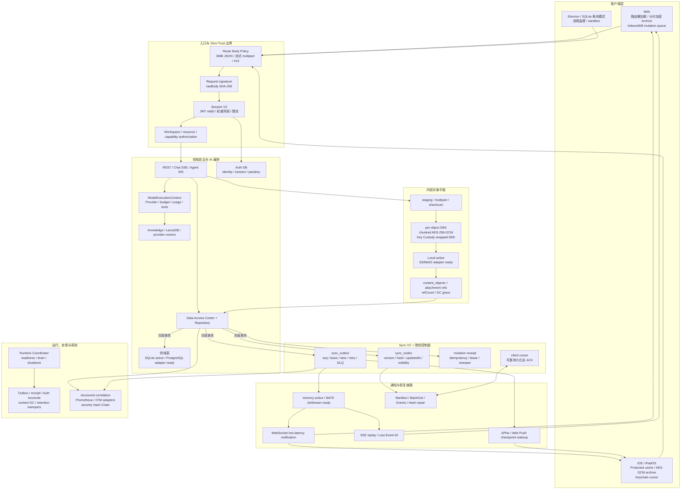

# Athena 分布式架构升级、Chat 大对象治理与最终验收报告

报告日期：2026-07-20
评审范围：Chat 内容对象、PostgreSQL/NATS 适配、Sync V2、数据访问语义、
安全与可观测边界、AI 治理、Web/iOS/Desktop、真实开发数据与最终门禁。

## 1. 执行结论

本轮没有重写 Athena，而是在现有 REST、Chat SSE、Agent/广播 WebSocket、
APNs/Web Push、领域表、SQLite 桌面模式和客户端缓存之上完成分层升级：

- Chat 的 Base64/大正文从关系库热路径迁入加密内容对象层。真实开发主库从
  `1,007,104,000 B` 降至 `84,914,176 B`，减少 `91.57%`；当前有 7 个 ready
  对象、8 个 Chat 引用，约 17 MiB 对象字节，Thread fork 只复制引用。
- Sync V2 继续作为一致性控制面，不成为业务数据库。真实开发库 263 个节点、
  186 个投影全部一致，权限泄漏、缺正文、Hash 漂移与投影冲突均为 0。
- SQLite 保持当前本机/桌面权威；PostgreSQL Main/Auth 双 Schema、运行时选择、
  方言层、迁移/CDC/校验与反向影子路径已实现并通过静态/故障测试，但本机没有
  Docker 或外部授权环境，因此尚未执行真实多实例切换。
- Outbox 仍是事务事实来源；memory transport 保持当前单实例路径，NATS
  JetStream transport、durable consumer、health/lag/drain 与 fail-closed Gateway
  已实现并通过测试，但未宣称已在生产运行。
- 146 个“数据库失败后返回空数组/0/false/null”的假健康分支已转换为可观测的
  `ModelDataAccessError`/HTTP 503；机械审计现在为 0，真实业务空结果语义保留。
- Web 初始入口为 `825,984 B raw / 234,701 B gzip`；Bundle、路由拆分、加密缓存、
  iOS 并发缓存、Desktop 隔离和三端最终测试均通过。

综合判断：仓库已经具备可渐进进入云端分布式灰度的控制面和回滚面，但不是
“已经完成生产多实例迁移”。下一步应在 Docker-capable staging 验证 PostgreSQL、
NATS、S3/MinIO、OTel/Prometheus 的真实故障恢复，再进行 cohort cutover。

## 2. 当前架构蓝图

### 2.1 四个权威边界

1. **业务权威**：领域表、Auth DB、对象存储、文件系统和向量 Provider 保存正文与
   业务约束；Sync V2 不复制成平行业务库。
2. **一致性权威**：`stateVersion`、Outbox `seq`、领域逻辑时钟和服务端生成时间是
   冲突真相；客户端时间戳只用于展示/辅助审计。
3. **传输边界**：WS/SSE/Push 负责“尽快知道变化”，Manifest/BatchGet/Events/Hash
   负责“最终确认与修复”。任一通知链丢失不会永久失联。
4. **客户端本地边界**：`dirty`、重试次数、失败队列、未提交草稿和本地 cursor 在
   账户隔离的加密存储中，不作为服务端共享状态。

## 3. 从用户操作出发的完整闭环

### 3.1 登录和启动

1. Route Body Policy 在解析前执行内容类型/大小策略，超限直接 413；签名链只接收
   有界 raw body 或预计算 SHA-256。
2. 密码、Passkey、ZK/OPAQUE、邀请和 SSO 统一落为服务端 Session。JWT 只携带
   `sid/jti`、身份、设备和 token version；安全操作绕过短正向缓存读取权威 Session。
3. Web/iOS 先恢复允许 stale-while-revalidate 的加密缓存，安全、权限、Session 和
   权益节点不得由旧缓存授予能力。
4. 客户端读取可见 Manifest，仅 BatchGet 变化节点；热点/当前路由先 hydration，
   冷节点懒加载或后台预取。
5. 客户端从最后可靠持久化的 `lastAppliedSeq` 补拉，再建立 WS；SSE、Push、启动
   校验、定时 Hash 和领域 ETag 是副链路。

### 3.2 Chat、附件和 AI 响应

1. 新客户端先创建附件 upload session，分片直接进入 staging；服务端流式计数、
   校验 checksum，并用随机对象 DEK 做 chunked AES-256-GCM。
2. DEK 由 Key Custody 封装；本地 Provider 使用临时文件、fsync、原子 rename，
   S3/MinIO Provider 使用不可变 key、multipart 和 checksum。
3. 对象 ready 后，数据库事务只保存对象/附件引用。普通历史分页不读取附件字节；
   下载必须重新验证账户、Workspace、Chat 与 Range/ETag 权限。
4. AI 请求进入 `ModelExecutionContext`，统一记录模型、Token、成本、延迟和预算；
   Chat/Agent/Reader/Cognition 仍保留各自流式和解析逻辑。
5. Assistant 文本有硬上限；超大正文外置为 `textRef`，消息只保留预览和截断标记。
6. 普通消息 append 在业务事务内完成 Chat 行、链尾 Hash Chain metadata、Sync 节点
   和 Outbox。编辑、删除、移动和密钥轮换保留范围/全链修复副链路。
7. 用户仍通过 Chat SSE 看到实时 Token；完成事件只发送 ID、版本、cursor 和引用，
   不把 Blob 或敏感正文塞进广播。

### 3.3 跨设备写入、冲突和 ACK

1. Mutation 携带 `mutationId`、`Idempotency-Key`、`baseVersion`、operation、
   `changedPaths` 与依赖 ID。
2. Receipt lease 保证重试不会重复产生副作用；业务写、节点版本/Hash 和 Outbox 在
   同一主库事务中提交，失败整体回滚。
3. Outbox 使用 claim lease、同节点顺序 lane、独立节点有界并行、指数重试和 DLQ；
   毒事件不再阻塞整个队列。
4. Web/iOS 将 25 ms/100 条事件微批去重，同一节点只保留最高版本；每 100 节点一次
   BatchGet，一批只提交一次 descriptor/archive，并只 ACK 一次。
5. ACK 表示节点处理、业务缓存、descriptor、加密 Archive 和 cursor 都已可靠落盘，
   不是“收到消息”。任一步失败都从上次 cursor 幂等重放。
6. `baseVersion` 后 changedPaths 不相交时自动 rebase；同字段修改进入冲突中心。
   已读 cursor 只增不减，删除使用 tombstone。

## 4. 数据与基础设施演进状态

| 能力 | 当前本机权威 | 已交付升级 | 尚未宣称完成 |
| --- | --- | --- | --- |
| Main/Auth DB | SQLite，单连接与完整性校验 | PostgreSQL 双 Schema/客户端、方言层、池角色、在线迁移/CDC/校验/反向影子 | 真实 PostgreSQL cutover 与七天 reverse-shadow |
| Chat Blob | Local Content Object Store | S3/MinIO Provider、multipart、checksum、staging/GC、租户范围 HMAC 去重 | 外部 S3/MinIO 故障演练 |
| Realtime | API 进程内 memory transport | NATS JetStream publish/subscribe/durable/health/lag/drain，分布式 fail-closed | 多实例 NATS staging 与网络分区演练 |
| Sync | Sync V2 shadow/allowlist，旧链保留 | cohort rollout、批量投影、客户端 Archive、cursor/receipt/outbox 自愈 | 生产 cohort 全量与真实长期 SLO |
| Observability | 结构化指标/日志和本地安全链 | OTel/Prometheus/Grafana/Tempo/Loki 配置与 correlation path | 外部长期保留、告警、SIEM 与容量看板 |
| AI governance | 领域调用现状 | usage event、budget reservation/policy、价格目录、ModelExecutionContext、Eval 模型 | 全 Provider enforce 和生产预算策略 |

PostgreSQL、NATS 和对象存储没有改变 REST/Sync/客户端公共协议，因此可独立灰度和
回滚。云端分布式配置下不得静默退回 SQLite 或 memory；桌面/离线模式则明确继续使用
SQLite、本地对象存储和 memory transport。

## 5. 自我运维与故障恢复

- **启动与退出**：Runtime Coordinator 在 HTTP ready 后依序启动 Outbox、Cognition、
  sweepers 与后台 Worker；SIGTERM 先关闭 readiness、停止接流量，再按依赖 drain，
  最后断开 Prisma。Supervisor 监督子进程与 crash-loop。
- **Sync 自愈**：Outbox/receipt lease 到期回收、指数重试、DLQ、admin replay；游标过期
  返回 full reconcile；同版本异 Hash 清单节点重拉并告警。
- **跨库 Auth 自愈**：Auth DB 与 Main Outbox 不可原子提交，使用不含 token/lastSeen
  的 Session 集合修订指纹、幂等通知和周期分页对账恢复漏发。
- **对象自愈**：staging/ready 状态机、checksum、引用计数、延迟删除与 reconciler；
  上传成功但 DB 失败的孤儿对象可在宽限期后回收。
- **迁移自愈**：SQLite 快照 + 单调 CDC、分块 canonical hash、写屏障、可续跑 migration
  receipt 与 reverse-shadow；回滚不删除任一侧数据。
- **安全自愈**：高风险事件进入 SHA-256 Hash Chain，周期 Ed25519 检查点和不可变归档
  适配；导出失败重试并告警，日志经过 redaction/correlation。
- **数据故障语义**：Repository 异常不再伪装为“没有数据”，API 返回稳定 503，后台
  任务进入重试/失败状态；真正空查询仍返回领域定义的空值。

## 6. 性能结果

### 6.1 Chat 存储与历史

| 指标 | 升级前 | 当前真实开发数据 | 改善 |
| --- | ---: | ---: | ---: |
| Main SQLite 文件 | 1,007,104,000 B | 84,914,176 B | -91.57% |
| ready 内容对象 | 内联于 Chat JSON | 7 objects / 8 refs | Blob 脱离热表 |
| Thread fork Blob 写入 | 复制/解密/重加密 | 引用与 refCount | 新增字节接近 0 |
| 普通历史分页 | 可能携带内联附件 | 元数据/引用；正文按需 | 避免无效下载 |

最终增量链基准在 10/100/1000 条历史各执行 5 个隔离 replicate、每组 120 次测量：

| 历史条数 | 稳健 p95 | 增量追加 | rebuild fallback |
| ---: | ---: | ---: | ---: |
| 10 | 3.078 ms | 600 | 0 |
| 100 | 3.164 ms | 600 | 0 |
| 1,000 | 2.892 ms | 600 | 0 |

1,000 条相对 10 条 p95 为 `-6.048%`，满足“最多回退 20%”；8,838 个基准 Chat 与
metadata 为 0 缺失、0 断链。绝对毫秒值是本机并行门禁结果，不等同生产 p95。

### 6.2 Sync V2

| 口径 | Legacy | Sync V2 | 改善 |
| --- | ---: | ---: | ---: |
| 全账户暖启动请求 | 29 | 8 | -72.41% |
| 全账户暖启动业务字节 | 209,469 | 1,116 | -99.47% |
| 全账户暖启动 gzip | 33,210 | 838 | -97.48% |
| 活跃账户暖启动请求 | 27 | 4 | -85.19% |
| 活跃账户暖启动业务字节 | 209,431 | 558 | -99.73% |
| 活跃账户暖启动 gzip | 33,132 | 419 | -98.74% |
| 活跃账户冷启动请求 | 27 | 6 | -77.78% |
| 活跃账户冷启动业务字节 | 209,431 | 89,615 | -57.21% |

### 6.3 Web Bundle

- 初始入口：`825,984 B raw / 234,701 B gzip`，低于 `1.2 MiB / 350 KiB` 门槛。
- 最大允许懒加载 Chunk：`1,723,011 B`（MindMap layout engine），低于未豁免
  `2 MiB` 硬门槛。
- Workspace shell、Settings、Reader、Agent、Crypto、Debug、冲突中心和大型解析器
  已按路由/能力切分；保留现有导航缓存和局部视觉 patch。

## 7. 最终验收矩阵

| 门禁 | 结果 |
| --- | --- |
| Server/Collector Jest | 253/253 suites，1,343/1,343 tests |
| Web Node | 394/394 tests |
| iOS/iPadOS | iPhone 17 Simulator，99/99 tests |
| Desktop | 5/5 tests；contextIsolation/sandbox/update signature 审计 0 findings |
| Lint | Server/Frontend/Collector 全通过；motion 34 个既有基线、0 新增 |
| Frontend build | Production build、Crypto output、Bundle budget 全通过 |
| 模块边界 | 3,417 files、11,258 local imports、0 error/0 warning |
| 独立模块 | Reader、Reader Worker、Background Worker、Realtime Gateway、Crypto 全通过 |
| 数据访问 | 689 files，0 bypass；错误语义 0；端点状态错误 0 |
| 数据库 | Main/Auth `quick_check=ok`、FK violation=0；PostgreSQL Schema valid |
| Sync shadow | 263 nodes、186 projections，0 permission/payload/hash/projection conflict |
| Outbox | pending/retrying/claimed/dead-letter 均为 0 |
| 安全账本 | 10 entries、3 signed checkpoints、0 verification failure |
| 加密覆盖 | 1,038/1,038 Chat prompt/response；metadata 1,038/1,038；断链 0 |
| 安全硬化 | 338 routes，0 finding；Key Custody 915 files，0 finding |
| 供应链 | Server/Collector/Frontend reachable Critical=0，门禁通过 |
| 维护性 | v2.3 收敛为 7 个既有受治理 God File、4 个明确的输入级 fail-closed fallback，0 growth finding |
| Runtime | Frontend 3000、API 3002、Collector 8889 均 HTTP 200 |
| Browser storage | 静态 14/14；未登录真实 Chromium 0 finding |
| Workflow/Shell | 11 个 workflow YAML 与 Shell syntax 通过 |

## 8. 剩余风险与上线边界

1. **真实分布式环境尚未演练**：本机无 Docker CLI，不能把 PostgreSQL/NATS/S3
   adapter/unit test 当成多实例生产证明。必须在 staging 进行断网、重投递、池耗尽、
   CDC 追平、cutover/reverse-shadow 和对象校验演练。
2. **供应链 High 未清零**：reachable Critical 为 0，但原始 High 仍为 Server 114、
   Collector 40、Frontend 11。继续执行负责人、隔离、到期时间和主版本兼容升级，
   不以 `force` 升级绕过回归。
3. **Sync 当前仍可关闭**：真实审计显示节点健康但当前环境 Sync 全局启用为 false。
   应按用户/设备/领域 deterministic cohort 从 shadow 到 Web、TestFlight 再全量。
4. **Cursor lag**：现有 3 个 cursor 最大 lag 696，需按 client lastSeen 区分活跃 SLO；
   过期客户端进入 full reconcile，而不是无限保留事件。
5. **God File**：7 个既有大文件继续受 no-growth 门禁约束。本轮关闭了新增增长并拆出
   Chat draft/runtime、Provider settings 与 Mind Map projection，但长期仍应按领域逐步拆分，
   不能宣布债务消失。
6. **运行时浏览器审计范围**：真实 Chromium 仅完成未登录边界；登录后的加密 Archive
   由 14/14 静态契约及持久化故障测试覆盖，生产灰度仍应补充授权测试账户的运行态证据。
7. **CRDT/Merkle/Event Sourcing**：当前不引入通用 CRDT、Merkle Tree 或全面事件溯源。
   协作正文出现明确并发需求后再试点 CRDT；聊天/安全使用领域事件日志和 Hash Chain，
   普通设置继续 version + patch，避免技术性重复建设。

## 9. 推荐发布顺序

1. 保持当前 SQLite/local/memory 权威，开启 Chat Content Object `read` 灰度并观察
   checksum、GC、历史分页和 fork 字节；旧 Payload API 保持兼容。
2. 在 Docker-capable staging 部署 PostgreSQL Main/Auth、NATS JetStream、MinIO 和
   OTel 栈；完成容量、故障注入与权限角色验证。
3. 先 SQLite → PostgreSQL shadow/CDC，对比行数、PK、分块 Hash、FK、Sync 投影和
   Chat Hash Chain；写屏障 cutover 后保留七天 reverse-shadow。
4. Outbox 对 memory/NATS 双发，验证 durable consumer lag/redelivery；只有 NATS
   健康时才启用独立 Realtime Gateway。
5. Sync V2 按 deterministic cohort：shadow → Web 小流量 → iOS TestFlight →
   核心领域；持续监控 Hash mismatch、full reconcile、cursor lag、ACK、冲突和 TTI。
6. AI governance 从 `observe` 进入按领域 `enforce`；插件高风险工具在容器隔离、
   capability/Secret Broker 和预算策略齐备后才开放。

所有切换均通过独立功能开关回滚；数据库迁移是 additive，关闭新读写路径时保留
PostgreSQL、SQLite、对象、Outbox 和迁移记录。本轮没有生成、轮换、覆盖或输出任何
现有密钥，也没有删除用户文档、向量、缓存或运行数据。
