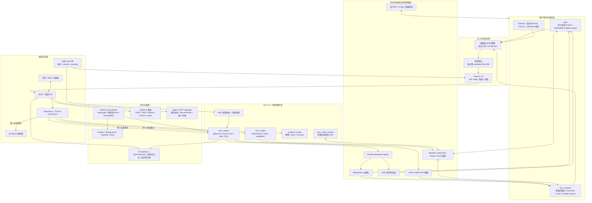

# Athena 最终系统架构、稳定性与性能报告

报告日期：2026-07-19

## 执行结论

本轮已完成整体系统的最终性完善优化，并关闭最终候选中发现的九项
代码/工程缺陷。当前仓库内 Server、Frontend、Collector、Reader、
Background Worker、Realtime Gateway、Desktop、Sync V2、数据库完整性、
安全审计、供应链和架构维护性门禁均通过；真实本地开发环境的 Frontend、
API、readiness 与 Collector 健康端点均返回 HTTP 200。

系统没有被推倒重写。REST、聊天生成 SSE、Agent/广播 WebSocket、APNs、
Web Push、领域缓存和领域数据库继续保留；Sync V2 是跨设备一致性控制面，
不是新的业务数据库或通用业务总线。业务表仍是正文权威，状态树只管理
版本、Hash、可见范围、事件游标和缓存失效。

结论边界：代码候选已经通过最终仓库门禁，但本机的 CoreSimulatorService、
Chrome 启动和 Docker CLI 有三个外部阻断。因此不能把 iOS 99 项测试、浏览器
运行时存储审计或容器 runtime smoke 虚报为通过；它们需要在健康的模拟器服务、
浏览器宿主和 Docker-capable CI/主机上执行。

## 当前总体架构

架构的核心分界如下：

- 领域数据：业务表、Auth DB、文件系统、对象存储和向量库是权威来源。
- 一致性控制：Sync V2 通过版本、Hash、Outbox sequence 和 cursor 判断缓存
  是否需要修复。
- 实时传输：WebSocket、SSE 和 Push 只负责快速告知变化，不独自承担最终一致性。
- 本地未提交状态：`dirty`、失败次数和重试依赖只在客户端加密队列，不进入
  服务端共享状态树。
- 权限：安全、会话、成员权限和权益必须回到权威 API/Session 校验，旧缓存不能
  授予实际权限。

## 完整同步链路

### 启动与读取

1. 客户端先恢复允许 stale-while-revalidate 的分片加密缓存，快速显示非安全页面。
2. 使用本地 manifest 摘要请求可见状态树；摘要一致时只接收 checkpoint，不重复
   传输业务正文。
3. 只批量拉取变化的 eager/当前页面节点；lazy 节点在页面进入、事件到达或抽检时
   hydration。
4. 从已可靠持久化的 `lastAppliedSeq` 补拉事件，再建立 WebSocket；Web 可用 SSE
   消费同一 Outbox sequence，iOS 可由 APNs checkpoint 唤醒。
5. 周期 Hash 校验用于发现同版本内容漂移；异常时清除单节点缓存并重新读取，客户端
   不自行提高版本。

### 写入、离线与冲突

1. 在线 mutation 携带 `mutationId`、`baseVersion`、operation、changedPaths 和
   `Idempotency-Key`。
2. Repository 在同一主库事务内提交业务数据、节点版本/Hash 和 Outbox；失败则整体
   回滚。
3. receipt 通过 request Hash、lease 和 sweeper 防止重复副作用或永久 pending。
4. Outbox 使用 claim lease、同节点有序 lane、独立节点有界并行、指数重试和 DLQ；
   毒事件不会阻塞其他节点。
5. 客户端只有在业务缓存、descriptor、加密 Archive/本地队列均可靠提交后才推进
   cursor 并 ACK。失败从最后成功 cursor 幂等重放。
6. 离线允许 profile、普通偏好、置顶/最近访问、草稿和低风险元数据排队；权限、
   登录安全、账务、聊天发送、Agent/任务启动 fail-closed。
7. `baseVersion` 之后的 changedPaths 不相交时服务端自动 rebase；同字段冲突进入
   冲突中心，不按客户端时间戳静默覆盖。

### 高频领域

- 聊天消息使用 append/edit/delete 事件游标、`clientTurnId`、`messageVersion`、
  tombstone、ETag 和分页历史，不对整段消息列表使用对象 Hash。
- 普通聊天新增使用索引化链尾查询和事务内 Hash Chain 增量追加；编辑、删除、移动、
  密钥轮换和审计修复仍保留范围/全链修复副链路。
- 文档元数据、标签、权限进入 version/hash；正文、Blob、向量和解析产物不进入普通
  状态树，处理进度使用事件 cursor。
- 真正多人协作正文仍应在明确业务需求出现时使用 OT/CRDT；当前单账户跨设备普通
  配置不为技术而强行引入 CRDT。

## 本轮最终完善内容

### 性能与同步

- `WorkspaceChats.whereWithData` 从 `1 + 2N` 关联查询收敛为最多三次批量查询。
- workspace/thread manifest 权限指纹收敛为授权 workspace、thread 和聊天活动三组
  批量查询，避免 workspace 级 N+1。
- mutation batch 同节点串行、独立节点默认四路并行（最大八路），保持输入结果顺序。
- Web Archive 按 profile、preferences、navigation 和 workspace 分片，一批加密后在
  单个 IndexedDB transaction 原子提交；失败不替换内存、不推进 cursor。
- Web/iOS 对事件页面和 25 ms 实时窗口去重、批量 BatchGet、批量应用、一次 ACK；
  iOS 同分区每批只做一次加密 Archive 写入。
- 聊天 Hash Chain 普通 append 从随历史长度增长的 rebuild 变为链尾查询和 metadata
  upsert；门禁使用多个隔离 replicate，避免亚毫秒调度噪声产生假回退。

### 稳定性与一致性

- Outbox 增加 claim lease、重试分级、同节点顺序、DLQ、持久 replay 确认和后台管理。
- mutation receipt 增加 lease、过期恢复、Outbox 对账和 sweeper；过期 recoverable
  可清理，活动请求保持可重试。
- Auth DB 与主库不能跨 SQLite 原子提交，现通过不含 token/lastSeen 的来源修订指纹、
  幂等 Outbox 通知和独立周期对账修复漏发。
- Runtime Coordinator 统一 HTTP、Outbox、Cognition、Bree、Push/Bot、MCP 和 Prisma
  生命周期；readiness fail-closed，SIGTERM 使用两阶段有界 drain。
- 本地 supervisor 和 `stop-all` 的默认 grace 为 35 秒，且不得低于应用 30 秒 drain。
- Reader/Background Worker 启动失败会体现在顶层 readiness，不再伪装为可用。
- 核心模型数据库异常开始使用可观测 503 语义；历史静默 fallback 以 112 为不可增长
  基线，后续只能递减。

### 安全与隔离

- 全局 3 GB parser 被按路由配额替代；普通请求、Webhook、raw-text、视觉资产、
  multipart 各自限额，超限在业务处理前返回统一 413。
- 上传使用 UUID 物理名、流式字节上限、原子提交和失败清理，显示名与物理路径分离。
- Session V2 统一密码、Passkey、ZK、邀请和 SSO 登录；JWT 只含 sid/jti 与身份版本，
  支持权威吊销、持久限流、旧 token 有期限升级。
- Collector 对 DNS、每次重定向、IPv4/IPv6 私网、云元数据、响应体、总超时、并发、
  解压 realpath/文件数/展开大小做 fail-closed 校验。
- MCP/Agent 使用插件服务身份、capability manifest、Secret Broker、最小环境继承、
  URL/文件能力复核和可信/容器隔离策略。
- 高风险审计写入 SHA-256 Hash Chain，检查点使用 HKDF 域隔离派生的 Ed25519 内存
  签名；失败进入 0600 fsync 队列并可幂等补录。
- Electron 显式启用 `contextIsolation`、sandbox、webSecurity，关闭 nodeIntegration
  与 webview，限制导航、IPC、权限和外部 URL，并监督 Server/Collector 子进程。
- Docker Scout 安装器固定到不可变 commit 并校验 SHA-256；供应链门禁拒绝 mutable
  raw GitHub shell installer 和直接 `curl | sh`。来源为
  [Docker Scout CLI 官方仓库](https://github.com/docker/scout-cli)。

## 最终性能结果

Sync V2 基准使用同一开发 SQLite 权威数据，对 legacy 工作区/线程/历史扇出与
manifest、eager batch、events 路径做只读比较。

| 口径                     |  Legacy | Sync V2 |    改善 |
| ------------------------ | ------: | ------: | ------: |
| 活跃账户冷启动请求       |      27 |       6 | -77.78% |
| 活跃账户暖启动请求       |      27 |       4 | -85.19% |
| 活跃账户冷启动业务字节   | 212,441 |  89,615 | -57.82% |
| 活跃账户暖启动业务字节   | 212,441 |     558 | -99.74% |
| 活跃账户冷启动 gzip 字节 |  35,337 |  14,844 | -57.99% |
| 活跃账户暖启动 gzip 字节 |  35,337 |     419 | -98.81% |
| 全账户冷启动请求         |      29 |      12 | -58.62% |
| 全账户暖启动请求         |      29 |       8 | -72.41% |
| 全账户冷启动业务字节     | 212,479 | 104,121 | -51.00% |
| 全账户暖启动业务字节     | 212,479 |   1,116 | -99.47% |
| 全账户冷启动 gzip 字节   |  35,415 |  18,168 | -48.70% |
| 全账户暖启动 gzip 字节   |  35,415 |     838 | -97.63% |

最终聊天链稳定性复测采用每个历史规模五个隔离 scope、每 scope 120 次测量：

| 历史消息数 | 稳健 p95 | 增量追加 | rebuild fallback |
| ---------: | -------: | -------: | ---------------: |
|         10 | 0.219 ms |      600 |                0 |
|        100 | 0.219 ms |      600 |                0 |
|      1,000 | 0.217 ms |      600 |                0 |

1,000 条相对 10 条的 p95 为 `-0.972%`，低于不超过 20% 的门槛；8,838 条
chat/metadata 审计为 0 缺失、0 断链。前一次独立 closure 复测为 `-5.969%`，
结果稳定。

Frontend 最终主 chunk 为约 3,459.25 kB、gzip 1,106.88 kB，相对首次门禁
3,458.82/1,106.66 kB 基本不变；这证明最终修复没有造成 bundle 回退，但主 chunk
本身仍较大，应继续通过路由级 lazy import 做 P2/P3 长期治理。生产真实设备 p95 TTI
仍需灰度遥测，本报告不把模型基准等同于真实用户体验指标。

## 最终验证矩阵

| 门禁                                                                   | 最终结果                                                                    |
| ---------------------------------------------------------------------- | --------------------------------------------------------------------------- |
| Server/全仓 Jest                                                       | 226 suites、1,244 tests 全通过                                              |
| Frontend Node                                                          | 394 tests 全通过                                                            |
| Lint / Prettier / production build                                     | 通过；36 个既有 motion finding 在基线内，0 新增                             |
| 模块边界                                                               | 3,287 文件、11,022 本地 import，0 error、0 warning                          |
| Reader / Reader Worker / Background Worker / Realtime Gateway / Crypto | build 通过                                                                  |
| Desktop                                                                | 5/5 测试与安全策略审计通过                                                  |
| 数据库                                                                 | 主库/Auth DB 均 99 migrations current、quick_check ok、FK=0                 |
| Sync shadow audit                                                      | 263 nodes、186 projections；权限泄漏、缺正文、Hash/投影冲突均为 0           |
| Outbox                                                                 | pending/retrying/claimed/dead-letter 均为 0                                 |
| 加密覆盖                                                               | 1,038/1,038 chat prompt/response 加密；metadata 1,038/1,038，断链 0         |
| 安全审计链                                                             | 5 entries、2 signed checkpoints、verification failure 0                     |
| 安全/供应链/维护性                                                     | 路由、DB、key custody、client encryption、供应链与维护性门禁通过            |
| 真实开发环境                                                           | Frontend 3000、API 3002 ping/ready、Collector 8889 均 HTTP 200              |
| Compose/Workflow/Shell                                                 | YAML 与语法静态验证通过；本机无 Docker CLI                                  |
| iOS/iPadOS                                                             | Simulator build 通过；99 tests 已发现但被 CoreSimulatorService 启动失败阻断 |
| 浏览器运行时存储                                                       | 静态 14/14 通过；Chrome 在页面创建前被宿主 SIGKILL，运行态审计阻断          |

最终缺陷记录见
[`athena-final-release-defect-ledger-2026-07-19.md`](./athena-final-release-defect-ledger-2026-07-19.md)。

## 当前风险与发布边界

1. **多实例实时传输**：memory transport 只能服务 API 进程内 Gateway。独立 Gateway
   会正确报告 not-ready；真正多实例前必须接 Redis Streams、NATS 或可靠 Outbox
   tailer，不能假装已共享广播。
2. **外部测试阻断**：iOS runtime test、Chrome storage runtime audit 和 Docker smoke
   仍需在健康宿主/CI 关闭。这是发布证据缺口，不是已通过项。
3. **供应链 High**：可达 Critical 为 0；Server/Collector/Frontend 的原始 High 计数
   分别为 111/40/11，当前依赖负责人、隔离措施和到期时间策略放行。应按到期日持续
   升级，不把策略豁免当成漏洞消失。
4. **请求签名灰度**：当前设备请求签名仍可处于 warn-only，strict readiness 显示
   `requestSigningDeviceRequired=false`。生产强制前需先观察旧客户端兼容率。
5. **旧客户端游标**：当前最大 cursor lag 696、平均 447，主要来自旧/不活跃客户端；
   应按 lastSeen 区分活跃 SLO，并在过期后要求 full reconcile。
6. **国际化覆盖**：中文 100%，日文约 89.6%，多数其他 locale 约 57.6%，缺项按明确
   English fallback 运行。需要持续补译，但不应使用 null 占位扩大 bundle。
7. **状态树边界**：Secret、token 流、行情 tick、音视频、原始 Blob、全文和向量不进入
   普通状态树；协作正文、通知收件箱、workspace-owned workflow 等必须先建立领域权威，
   再通过节点/事件适配接入。
8. **外部可观测基础设施**：代码已提供 Prometheus、OpenTelemetry、结构化 correlation
   和签名审计链；长期保留、告警和 SIEM 仍需要实际生产基础设施配置。

## 推荐发布动作

1. 保持状态树影子审计与旧链路双发，先开启 Web 小流量，再进入 iOS TestFlight。
2. 在 Docker-capable CI 跑容器 build/health/shutdown smoke；在健康 macOS runner 跑
   iOS 99 tests 和 Playwright runtime storage audit。
3. 灰度采集 manifest 命中率、BatchGet 节点数、Outbox latency/backlog、cursor lag、
   ACK 延迟、Hash mismatch、full reconcile、冲突率、离线队列深度与真实 p95 TTI。
4. 只有多实例需求成为现实后再接共享 transport；客户端和 Sync V2 公共协议无需改变。
5. 旧全量接口在连续两个稳定版本且至少 30 天无调用后再下线。

回滚继续通过服务端、客户端和领域 allowlist 独立关闭 Sync V2 读取/dispatcher；additive
表和 Outbox 记录保留，不反向删除迁移。此次修复和测试没有生成、轮换、覆盖或输出任何
现有密钥。Auth DB 迁移前备份保留在
`server/storage/shared/backups/auth-before-final-migrations-20260719T081700+0800.db`。
