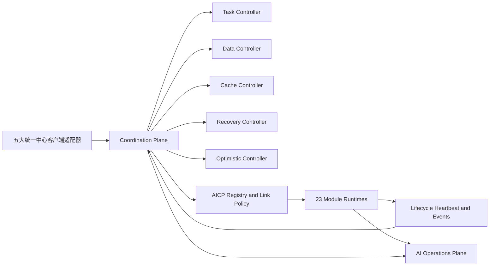

# Athena 微模块最终收口实施记录

日期：2026-08-01  
代码阶段：`production-contracts-shadow-enforcement`

## 当前结论

本轮已把 Athena 的模块事实源收口到 23 份 `ModuleManifest v1.1`，并新增独立 `coordination-plane`。协调平面只管理跨模块 lineage、所有权、失效、恢复和乐观确认，不接管 Chat、Agent、Crypto、Knowledge 等模块的业务执行器。

云端配置继续保持：

- `ATHENA_COORDINATION_AUTHORITY_MODE=shadow`
- `ATHENA_AICP_ENFORCEMENT_MODE=observe`
- `ATHENA_MODULE_MANIFEST_V11_REQUIRED=true`

因此本轮不会提前切换五大中心权威，也不会改变现有外部 API、Prompt、RAG、审批或加密语义。

## 已落地的约束

1. 所有模块都声明职责、非职责、契约、所有权、生命周期、协调中心、SLO、RTO/RPO、降级方式和禁止降级项。
2. 所有物理运行时都提供 `describe/self-test/lifecycle/drain/quiesce/resume`，并维护实例租约、状态序列和 Manifest 指纹。
3. AICP 对调用方、目标、能力、版本、Schema 指纹、Link ID、deadline 和 CoordinationContext 进行协商及校验。
4. 生命周期写命令要求 Operations 批准验证器和 PrincipalAssertion 验证器；任一验证器未装配时 fail-closed。
5. 生命周期 Heartbeat/Event 与 Operations ingest 已按 Manifest Link 定向强制 AICP；其他链路保持 observe，等待真实观察期后逐链切换。
6. 五个协调控制器只复用现有 Chat Run、Agent Run、Tool Invocation、Scheduled Run 和 Sync Outbox，不建立平行业务状态机。
7. L0 到 L4 严格顺序执行。L2 必须证明 L1 耗尽，L3 必须证明 L2 失败，L4 继续双重批准；低级恢复成功即关闭高级方案。
8. Operations 通过 `coordination.status` 获取 23 个模块的最新实例、租约新鲜度和 degraded/unmonitored/unknown 状态，但协调平面故障暂不反向阻断现有 Operations 或业务 readiness。

## 本地验证证据

- Manifest：23
- 物理运行时：23
- Prometheus Targets：23
- Operations readiness endpoints：23
- mTLS identities：23
- RPC capabilities：53
- 声明 Link：649
- unresolved：0
- contract drift：0
- 定向 Jest：14 suites / 65 tests 通过
- 前端协调适配及聊天断联相关 Node tests：26 tests 通过
- PostgreSQL Prisma Schema：验证通过
- Crypto asset audit：25 assets / 0 findings

## 尚未完成且不得提前宣称完成的门禁

以下属于真实环境 cutover，不由本地代码检查替代：

1. 在预生产应用数据库迁移并验证 PostgreSQL、NATS、对象存储、mTLS 和备份恢复。
2. 采集连续七天影子决策零差异、旧协议零命中和 23/23 新鲜租约证据。
3. 完成网页端、手机网页端、跨设备、滚动发布、断连恢复、模块暂停和双账户 Crypto 隔离演练。
4. 为生命周期写命令装配可验证的 Operations 批准凭据和混合签名 PrincipalAssertion；未装配前保持 fail-closed。
5. 按单条 Link 灰度从 observe 切到 enforce；不得全局一次性强制，也不得保留安全旁路。

只有上述门禁完成后，才能把五大中心逐一切换为权威并删除旧跨模块路径。
