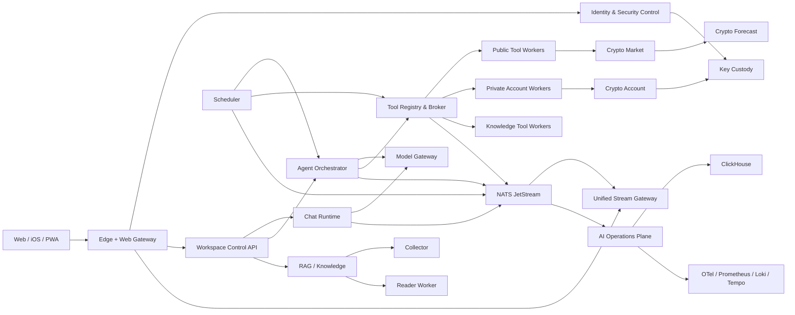
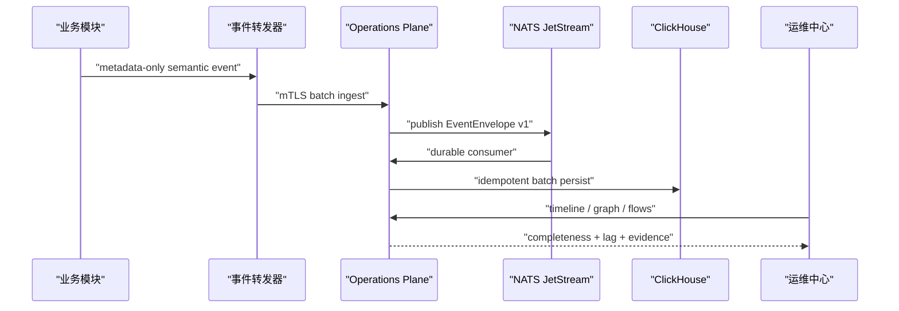

# Athena 微模块架构与统一 AI 运维中心最终检测报告

日期：2026-07-31
检测范围：当前工作区、自动化契约与运行时测试、线上生产容器、NATS JetStream、ClickHouse、Prometheus、OTel、Loki、Tempo、Grafana、公开 HTTPS 健康接口
检测方式：只读生产核验；未重启、重建、切流或修改生产数据

## 本轮继续推进补充

工作区已进一步补齐 9 个基础设施节点的权威健康投影。隔离契约验收现在返回：20/20 微模块健康、9/9 基础设施健康、状态图 35 个节点中 `unknown=0`、`unmonitored=0`、`degraded=0`。新增探针覆盖 PostgreSQL、NATS、S3、ClickHouse、OTel、向量库、模型 Provider、Embedding Provider 和 PQ 控制；所有事件保持 metadata-only。

这项结果只证明代码和隔离协议完整，仍不等于独立预生产实测。静态拓扑同时识别到 16 个逻辑 Schema 尚未切换，以及 Collector/兼容存储仍有共享可写卷，因此 `productionCutoverReady=false`。正式证据门禁已经改为同时要求 20/20 模块、9/9 基础设施、Schema 权威、共享存储退休、滚动发布、断连恢复、故障隔离、备份恢复和双账户 Crypto 演练全部通过。

## 本轮物理拓扑收口补充

在本报告首次检测之后，工作区进一步补齐了 `authentication`、`knowledge-ingest`、`rag` 和 `operations-shadow-agents` 四个独立运行时。当前代码与部署契约已经达到：

- 20/20 模块拥有独立 Compose service、Docker build target、entrypoint 和服务身份。
- 20/20 模块拥有独立 readiness endpoint 与 Prometheus mTLS target。
- Operations Plane 对 19 个远程模块执行主动探测，并将自身作为第 20 个本地 provider。
- API 已停止替 Authentication、Knowledge Ingest 和 RAG 代报健康。
- Identity 的内部 session introspection 校验服务端 Session、账户、客户端撤销状态与 `clientId`，只返回最小主体断言。
- RAG 分布式 cutover 后禁止进程内向量回退；Shadow Agent 故障只降级运维建议。
- 预生产拓扑中平台 Master Key 只挂载到 Key Custody；Crypto Account 经远程 custody 解封，Tool Broker 经 Crypto Account 获取私有账户能力。

本地隔离验收返回 `healthy=20`、`degraded=0`、`unmonitored=0`，5/5 Golden Journey 相关性覆盖率为 100%；密码资产审计与加密敏捷性审计均为零发现。

这些结果更新了“代码和部署契约”的完成度，不改变本报告关于生产状态的结论：本轮没有获得独立预生产 Docker 主机，也没有执行生产切流。`ATHENA_MODULE_SCHEMA_CUTOVER` 仍保持关闭，16 个领域 Schema 的 expand/contract 物理迁移和数据库角色收紧尚需真实预生产证据。

## 一、最终结论

Athena 的微模块代码底座已经成型，模块契约、独立运行角色、持久运行状态、远程 Operations Plane、主动健康探测、跨模块流程投影、Tool/Crypto 隔离和远程 Key Custody 均已通过本地代码级与隔离契约测试。

当前生产系统本身健康：

- 主应用容器为 `healthy`，RestartCount 为 `0`。
- `/api/ping`、`/api/ready`、`/api/setup-complete` 均返回 HTTP 200。
- 生产使用 Node `v24.18.0`，原生 ML-DSA-65 生成、签名和验证成功。
- NATS Operations consumer 的 stream sequence 与 ACK floor 都为 `7765`。
- NATS lag、ACK pending、redelivery、DLQ 均为 `0`。
- ClickHouse 已持久化 7,336 条 Operations 事件，检测时最新事件仍在持续写入。
- Prometheus 当前两个 target 均为 up；Loki、Tempo、Grafana、OTel 均返回健康状态。

但“统一 AI 运维中心已完全监测生产微模块系统”的结论目前不成立。

原因不是线上发生故障，而是生产仍运行旧的合并式单体拓扑：

- 生产只观测到一个 `api` runtime role。
- 新的 `moduleHealthMonitor`、`remoteEventForwarder`、`flowProjection` 和独立 `operations-plane.js` 尚未进入生产镜像。
- 当前生产状态图的 20 个旧节点中，19 个为 `unknown`，只有 Tool Runtime 因近期事件被标记为 `observed`。
- 当前生产 Prometheus 只抓取 Athena API 与 OTel Collector，没有逐个抓取微模块。
- 当前线上无法使用新的 `/api/operations/flows` 和 20 模块主动 readiness 校验。

因此，本轮状态应定义为：

| 层级 | 结论 |
| --- | --- |
| 生产主系统可用性 | 通过 |
| 生产 Operations 基础设施 | 通过 |
| 微模块代码与契约 | 通过 |
| 独立运行角色构建 | 通过 |
| 本地 Operations 隔离契约 | 通过 |
| 生产微模块部署 | 尚未执行 |
| 生产 20 模块主动监测 | 尚未执行 |
| PostgreSQL / S3 / mTLS 权威切换 | 尚未执行 |
| 旧单体退休 | 不允许 |

## 二、目标微模块架构



### 20 个模块清单

| 领域 | 模块 |
| --- | --- |
| 边缘与控制 | `edge-web`、`athena-api`、`authentication` |
| 核心 AI | `chat-runtime`、`agent-runtime`、`model-gateway` |
| 工具与调度 | `tool-runtime`、`scheduler` |
| 加密业务 | `crypto-market`、`crypto-account-access`、`crypto-forecast` |
| 知识链路 | `collector`、`reader-worker`、`knowledge-ingest`、`rag` |
| 后台与实时 | `background-worker`、`sync-v2` |
| 安全与运维 | `key-custody`、`operations-plane`、`operations-shadow-agents` |

每个模块都由 `ModuleManifest v1` 声明：

- 模块 ID、版本、运行角色和镜像。
- 公共路由、内部 RPC、发布与订阅事件。
- 数据 Schema、对象存储前缀和密钥域。
- 依赖、健康、就绪、排空和 SLO。
- 服务身份、允许调用者、失败模式和主体断言时效。

当前静态契约结果：

- 20 个 Manifest。
- 32 个唯一 RPC 契约。
- 18 个唯一公共路由所有者。
- 16 个唯一数据库 Schema 所有者。
- 20 个唯一服务身份。
- 无重复 RPC provider、路由所有者、Schema 所有者或服务身份。
- 无未知调用方、缺失 provider 或依赖环。

## 三、系统如何协调运行

### 1. 用户请求

Edge 保持现有 `/api/*`、Chat SSE、Agent WebSocket 和 iOS/PWA 协议，对内部服务进行路由。客户端不需要感知后端服务拆分。

### 2. 身份与安全

Identity 验证 Session、设备身份、通行密钥、请求签名和 PQ 状态，并签发短时、目标服务绑定的 `PrincipalAssertion v1`。高风险能力继续要求经典签名与 ML-DSA-65 混合签名，不允许 PQ 降级。

User Root 原文不上传服务器。Root Envelope、域密钥版本和包装元数据仍由现有安全体系管理；平台主密钥最终只允许存在于 Key Custody。

### 3. Chat 与 Agent

Chat 和 Agent 使用持久 run：

- `chat_runs / chat_run_events`
- `agent_runs / agent_run_events`
- 单调 `sequence`
- 稳定幂等键

客户端重连只携带 `runId + lastSequence`。页面进入后台、网络断开或 Stream Gateway 滚动发布不会取消服务端生成；重连后补发缺失事件。

### 4. 模型与工具

Model Gateway 统一管理 Provider 连接、限流、重试和流输出。Agent 不直接持有 Provider 生命周期。

Tool Broker 统一管理：

- 工具注册与账户资格。
- 逐次批准或任务级精确预批准。
- 持久 `tool_invocations`。
- 数据库原子 nonce。
- 混合签名 capability。
- 结果敏感策略。

私有 Crypto 工具只把认证上下文中的 owner 传给 Crypto Account，不接受模型参数中的用户 ID、账户 ID 或连接 ID。

### 5. Scheduler、Reader 与后台任务

Scheduler 保存 owner、批准范围、幂等键、checkpoint 和任务状态。Reader 与 Background Worker 使用持久队列；云端切换完成后必须关闭进程内静默回退。

### 6. 事件与流

业务服务将状态事件写入 NATS JetStream。Outbox 与 `eventId` 保证事务后发布和消费者幂等。Stream Gateway 从 NATS 读取并向客户端补发；Operations Plane 从同一事件流建立时间线、状态图和流程视图。

## 四、统一 AI 运维中心如何监测

### 1. 静态拓扑

Operations 从 Manifest 动态建立服务目录、依赖图、责任人、关键性、失败模式和安全边界，不再维护一份容易漂移的静态组件名单。

### 2. 主动运行探测

独立 Operations Plane 每 15 秒访问模块 readiness endpoint，并校验：

- `moduleId`
- 模块版本
- Manifest fingerprint
- `ready` 状态
- 探测耗时

身份、版本或 fingerprint 不一致都会标记为 degraded，而不是把任意 HTTP 200 当作健康。

### 3. Producer 心跳与语义事件

各 Node 运行角色通过 mTLS 将事件批量转发到 Operations Plane：

- 有界队列最多 2,000 条。
- 每批最多 50 条。
- 失败指数退避。
- 不阻塞业务请求。
- 定期发送 `module.telemetry.heartbeat`。

Operations 记录 producer 的最后事件时间并标记 stale，可识别“服务仍可探测，但遥测链路已经断开”。

### 4. 持久消费



当 ClickHouse 可用时，时间线以 ClickHouse 为权威；ClickHouse 暂时不可用时，可降级到 NATS retained events 和本进程 recent buffer，并明确返回 `degraded` 与 `completeness`，不伪装为完整数据。

### 5. 跨模块流程

`/api/operations/flows` 使用以下关联键聚合完整流程：

- `operationId`
- `clientTurnId`
- `invocationId`
- `toolCallId`
- `sourceActionId`
- `requestId`

它可以显示流程经过的模块、开始和终态、耗时、失败原因和终态是否完整。适用于登录、Chat、Agent、批准、工具、Crypto、调度和知识任务。

### 6. Shadow Agent 与动作控制

Monitoring、RCA、性能、安全和成本 Shadow Agent 只观察，不直接执行变更。动作必须经过策略、人工批准、执行、验证、审计与回滚流程。

Operations 故障采用 `isolated-degraded`：运维能力可以降级，但不能把正常 Chat、登录或公开市场能力一起拉成 `runtime_not_ready`。

### 7. 敏感数据边界

Operations、NATS、ClickHouse、OTel 和日志只允许 metadata-only 事件。禁止进入遥测的内容包括：

- 密码、JWT、恢复句柄。
- User Root、DEK、平台主密钥、私钥。
- API Key、API Secret。
- 加密账户余额、完整持仓和完整交易记录。
- 完整 Tool result。

## 五、本轮自动化检测结果

| 检测 | 结果 |
| --- | --- |
| 模块边界审计 | 2,561 文件、7,971 条本地导入，0 error，0 warning |
| Operations 专项测试 | 9 suites、32 tests 全部通过 |
| 后台模块协调测试 | 15 suites、53 tests 通过，1 个本机原生 PQ 用例跳过 |
| 语义事件、启动安全和能力签名 | 4 suites、25 tests 全部通过 |
| 微模块运行时构建 | Scheduler、Operations、Chat、Agent、Model、Tool、Crypto、Key Custody、Reader、Background、Realtime 全部通过 |
| PostgreSQL Prisma Schema | valid |
| 密码资产盘点 | 25 项，0 findings |
| Key Custody 边界 | 扫描 1,097 文件，0 findings |
| 密码敏捷性边界 | 扫描 1,757 文件，0 findings |
| 数据安全目录 | 56 个域、5 个等级，0 findings |

`yarn operations:verify` 隔离契约结果：

- 5 个 Golden Journey，相关性覆盖率 100%。
- 36 个语义事件全部进入 ClickHouse 协议实现。
- 36 条 OTel 日志、129 条 trace。
- 状态图 35 个节点、89 条依赖边。
- 合成探针下 20/20 模块健康。
- 10 个流程中 9 个完成、1 个运行中、0 个失败。
- 4 类人工批准动作执行成功。
- 中断动作完成回滚。
- Agent 直接控制动作被阻止。

这里的 20/20 是隔离契约中的合成 readiness provider，不是生产容器实测结果。

本机 Node 不支持原生 `ml-dsa-65`，因此一个原生混合 capability 单测按设计跳过；生产 Node 24 的直接 ML-DSA-65 生成、签名和验证已在本轮只读检测中成功。

## 六、生产实测结果

检测时间：2026-07-31 04:29–04:32，Asia/Shanghai。

### 应用与安全

| 项目 | 结果 |
| --- | --- |
| 应用容器 | healthy |
| RestartCount | 0 |
| Entrypoint | 正确的应用 entrypoint |
| Node | v24.18.0 |
| ML-DSA-65 | sign/verify 成功 |
| `/api/ping` | 200 |
| `/api/ready` | 200 |
| `/api/setup-complete` | 200 |

### Operations 持久链路

| 项目 | 结果 |
| --- | --- |
| NATS stream first | 557 |
| NATS stream last | 7765 |
| ACK floor | 7765 |
| delivered | 7765 |
| lag | 0 |
| ACK pending | 0 |
| redelivered | 0 |
| DLQ | 0 |
| paused | false |
| ClickHouse 总事件 | 7,336 |
| ClickHouse event types | 48 |
| ClickHouse runtime roles | 1，仅 `api` |

近 24 小时仍在产生 Crypto Forecast、Operations Shadow、Agent Tool 与 Model Governance 事件。检测时 ClickHouse 最新事件距当前时间约 30 分钟，说明现有消费与落库链路在工作。

### 可观测性基础设施

| 组件 | 结果 |
| --- | --- |
| Prometheus | 2/2 targets up |
| Athena API target | up |
| OTel Collector target | up |
| Loki | HTTP 200 |
| Tempo | HTTP 200 |
| Grafana | HTTP 200 |
| OTel metrics | HTTP 200 |
| NATS | healthy |
| ClickHouse | healthy |

### 生产监测缺口

生产镜像中不存在：

- `moduleHealthMonitor.js`
- `remoteEventForwarder.js`
- `flowProjection.js`
- 独立 `operations-plane.js`

生产事件只来自 `api` runtime role。当前旧状态图在最近 500 条事件窗口中：

- 20 个节点。
- 19 个 `unknown`。
- 1 个 `observed`。
- 0 个 degraded。

这里的“0 degraded”不能解释为“20 个模块全部健康”；它只表示当前事件窗口没有明确失败事件。由于 19 个节点没有实时探针或近期事件，它们是监测盲区。

## 七、为什么当前不能执行最终切换

严格 foundation gate 当前返回未就绪，关键项包括：

- 生产拓扑仍非 distributed。
- PostgreSQL Main/Auth 尚未成为权威。
- NATS 尚未成为全部模块的权威广播路径。
- S3/MinIO 尚未成为权威内容存储。
- 服务间 mTLS 尚未全局强制。
- Reader durable queue 尚未全局开启。
- Reader 进程内回退尚未关闭。
- 缺少正式 cutover evidence。

此外，当前新 Compose 的主动 endpoint map 只显式包含：

- Chat
- Agent
- Model
- Tool
- Crypto Market
- Crypto Account
- Crypto Forecast
- Key Custody
- Scheduler

加上 Operations 本地 provider，最多只能直接覆盖 10 个模块。API、Authentication、Edge、Reader、Background、Realtime、Collector、Knowledge、RAG 和 Shadow Agents 仍需补齐真实或虚拟 readiness provider，才能达到 20/20 实际探测。

## 八、必须完成的技术优化

### P0：防止“未知被误判为健康”

1. 状态图必须同时显示 `healthy / degraded / unmonitored / unknown`。
2. 首页必须显示监测覆盖率，不能只显示 degraded 数量。
3. 任一关键模块没有 probe 且没有新鲜 heartbeat 时，Operations 总状态必须为 `coverage_incomplete`。
4. 发布门禁必须拒绝 `unknown > 0` 或关键模块 `unmonitored`。

### P0：把新 Operations 真正部署到预生产

1. 先部署独立 Operations Plane。
2. 为全部真实服务配置 mTLS readiness endpoint。
3. 为仍共置的 Authentication、RAG、Knowledge 等逻辑模块提供独立虚拟探针。
4. 将 Operations Shadow Agents 作为本地 provider 纳入主动健康。
5. 确认所有运行角色产生 heartbeat，stale 为 0。

### P0：补齐生产数据底座

1. PostgreSQL Main/Auth 完成快照、CDC、零差异校验和写屏障切换。
2. NATS 成为云端唯一广播通道。
3. S3/MinIO 成为大对象和 Reader 产物权威存储。
4. 生产关闭 SQLite、memory transport 和本地共享目录静默回退。

### P1：事件声明与实现一致性

Manifest 声明了 `chat.run.*`、`agent.run.*`、`scheduler.run.*`、`model.stream.*`、`tool.invocation.*` 等事件族，但需要为每个模块增加契约测试，证明 started、completed、failed、denied、recovered 等关键终态确实产生，且 correlation key 贯穿全流程。

### P1：扩大 Prometheus 与 SLO 覆盖

当前生产只有两个 target。微模块上线后，至少要逐个抓取所有已部署服务，并建立：

- readiness 和 heartbeat stale。
- 请求错误率、延迟和饱和度。
- NATS lag、ACK pending、redelivery、DLQ。
- ClickHouse 持久延迟。
- Chat/Agent replay 时间和重复率。
- Tool approval、拒绝、超时和 scope violation。
- Crypto 私有连接延迟与隔离拒绝。
- Scheduler checkpoint 与重试。
- Reader queue depth、失败和进程内回退命中。

### P1：真实流程与故障演练

必须在预生产完成：

- Chat 输出中滚动更新 Web、Tool、Crypto Forecast、Reader 和 Operations。
- Agent 工具调用中更新 Tool Worker。
- 强制终止 Crypto、Reader 或某个 Tool Worker，主聊天与登录仍可用。
- Stream Gateway 重启后 sequence 完整补发。
- Identity/Key Custody 故障时高风险操作安全拒绝，已有普通 Chat 不被终止。
- 两账户 Crypto Account 并发隔离。
- PostgreSQL、NATS、对象存储网络分区和备份恢复。

## 九、推荐运行与验收方式

### 代码级检查

```bash
yarn check:modules
yarn check:micro-module-runtimes
cd server
yarn operations:verify
yarn micro-modules:cutover-verify
```

最后一条在证据未完成时应当失败；失败是保护机制，不应绕过。

### 分布式 Compose

必须在已准备 PostgreSQL、NATS、对象存储、mTLS 和密钥文件的预生产环境执行：

```bash
docker compose \
  --env-file <secure-compose-env> \
  -f docker/docker-compose.modular.yml \
  --profile realtime-gateway \
  --profile reader-worker \
  --profile scheduler \
  --profile operations-plane \
  --profile core-runtimes \
  --profile tool-runtimes \
  --profile crypto-runtimes \
  --profile security-control \
  up -d
```

随后必须核验：

1. 每个服务 `/live` 与 `/ready`。
2. moduleId、版本和 Manifest fingerprint 一致。
3. Operations module health 无 unknown/unmonitored/degraded。
4. 所有 producer heartbeat 新鲜。
5. NATS sequence 等于 ACK floor。
6. lag、ACK pending、redelivery 和 DLQ 为零。
7. ClickHouse 最新落库时间持续推进。
8. Golden Journey 的 correlation coverage 为 100%。
9. Chat/Agent 重连 P95 不超过 3 秒。
10. 日志与事件扫描不到凭据、Root、DEK、余额或完整交易。

## 十、最终判断

Athena 现在已经具备从单体走向微模块的正确技术骨架，代码级模块边界和 Operations 监测模型已经通过验证；现有生产单体及其 Operations 基础设施也处于健康状态。

但当前线上还不是微模块生产拓扑，统一 AI 运维中心只能完整观察现有单体中的部分语义流程，不能证明 20 个后台模块都在线、都被主动探测、都能独立发布和独立故障隔离。

正确的下一阶段不是立即退休单体，而是：

1. 在独立预生产部署完整微模块拓扑。
2. 补齐 20/20 readiness、heartbeat、Prometheus 和流程事件覆盖。
3. 完成 PostgreSQL/NATS/S3/mTLS 权威切换。
4. 运行蓝绿、故障、恢复和账户隔离演练。
5. 生成正式 cutover evidence。
6. 连续观察零旧读取后再逐步切换生产。

在这些条件全部成立之前，旧单体、SQLite、本地对象和旧密钥读取路径都必须保留为受控回滚能力，不得提前退休。
