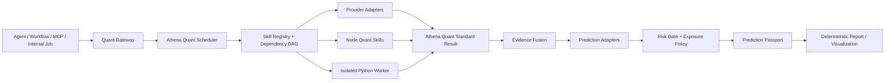

# Athena Quant Intelligence Engine Upgrade Proposal

> 文档状态：长期架构提案，不代表方向预测已经获准公开，也不代表 V2/V3 已经上线  
> 审计基线：[`agiprolabs/claude-trading-skills@938a6ee`](https://github.com/agiprolabs/claude-trading-skills/tree/938a6ee84eed8f2b51cfb5055eaaddc8c596028d)  
> Athena 基线：2026-07-31 当前工作树与现有 Crypto Quant / Gold GQSS 治理边界  
> 机器可读库存：[claude-trading-skills-inventory.json](./research/claude-trading-skills-inventory.json)

## 执行摘要

`claude-trading-skills` 的主要价值是广度、量化领域知识组织和大量可阅读的公式样例，不是可以直接安装到 Athena 的生产量化引擎。

固定提交中共有：

- 67 个 Skill、67 个 `SKILL.md`。
- README 实际枚举 15 类，而文案宣称 17 类。
- 118 个 Skill Python 脚本、119 个仓库 Python 文件、149 个 reference 文件。
- 58,692 行 Skill Python。
- 63 个脚本包含网络/API调用，67 个包含合成、随机或演示数据路径。
- 118 个脚本都以终端文本为主要接口；仅5个涉及JSON序列化、3个输出CSV、4个输出图片。
- 只有1个测试文件、2个单元测试。
- 没有统一依赖锁、统一数据协议、中央Registry、依赖DAG、共享缓存、Fusion、Prediction治理或真正可执行的跨Skill Workflow。

因此，本提案不复制 Claude Skill 目录，也不把118个脚本直接放入生产容器。正确路线是：

1. 把经过审计的公式、统计方法和研究方法吸收为 Athena 自有内核。
2. 把实时API脚本重写成 Athena Provider Adapter。
3. 建立统一的 Quant Standard Schema、Skill Registry 和 Scheduler。
4. 用证据图和风险闸门组合能力，而不是让 Agent 拼接终端文字。
5. 把 Python 限定为隔离的研究 Worker，Node 继续负责生产调度和在线轻量计算。
6. 保持当前 `monitoring_only` 公共边界；Prediction 先 Shadow，独立审计和前瞻证据通过后才允许按周期申请公开。

最终目标不是“更多指标”，而是形成一个可组合、可追溯、可失败、可复算、可扩展且不会夸大预测能力的 Quant Intelligence Engine。



---

## 1. 当前项目分析

### 1.1 仓库架构

外部仓库的实际结构是：

```text
.claude-plugin/
  plugin.json
  marketplace.json
skills/
  <skill>/
    SKILL.md
    scripts/*.py
    references/*
tests/
  test_drawdown_analyzer.py
README.md
CONTRIBUTING.md
LICENSE.md
```

它的运行模型是：

```text
自然语言请求
  -> Agent 发现 SKILL.md
  -> Agent 阅读公式、示例和建议流程
  -> Agent 决定是否运行某个 Python CLI
  -> CLI 从参数、环境变量、文件或网络取数
  -> print() 输出表格、说明或路径
  -> Agent 再把文本组织成回答
```

这里不存在代码级的 `skillsets/` 调度层。README 中的多 Skill Workflow 是提示词示例；Skill 之间的“Integration”也是文档建议，不是可验证的依赖图。

`.claude-plugin/plugin.json` 只承担安装、发现和命名空间包装，不承担：

- 输入输出类型校验。
- Provider级限流和缓存。
- Skill依赖解析。
- 数据时间合同。
- 失败隔离。
- 结果融合。
- 模型治理。
- 统一可观测性。

### 1.2 分类、脚本与规模

| README实际分类 | Skill | Python脚本 | Python行数 |
|---|---:|---:|---:|
| Market Data & APIs | 7 | 14 | 4,329 |
| Solana Infrastructure | 6 | 12 | 4,895 |
| On-Chain Analysis | 5 | 10 | 5,035 |
| Technical Analysis | 3 | 6 | 3,472 |
| Backtesting & Strategy | 4 | 8 | 4,039 |
| Portfolio & Risk | 4 | 8 | 4,227 |
| DeFi Specific | 6 | 12 | 7,112 |
| Statistical Methods | 5 | 10 | 5,753 |
| ML for Trading | 4 | 8 | 4,531 |
| Execution & Trading | 4 | 8 | 3,720 |
| Data & Visualization | 3 | 6 | 3,612 |
| Market Microstructure | 2 | 4 | 2,019 |
| Quantitative Finance | 2 | 2 | 929 |
| Prediction Markets | 5 | 3 | 481 |
| Tax, Accounting & Compliance | 7 | 7 | 4,538 |
| **合计** | **67** | **118** | **58,692** |

机器库存按主要性质给出的分布是：

| 主要性质 | Skill数 | 判断 |
|---|---:|---|
| 纯计算内核 | 12 | 有独立公式，但仍主要是CLI接口 |
| 带演示数据的计算内核 | 24 | 计算有参考价值，数据和验收不具生产性 |
| 可执行演示脚手架 | 3 | 主要生成图表、报告或本地工件 |
| 实时API适配器 | 11 | 能访问真实来源，但缺少中央治理 |
| 实时API+计算混合 | 7 | 真实读取与启发式逻辑混在一起 |
| 实时/执行脚手架 | 4 | 可能触达交易或执行相关路径 |
| ML研究演示脚手架 | 4 | 特征、分类、情绪和RL研究样例，不是生产模型 |
| Prompt Workflow | 2 | 无 Python 脚本，仅有说明和公式 |

### 1.3 技术指标能力

必须区分三个口径：

1. **依赖库理论表面**：pandas-ta 130+指标、TA-Lib 150+函数和61个K线形态。
2. **仓库脚本实际调用**：SMA、EMA、RSI、MACD、BOLL、ATR、ADX、OBV、SuperTrend、Stochastic、CCI、Williams %R、ROC、MFI等常用集合。
3. **仓库显式实现或封装的量化因子**：技术、波动率、统计、链上和微观结构共55个规范化名称，完整清单在机器库存中。

外部脚本值得关注的因子族包括：

- 趋势与动量：SMA、EMA、MACD、ADX、SuperTrend、ROC。
- 均值回复：RSI、BOLL %B、Stochastic、CCI、Williams %R。
- 波动率：ATR、close-to-close、Parkinson、Garman-Klass、EWMA、简化GARCH、volatility cone。
- 量价：OBV、MFI、VWAP、量比、volume profile。
- 链上/衍生品启发式：NVT、MVRV、exchange netflow、funding aggregate、OI momentum、holder momentum。
- 统计：ADF、Hurst、variance ratio、OU、half-life、Engle-Granger、Johansen、rolling/EWMA correlation、tail dependence。
- 微观结构：quoted/effective/realized spread、Kyle Lambda、trade pressure、trade-size entropy。

问题在于：脚本没有统一证明这些指标使用了已收盘、点时可用、没有未来泄漏的数据，也没有为每个公式提供黄金测试。某些“live”脚本在取不到真实字段时会构造随机或合成输入，因而不能直接作为生产证据。

### 1.4 量化、链上、回测、风险、ML与可视化

#### 量化分析

仓库覆盖行情获取、OHLCV处理、技术指标、regime、波动率、相关性、协整、均值回复、组合分析、回测、执行模拟、DeFi数学、期权、固定收益和预测市场。

优势是广度和教学可读性；缺点是每个Skill独立打印结果，没有共享 `asOf`、`availableAt`、单位、质量、引用和SHA。

#### 链上分析

5个核心On-Chain Skill、10个脚本，覆盖：

- Holder concentration、Gini、HHI、Nakamoto coefficient。
- 钱包PnL、交易风格和bot-like启发式。
- Whale accumulation/distribution。
- Funding-source tracing。
- Co-trade、bundle和wash-cycle启发式。
- DEX流动性、深度和滑点。

这些能力适合作为证据族，但“insider”“smart money”“bot probability”等结论依赖启发式阈值，不能直接进入 Athena 的方向模型或对用户写成事实。

#### 回测

4个核心Skill、8个脚本：

- VectorBT风格向量回测和参数扫描。
- Backtrader风格事件回测和 bracket order 示例。
- Strategy definition/scorecard。
- Walk-forward、purging、embargo、PBO、Deflated Sharpe和多重检验。

大多数示例使用合成数据。费用和滑点在部分示例存在，但缺少统一成本模型、资金费率、市场规则、点时Provider数据和独立结算器。可以吸收研究方法，不能直接采用回测结论。

#### 风险

4个核心Skill、8个脚本，外加DeFi、执行和微观结构中的交叉风险能力：

- Sharpe、Sortino、Calmar、Omega、VaR/CVaR。
- Drawdown、time underwater、profit factor。
- Exposure、HHI、sector concentration。
- Fixed fractional、volatility adjusted、liquidity constrained、Kelly。
- 无常损失、MEV、滑点和流动性风险。

这一部分是最值得优先吸收的计算域之一，因为其确定性强、输入输出可测试，而且不会单独制造未来方向。

#### 机器学习

4个Skill、8个脚本：

- Feature engineering、stationarity和冗余检测。
- MDI、permutation和SHAP重要度。
- GradientBoosting/XGBoost信号分类。
- Walk-forward预测。
- Almgren-Chriss、TWAP/VWAP/adaptive执行模拟。
- 关键词情绪。

当前实现属于研究脚手架：默认合成样本、模型选择空间有限、概率校准和数据隔离不统一，也没有工件签名和在线/离线parity。不能将其训练结果迁入 Athena。

#### 可视化

3个核心Skill、6个脚本，但实际产生图片的脚本只有4个。可绘制K线、指标、权益、回撤、收益分布、交易标记、月度热力图和微观结构图。它们适合重写为消费统一JSON的渲染器，不应继续自行生成行情或合成交易。

### 1.5 每个Skill的调用与依赖审计

逐Skill、逐脚本的以下字段保存在[机器库存](./research/claude-trading-skills-inventory.json)：

- Skill描述、分类、文档行数、scripts和references。
- 输入通道：自然语言、CLI、环境变量、文件、网络、合成数据。
- 输出通道：terminal、JSON、CSV、image。
- Python依赖、环境变量、Provider域名。
- 公开函数、类、入口、代码行数和语法有效性。
- 是否使用网络、随机模拟、合成数据。
- 是否有仓库直接单测。
- 主要性质、风险标记和Athena采用决策。

统一调用流程判断是：`SKILL.md -> Agent选择 -> CLI脚本 -> terminal text -> Agent解释`。不存在可以直接映射为服务间JSON调用的稳定协议。

---

## 2. 可直接复用能力

这里的“复用”指吸收公式、测试向量、接口经验或领域分层，不表示复制CLI。

### 2.1 第一优先级：确定性风险与统计内核

建议重写并做双实现黄金测试：

- Total return、CAGR、annualized volatility。
- Sharpe、Sortino、Calmar、Omega、information ratio。
- Historical VaR/CVaR。
- Maximum drawdown、drawdown duration、recovery required。
- Exposure、HHI、correlation-adjusted risk。
- Fixed fractional、volatility adjusted、liquidity constrained sizing。
- Kelly、fractional Kelly、Wilson interval和稳定性限制。
- EWMA、Parkinson、Garman-Klass、简单GARCH基线。
- ADF、Hurst、variance ratio、half-life、cointegration。

这些内核必须：

- 明确收益频率、年化因子、无风险利率和单位。
- 明确缺失值、零值、极端值策略。
- 不在运行时依赖自由文本阈值。
- 由Node和独立Python实现对同一向量交叉验证。

### 2.2 第二优先级：回测治理方法

吸收：

- Rolling/expanding walk-forward。
- 标签窗口级purging。
- 与预测周期相匹配的embargo。
- 参数扫描后的PBO、Deflated Sharpe。
- Bonferroni/Holm等多重检验校正。
- 最简单策略基线和随机固定种子基线。

Athena不复用其合成价格和示例策略结果，只复用方法论，并接入现有独立审计器、成本模型和Prediction Passport。

### 2.3 第三优先级：链上与DeFi指标定义

值得保留：

- Holder concentration、Gini、HHI、Nakamoto。
- Funding source和共同祖先图。
- Co-trade时间聚类。
- AMM/CLMM流动性数学。
- Slippage curve。
- Impermanent loss和fee breakeven。
- Token supply、unlock和稀释状态。

这类结果只能表达观测证据。任何“内幕”“庄家”“聪明钱”必须拆成可验证字段和阈值，不得作为事实标签。

### 2.4 可作为离线交叉校验器的框架

- VectorBT：快速向量筛选适配器。
- Backtrader：事件顺序、订单状态和成本的外部校验适配器。
- pandas-ta/TA-Lib：指标公式交叉验证器。

它们不是在线依赖，也不决定正式结果。正式结果仍由 Athena 内核和独立审计器生成。

---

## 3. 建议重构能力

### 3.1 Provider Adapter

所有数据源统一为：

```text
Provider request
  -> credential boundary
  -> rate limiter
  -> timeout/retry/circuit breaker
  -> provider response validation
  -> MarketDataEnvelope
  -> normalized payload + quality + citation
```

Provider Adapter必须声明：

- 数据许可和允许用途。
- 市场、资产、频率和历史深度。
- 时间戳语义和预计可用延迟。
- 修订策略。
- 形成中K线处理。
- 限流和并发预算。
- Provider错误到Athena错误码映射。
- 能否用于模型、仅旁证或仅展示。

真实Provider失败时返回`partial/degraded/unavailable`，严禁自动生成合成行情。

### 3.2 指标和链上启发式

指标重构为纯函数：

```text
validated data reference
  -> formula registry lookup
  -> deterministic calculation
  -> range/unit/null validation
  -> signal event extraction
  -> typed result + source paths
```

“综合看多”“smart money score”等应拆为：

- 原始观测。
- 公式计算值。
- 阈值是否满足。
- 数据覆盖。
- 支持与冲突。
- 是否具备模型输入资格。

### 3.3 回测与机器学习

研究流水线必须使用：

- Development、calibration、historical audit、forward shadow隔离域。
- Feature Registry和点时可用性。
- 不复用训练函数的独立标签/成本/结算器。
- 模型、校准器、阈值、Registry和数据清单SHA。
- ML-DSA-65签名。
- Python/ONNX/Node parity。

### 3.4 可视化

Visualization只消费 `quantRunRef` 和图表规范：

- 不自行抓行情。
- 不自行计算指标。
- 不在图中添加模型未输出的结论。
- 图中每个点可追溯到feature或signal路径。
- 支持静态图片和未来前端交互图，但共用同一数据快照。

---

## 4. 建议废弃能力

以下能力不进入Quant Engine核心：

- 实时失败后自动切换合成/随机行情。
- 对高度相关指标做简单票数统计。
- 无校准的`composite score`。
- 从单一funding、OI、whale或成交量推导未来方向。
- 从钱包启发式推导真实身份或机构行为。
- 使用同一数据做特征筛选、阈值选择和最终验收。
- 以回测最高准确率代替全样本、最差分组和成本后结果。
- 在生产业务容器运行大规模参数搜索、Kronos/TimesFM训练。
- Agent直接运行任意Python脚本。
- 把LLM自由文本当成模型输出或风险判断。

以下域拆成独立插件，不进入Crypto MVP：

- 真实DEX执行、Jito bundle、ShredStream、copy trading。
- 税务、会计、监管申报。
- Kalshi/Polymarket。
- 固定收益。
- 未经独立验证的情绪综合分。

---

## 5. Athena Quant Skills 重构方案

### 5.1 Skill Descriptor

Athena Quant Skill不沿用Claude的“文档触发+任意脚本”模型。每个Skill必须注册：

```json
{
  "schemaVersion": "athena.quant.skill-descriptor.v1",
  "id": "indicator",
  "version": "1.0.0",
  "category": "analysis",
  "description": "Deterministic indicator calculation",
  "inputSchema": {},
  "outputSchemaRef": "athena.quant.result.v1#/$defs/IndicatorPayload",
  "dependencies": ["market-data"],
  "runtime": "node",
  "resourceBudget": {
    "timeoutMs": 2000,
    "memoryMb": 32,
    "concurrencyPool": "quant-cpu"
  },
  "cachePolicy": {
    "strategy": "content-addressed",
    "ttlMs": 0
  },
  "retryPolicy": {
    "maxAttempts": 1
  },
  "permissions": {
    "dataClassification": "public-market",
    "userScoped": false
  },
  "asyncMode": "inline",
  "exposure": {
    "agent": true,
    "workflow": true,
    "mcp": true
  },
  "formulaVersion": "athena-indicators-v1"
}
```

Registry加载时执行：

- ID和版本唯一性校验。
- JSON Schema编译。
- 依赖存在性和无环校验。
- runtime allowlist校验。
- 权限、缓存、超时和资源预算校验。
- 输出Schema必须继承Quant Standard Envelope。
- 签名和代码工件SHA校验。

### 5.2 17个核心Skill

#### 1. MarketData Skill

输入：

```json
{
  "symbol": "BTC",
  "quote": "USDT",
  "market": "spot|usdt_perpetual",
  "timeframes": ["5m", "1h", "4h", "1d", "1w"],
  "range": {"closedBars": 500},
  "asOf": "ISO-8601",
  "sourcePolicy": "primary_with_crosscheck"
}
```

Payload要求：

- `ticker`、`candles`、`formingCandle`。
- `sourceComparisons`和价差。
- `envelopes`：exchange time、received time、available time。
- `gaps`、`duplicates`、`revisions`、`freshnessMs`。

调用Gate/Binance现有公开客户端。依赖Provider Adapter。异步；1–60秒Provider缓存和in-flight合并。Agent/Workflow/MCP均可调用。

#### 2. Indicator Skill

输入：`candleRef`、`indicatorSet`、参数和`formulaVersion`。

Payload要求：

- `indicators[]`：name、value、unit、window、slope、sourceFeatureRefs。
- `events[]`：cross、threshold、overbought/oversold等已观察事件。
- `levels[]`：明确定义的区间、Donchian、Fibonacci或pivot角色。

只消费已关闭K线。依赖MarketData。内容寻址缓存，无网络，Node内联计算。Agent/Workflow/MCP均可调用。

#### 3. OrderBook Skill

输入：symbol、market、depth bps、采样窗口、`asOf`。

Payload要求：

- `spread`、`midPrice`、`microprice`。
- `depthByBps`、`imbalance`、采样覆盖。
- `sequenceState`、gap和resync计数。
- 1/5/15分钟聚合，不输出伪持续流。

依赖公共WebSocket collector和快照重建。异步，1–5秒缓存；冷启动返回`warming`。Agent/Workflow/MCP均可调用。

#### 4. OnChain Skill

输入：chain、asset/contract、window、metrics、`asOf`。

Payload要求：

- activity、transfer volume、holder count、concentration。
- Gini、HHI、Nakamoto及其样本定义。
- exchange flow、supply变化。
- point-in-time质量和provider覆盖。

依赖经过许可的链上Provider。异步，1–30分钟缓存。初期仅Solana，BTC/ETH适配器后续加入。Agent/Workflow/MCP均可调用。

#### 5. Whale Skill

输入：chain、asset、notional阈值、window、已知地址标签策略。

Payload要求：

- 大额转移和余额变化。
- 地址群组、共同资金来源和证据边。
- accumulation/distribution只作为观察标签。
- 地址标签来源、置信和过期时间。

依赖OnChain。异步，1–10分钟缓存。Agent和Workflow可用；MCP默认关闭，管理员可开启。

#### 6. Funding Skill

输入：contract、window、sample count、`asOf`。

Payload要求：

- 当前、历史均值、分位数、Z值。
- 下一次结算时间。
- 实际历史资金费率清单引用。
- crowding只作风险标签。

依赖MarketData/Provider。异步，30–300秒缓存。三入口均可用。

#### 7. OpenInterest Skill

输入：contract、1h/4h/24h窗口、`asOf`。

Payload要求：

- OI绝对值和变化。
- 价格/OI四象限。
- coverage、sampling interval和contract unit。
- 不将OI变化单独解释为方向。

依赖MarketData。异步，30–300秒缓存。三入口均可用。

#### 8. Liquidation Skill

输入：contract、window、minimum notional。

Payload要求：

- 多空爆仓额、事件数、均值和异常程度。
- 窗口覆盖和Provider语义。
- squeeze/deleveraging风险，不推导反转。

依赖衍生品Provider。异步，15–60秒缓存。三入口均可用。

#### 9. Macro Skill

输入：series集合、地区、`asOf`、最大允许年龄。

Payload要求：

- DXY/利率/VIX等观测值和变化。
- observation date、release time、received time、revision state。
- `availabilityEstimated`显式标志。
- 宏观顺风/逆风是状态，不是价格预测。

依赖FRED或经审计Provider。异步，按发布时间缓存。三入口均可用。

#### 10. News Skill

输入：asset、window、source allowlist、语言。

Payload要求：

- 去重事件、事件时间、首次可用时间。
- 来源、URL、实体、事件类型和重要度。
- 不把LLM情绪分直接作为方向。
- 未确认事件和重复转载显式标记。

依赖Search/Knowledge和来源许可层。异步，1–15分钟缓存。Agent/Workflow可用，MCP默认可选。

#### 11. ETF Skill

输入：underlying、fund list、`asOf`。

Payload要求：

- price、NAV、shares、holdings、flow proxy。
- 数据日期、发布时间、修订和freshness。
- 跨基金口径差异。

依赖发行人或许可Provider。异步，5分钟至24小时缓存。三入口均可用。

#### 12. Portfolio Skill

输入：`userScope`、positionsRef、valuationRef、costBasis policy。

Payload要求：

- positions、exposure、PnL、concentration。
- realized/unrealized分离。
- 价格引用和估值时间。
- 私人账户数据不得进入公共结果或Operations。

依赖私有账户权限和MarketData。异步，用户隔离短缓存。Agent/Workflow可用；MCP仅受信、用户授权的会话可用。

#### 13. Risk Skill

输入：evidenceRefs、portfolioRef、policyVersion。

Payload要求：

- market、liquidity、leverage、concentration、data-quality风险族。
- `vetoes[]`、warnings、limits。
- VaR/CVaR、drawdown等计算必须带样本和假设。
- 不产生价格方向。

依赖相关证据Skill。按输入SHA缓存，Node内联。三入口均可用。

#### 14. Backtest Skill

输入：

- strategySpec、datasetRef、costModelRef。
- split policy、baseline set、bootstrap policy。
- overlap policy、paper execution policy。

Payload要求：

- 全样本和不重叠持仓结果。
- Accuracy/F1/MCC/Brier/ECE。
- 净收益、Sharpe/Sortino、最大回撤、turnover。
- 成本敏感度、基线、置信区间、PBO/DSR。
- audit program/data/result SHA。

依赖Feature Engineering、Risk和历史数据。持久化异步Job，不允许Agent长时间阻塞；Agent得到job/result ref。Workflow可用，MCP仅管理员/研究权限。

#### 15. Feature Engineering Skill

输入：datasetRef、featureRegistry、decision schedule、eligibility policy。

Payload要求：

- feature snapshot refs、coverage、missingness。
- 每个特征的availableThrough。
- redundancy、stability和family eligibility。
- Python/Node parity结果。

依赖MarketData及候选证据Skill。Python Worker批处理异步。Agent只读结果，Workflow可用，MCP仅研究权限。

#### 16. Prediction Skill

输入：featureSnapshotRef、horizon、model policy、exposure policy。

Payload要求：

- modelEvidence[]。
- 校准后的up/range/down概率，仅内部或已激活周期可见。
- abstention和risk veto。
- evidenceGraph、driver sensitivity、model/data/registry SHA。
- Prediction Passport引用。

依赖Feature Engineering、Fusion、Risk和签名模型。异步，可按模型/快照SHA缓存。Agent和MCP只能获得治理后的公开视图；Workflow可运行Shadow。

#### 17. Visualization Skill

输入：quantRunRef、chartSpec、format、locale。

Payload要求：

- artifactRef、mime、dimensions。
- sourceFieldRefs、dataSnapshotSha。
- chart warnings和truncation。

依赖已有Quant结果，不直接抓数据。异步工件缓存。三入口均可用。

### 5.3 Skill调用原则

- Agent只调用`quant_intelligence`网关，不直接看到Python脚本名。
- Workflow可以请求确定性Skill集合或引用已保存run。
- MCP暴露同一网关及受权限控制的审计查询，不建立第二套业务逻辑。
- 内部定时任务使用相同Scheduler和Descriptor。
- Skill之间只传run/reference和结构化JSON，不传Markdown。

---

## 6. Athena Quant Standard Schema

### 6.1 统一Envelope

```json
{
  "$schema": "https://json-schema.org/draft/2020-12/schema",
  "$id": "athena.quant.result.v1",
  "type": "object",
  "required": [
    "schemaVersion",
    "runId",
    "skill",
    "subject",
    "status",
    "asOf",
    "availableThrough",
    "signals",
    "features",
    "citations",
    "rawDataRefs",
    "quality",
    "errors",
    "metadata",
    "payload"
  ],
  "properties": {
    "schemaVersion": {"const": "athena.quant.result.v1"},
    "runId": {"type": "string", "format": "uuid"},
    "skill": {
      "type": "object",
      "required": ["id", "version"],
      "properties": {
        "id": {"type": "string"},
        "version": {"type": "string"}
      },
      "additionalProperties": false
    },
    "subject": {
      "type": "object",
      "required": ["asset"],
      "properties": {
        "asset": {"type": "string"},
        "quote": {"type": ["string", "null"]},
        "market": {"type": ["string", "null"]},
        "venue": {"type": ["string", "null"]}
      },
      "additionalProperties": false
    },
    "status": {
      "enum": [
        "complete",
        "partial",
        "degraded",
        "warming",
        "unavailable",
        "failed"
      ]
    },
    "asOf": {"type": "string", "format": "date-time"},
    "availableThrough": {"type": "string", "format": "date-time"},
    "score": {
      "type": ["object", "null"],
      "required": ["value", "scale", "meaning"],
      "properties": {
        "value": {"type": "number"},
        "scale": {
          "type": "array",
          "prefixItems": [{"type": "number"}, {"type": "number"}],
          "minItems": 2,
          "maxItems": 2
        },
        "meaning": {"type": "string"}
      }
    },
    "confidence": {
      "type": ["object", "null"],
      "required": ["method", "calibrationState"],
      "properties": {
        "value": {"type": ["number", "null"], "minimum": 0, "maximum": 1},
        "method": {
          "enum": [
            "observational",
            "rule_coverage",
            "calibrated",
            "insufficient"
          ]
        },
        "calibrationState": {"type": "string"}
      }
    },
    "trend": {
      "type": ["object", "null"],
      "properties": {
        "state": {
          "enum": ["up", "down", "range", "mixed", "unknown"]
        },
        "horizon": {"type": ["string", "null"]},
        "strength": {"type": ["number", "null"], "minimum": 0, "maximum": 1}
      }
    },
    "signals": {"type": "array"},
    "features": {"type": "array"},
    "risk": {"type": "array"},
    "citations": {"type": "array"},
    "rawDataRefs": {"type": "array"},
    "quality": {"type": "object"},
    "errors": {"type": "array"},
    "metadata": {"type": "object"},
    "payload": {"type": "object"}
  },
  "additionalProperties": false
}
```

### 6.2 Skill Payload Schema Registry

Envelope中的`payload`不是任意对象。Descriptor必须引用以下独立Schema：

| Skill | Input Schema Ref | Output Payload Ref | 必需字段 |
|---|---|---|---|
| MarketData | `quant/inputs/market-data.v1` | `#/$defs/MarketDataPayload` | `ticker,candles,envelopes,gaps` |
| Indicator | `quant/inputs/indicator.v1` | `#/$defs/IndicatorPayload` | `indicators,events,levels` |
| OrderBook | `quant/inputs/order-book.v1` | `#/$defs/OrderBookPayload` | `spread,depthByBps,imbalance,sequenceState` |
| OnChain | `quant/inputs/on-chain.v1` | `#/$defs/OnChainPayload` | `activity,concentration,flows,coverage` |
| Whale | `quant/inputs/whale.v1` | `#/$defs/WhalePayload` | `transfers,clusters,evidenceEdges` |
| Funding | `quant/inputs/funding.v1` | `#/$defs/FundingPayload` | `current,history,statistics,nextSettlementAt` |
| OpenInterest | `quant/inputs/open-interest.v1` | `#/$defs/OpenInterestPayload` | `current,changes,priceOiState,coverage` |
| Liquidation | `quant/inputs/liquidation.v1` | `#/$defs/LiquidationPayload` | `longs,shorts,events,coverage` |
| Macro | `quant/inputs/macro.v1` | `#/$defs/MacroPayload` | `observations,releaseState` |
| News | `quant/inputs/news.v1` | `#/$defs/NewsPayload` | `events,deduplication,coverage` |
| ETF | `quant/inputs/etf.v1` | `#/$defs/EtfPayload` | `funds,holdings,nav,flows` |
| Portfolio | `quant/inputs/portfolio.v1` | `#/$defs/PortfolioPayload` | `positions,valuation,exposure,concentration` |
| Risk | `quant/inputs/risk.v1` | `#/$defs/RiskPayload` | `families,vetoes,warnings,limits` |
| Backtest | `quant/inputs/backtest.v1` | `#/$defs/BacktestPayload` | `samples,baselines,metrics,costs,audit` |
| FeatureEngineering | `quant/inputs/features.v1` | `#/$defs/FeaturePayload` | `snapshots,coverage,eligibility,parity` |
| Prediction | `quant/inputs/prediction.v1` | `#/$defs/PredictionPayload` | `models,probabilities,abstention,evidenceGraph,passportRef` |
| Visualization | `quant/inputs/visualization.v1` | `#/$defs/VisualizationPayload` | `artifactRef,mime,sourceFieldRefs,dataSnapshotSha` |

顶层Schema对`payload`使用按Skill ID判别的`oneOf`：

```json
{
  "allOf": [
    {
      "if": {
        "properties": {
          "skill": {
            "properties": {"id": {"const": "indicator"}}
          }
        }
      },
      "then": {
        "properties": {
          "payload": {"$ref": "#/$defs/IndicatorPayload"}
        }
      }
    }
  ]
}
```

每个Payload `$defs`必须是`type: object`、列出`required`并默认`additionalProperties: false`。版本升级新增Schema ID，不就地改变已保存结果含义。

### 6.3 信号、特征和引用

标准信号：

```json
{
  "id": "daily_breakout",
  "family": "price_trend",
  "state": "triggered|not_triggered|insufficient",
  "direction": "supports_up|supports_down|neutral|none",
  "severity": 0.0,
  "observedAt": "ISO-8601",
  "expiresAt": "ISO-8601|null",
  "featureRefs": ["run#features/3"],
  "evidenceRefs": ["run-id#/payload/..."],
  "conditions": [
    {
      "leftRef": "run#/features/close",
      "operator": "gt",
      "rightRef": "run#/features/donchian20High",
      "met": true
    }
  ]
}
```

标准特征：

```json
{
  "id": "rsi14",
  "value": 61.2,
  "unit": "index",
  "window": "14x4h",
  "asOf": "ISO-8601",
  "availableAt": "ISO-8601",
  "formulaVersion": "rsi-wilder-v1",
  "quality": "complete",
  "sourceRefs": ["market-run#/payload/candles"]
}
```

标准引用：

```json
{
  "id": "source-1",
  "provider": "gate",
  "dataset": "spot.candlesticks",
  "url": "provider-documentation-or-public-resource",
  "observedAt": "ISO-8601",
  "availableAt": "ISO-8601",
  "manifestSha256": "hex",
  "fields": ["payload.candles"]
}
```

### 6.4 语义约束

- `score`可省略，且必须声明含义；不同Skill的score禁止直接相加。
- `confidence`不得把数据覆盖率冒充预测概率。
- 只有通过校准和激活治理的Prediction结果可以使用`method=calibrated`。
- `rawDataRefs`默认是受限引用，不在Agent上下文复制大规模行情。
- `availableThrough`不得晚于Scheduler的decision time。
- `errors`使用低基数code和安全detail，不包含密钥或账户正文。
- `metadata.resultSha256`基于规范化JSON计算。
- 所有Skill输出必须先通过Schema验证才能进入Fusion。

---

## 7. Athena Quant Scheduler

### 7.1 入口

```json
{
  "intent": "market_analysis|risk_review|backtest|shadow_prediction|visualize",
  "subject": {
    "asset": "BTC",
    "quote": "USDT",
    "market": "spot"
  },
  "horizon": "4h",
  "requestedCapabilities": [
    "market",
    "indicators",
    "microstructure",
    "derivatives",
    "risk"
  ],
  "asOf": "ISO-8601",
  "freshnessPolicy": "near_realtime",
  "exposurePolicy": "public_monitoring_only",
  "caller": {
    "surface": "agent|workflow|mcp|internal",
    "userScope": "opaque-scope"
  }
}
```

### 7.2 调度流程

```text
Normalize Intent
  -> Authorize caller and data scope
  -> Resolve capability plan
  -> Expand Skill dependency DAG
  -> Calculate cache keys
  -> Execute ready nodes with bounded concurrency
  -> Retry idempotent provider reads
  -> Validate every result schema
  -> Persist run metadata and result SHA
  -> Fuse independent evidence families
  -> Apply data-quality and risk vetoes
  -> Optionally invoke Prediction adapters
  -> Apply exposure policy
  -> Build deterministic report or visualization reference
```

### 7.3 依赖DAG

示例：

```text
MarketData ───────┬──> Indicator ───────┐
                  ├──> OrderBook ───────┤
                  ├──> Funding ─────────┤
                  ├──> OpenInterest ────┤
                  └──> Liquidation ─────┤
OnChain ─────────────> Whale ───────────┤
Macro ──────────────────────────────────┤
ETF ────────────────────────────────────┤
News ───────────────────────────────────┤
                                      Fusion
                                        │
                         FeatureEngineering
                                        │
                                  Prediction
                                        │
                                      Risk
                                        │
                              Exposure / Report
```

Registry拒绝环形依赖。依赖失败时：

- 必需依赖失败：当前Skill为`unavailable`。
- 可选依赖失败：当前Skill为`partial`并记录缺失证据。
- 风险依赖失败：Prediction必须弃权。

### 7.4 缓存

缓存键包含：

- Skill ID/version/formula version。
- 规范化输入。
- subject、market、venue。
- `asOf` bucket。
- source policy。
- user scope或public scope。
- dependency result SHA。
- model/registry/cost policy SHA。

缓存层级：

1. 进程内短TTL和in-flight Promise。
2. SQLite/WAL结果引用。
3. 历史分片/对象工件。

私人Portfolio结果禁止进入公共缓存。错误不缓存；Provider rate-limit可短暂缓存退避状态。

### 7.5 重试、熔断与资源

- 只有幂等读取可以重试。
- 默认最多3次，指数退避加抖动。
- Provider级并发池和token bucket。
- 连续失败打开熔断，保留最近合格缓存并标记stale。
- Python Worker按Job运行，具有内存、CPU、时间和输出大小限制。
- 大型模型不在业务API进程加载。
- 取消Job不删除已完成节点和审计记录。

### 7.6 可观测性

低基数指标：

- Scheduler请求、成功、部分、失败、耗时。
- 每Skill缓存命中、重试、熔断和Schema失败。
- Provider新鲜度、gap、rate limit。
- DAG节点数和关键路径耗时。
- Python Worker队列和资源使用。
- Prediction abstain、veto、signature failure。

Semantic Event只保存：

- run ID、skill ID/version、状态、耗时bucket、错误码。
- input/result SHA、model/registry/data manifest SHA。
- 不保存原始行情正文、私人Portfolio、提示词或LLM自由文本。

---

## 8. Prediction Engine 架构

### 8.1 设计原则

Prediction不是Scheduler的默认终点。普通行情分析可以在Fusion和Risk后结束。

Prediction必须满足：

- 输入全部来自已验证Feature Snapshot。
- 每个字段点时可用。
- 方向、可交易性、波动率和尾部风险分离。
- 风险头只能提高弃权，不修改方向概率。
- 所有模型先Shadow。
- LLM不能产生概率或决定方向。

### 8.2 Prediction Adapter

```json
{
  "id": "kronos-mini",
  "version": "pinned-version",
  "runtime": "python-worker",
  "supportedAssets": ["BTC", "ETH", "SOL"],
  "supportedHorizons": ["4h", "24h"],
  "inputSchemaRef": "athena.quant.feature-snapshot.v1",
  "outputSchemaRef": "athena.quant.model-evidence.v1",
  "artifactSha256": "hex",
  "registrySha256": "hex",
  "signature": {
    "algorithm": "ML-DSA-65",
    "keyId": "model-signing-key",
    "value": "opaque"
  },
  "lifecycle": "shadow"
}
```

统一模型输出：

```json
{
  "modelId": "kronos-mini",
  "modelVersion": "version",
  "horizon": "4h",
  "generatedAt": "ISO-8601",
  "probabilities": {
    "up": 0.0,
    "range": 0.0,
    "down": 0.0
  },
  "calibration": {
    "method": "vector-scaling",
    "state": "shadow_validated|unvalidated"
  },
  "abstained": true,
  "abstainReasons": [],
  "featureSnapshotSha256": "hex",
  "drivers": [
    {
      "featureRef": "feature-run#/features/3",
      "method": "conditional_sensitivity",
      "effect": 0.0
    }
  ]
}
```

### 8.3 模型层次

#### 基线

- 等概率。
- 训练集多数类。
- 价格持续性。
- 简单动量。
- Logistic。
- 小型XGBoost。

任何复杂模型必须在完全相同样本上优于最强基线。

#### 专用与基础模型

- 当前签名ONNX Shadow模型。
- K线Transformer Adapter。
- [Kronos](https://github.com/shiyu-coder/Kronos)：优先评估4.1M参数mini，利用OHLCV序列，按需运行。
- [TimesFM](https://github.com/google-research/timesfm)：作为通用时序和分位数challenger；200M版本只在隔离Worker运行。
- 未来模型通过Adapter接入，不改变Scheduler和Schema。

Kronos和TimesFM不能因为“预训练模型”身份自动晋级。必须验证：

- 对Crypto的点时数据和成本后任务是否有效。
- 对简单模型是否有稳定增益。
- 推理资源是否满足预算。
- 输出是否能校准。
- 不同币种和regime是否稳定。

### 8.4 Fusion与模型融合

证据Fusion和模型ensemble是两层：

1. **Evidence Fusion**判断输入证据的支持、冲突和完整性。
2. **Model Ensemble**只融合已校准的模型输出。

模型ensemble采用冻结校准集训练的stacking或regime router。禁止手工设定“Kronos 40%、TimesFM 30%、指标30%”。

输入证据族：

- K线趋势。
- 量价资金流。
- OrderBook和成交。
- Funding/OI/liquidation。
- OnChain/Whale。
- Macro。
- News。
- ETF/跨市场。

每个证据族必须有`eligibleForModel`。`supporting_only`只能用于风险提示和解释。

### 8.5 风险闸门

Prediction后依次检查：

- 数据新鲜度和gap。
- Provider冲突。
- 特征覆盖和漂移。
- 模型/Registry/校准器验签。
- 概率和、校准状态。
- 交易成本和预期波动。
- liquidity、funding crowding和tail risk。
- 生命周期与公开策略。

任一硬条件失败：

```json
{
  "candidateState": null,
  "predictedState": null,
  "abstained": true,
  "publicDirectionalOutput": false
}
```

### 8.6 可解释性

不保存或展示LLM隐藏思维链。对外提供：

- `evidenceGraph`：数据、特征、信号、模型、风险和结论的有向图。
- 条件敏感度和特征族消融。
- 支持/冲突路径。
- 数值、时间、版本和SHA。
- 已触发的治理规则。

报告层只能把这些确定性对象转成自然语言。

### 8.7 生命周期

```text
candidate
  -> offline_validated
  -> shadow
  -> paper_eligible
  -> active
  -> degraded
  -> suspended
  -> retired
```

激活要求至少包括：

- 独立审计无泄漏、无成本遗漏。
- Brier Skill大于0、ECE达标、MCC大于0。
- 非弃权覆盖率和精选准确率达标。
- 成本后收益Bootstrap下界大于0。
- PBO/Deflated Sharpe达标。
- 主要币种和regime无显著退化。
- 前瞻Shadow达到时长和样本量。
- 人工批准。

历史回测不能自动把模型从Shadow提升为Active。

## 9. Plugin 化建议

### 9.1 插件边界

Quant Engine 核心只保留协议、调度、治理和受控运行时。具体市场与能力按下列包拆分：

| 包 | 内容 | 默认权限 |
|---|---|---|
| `quant-core` | Schema、Descriptor、Registry、Scheduler、Fusion、Risk Gate、Passport | 只读内部 |
| `quant-provider-crypto-public` | Binance、Gate 等公开行情适配器 | 公开网络、无账户 |
| `quant-evidence-derivatives` | Funding、OI、Liquidation | 公开网络、无账户 |
| `quant-evidence-onchain` | 链上和 Whale 数据适配器 | 按链与供应商限权 |
| `quant-research` | Feature、Backtest、Prediction Challenger | 隔离 Python Worker |
| `quant-portfolio` | 用户持仓分析 | 用户隔离、显式授权 |
| `quant-visualization` | 图表工件生成 | 只读 Quant Result |
| `quant-gold-gqss` | 黄金 MarketData、Macro、COT、ETF、SGE | 后续独立安装 |

税务、真实执行、复制交易、MEV、预测市场和固定收益不得捆绑进 Crypto MVP。

### 9.2 插件清单

第三方包只能声明受限能力，不能提交任意脚本路径：

```json
{
  "schemaVersion": "athena.quant.plugin.v1",
  "id": "quant-evidence-onchain",
  "version": "1.0.0",
  "publisher": "athena",
  "skills": ["onchain", "whale"],
  "runtime": "node|python-worker",
  "networkAllowlist": ["api.provider.example"],
  "secretRefs": ["provider-api-key"],
  "storageQuotaBytes": 134217728,
  "cpuBudgetMs": 5000,
  "memoryBudgetMiB": 96,
  "artifactSha256": "...",
  "signature": {
    "algorithm": "ML-DSA-65",
    "keyId": "...",
    "value": "..."
  }
}
```

安装与运行规则：

- Descriptor、代码工件、依赖清单和公式清单必须验签。
- Provider域名、Secret、文件系统和数据库访问使用最小权限。
- Python Worker不继承应用容器的业务数据库凭证。
- 插件不能直接向Agent返回Markdown，也不能绕过Scheduler调用模型。
- 账户型数据与公开市场数据使用不同权限域和缓存域。
- 卸载插件不删除审计Passport；历史结果保留原版本和SHA。

### 9.3 三种公开入口

Agent、Workflow和MCP只是同一 Gateway 的适配器：

```text
Agent Tool Adapter ─┐
Workflow Adapter ───┼─> Quant Gateway -> Scheduler
MCP Tool Adapter ───┘
```

三者必须产生相同规范化Intent；相同权限、`asOf`和输入应得到相同`resultSha256`。MCP不得成为绕过用户权限或运行重型脚本的旁路。

## 10. 与 Athena 当前系统融合方案

### 10.1 当前能力对照

| 领域 | Athena当前状态 | 外部仓库状态 | 决策 |
|---|---|---|---|
| 公开行情 | Gate/Binance真实适配、降级、缓存 | 多个独立脚本直接请求API | 保留Athena，统一Provider合同 |
| K线与指标 | 已有多周期、量价、趋势、Fibonacci及质量边界 | 指标面广但实现分散、常带演示数据 | 保留Athena内核，择优补公式 |
| 微观结构 | 订单流、盘口、缺口重建和warming语义 | 多为单脚本快照/演示 | 保留Athena |
| 衍生品 | Funding、OI、Liquidation及证据约束 | 覆盖面较广但缺统一点时合同 | 保留Athena并Skill化 |
| 预测治理 | Shadow、Passport、签名、弃权 | 无统一模型生命周期 | 保留Athena |
| 风险/Portfolio | 市场风险已有，组合分析不完整 | 组合与风险公式更丰富 | 吸收公式，重写协议 |
| 回测 | 有独立审计和成本真实性边界 | 工具较多但无中央治理 | 以Athena审计器为主，外部框架交叉校验 |
| 链上/DeFi | 能力较少 | 覆盖广，部分公式有价值 | V2按Provider和证据族重写 |
| ML研究 | ONNX与时间隔离框架已有 | 示例型XGBoost/RL/特征脚本 | 不复制，作为候选设计参考 |
| 可视化 | Crypto Center和结果展示已有 | 终端输出为主，少量图片 | 建立独立Visualization Skill |
| Scheduler/Fusion | 当前工具内部编排，未统一 | 不存在 | Athena新建 |
| Agent/Workflow/MCP | 三种入口均存在 | Claude Prompt Skill单入口 | Athena明显更适合作为承载层 |

### 10.2 复用真实现有链路

首批封装应围绕当前代码而不是建立第二套行情实现：

- `server/utils/agents/aibitat/plugins/crypto-market/index.js`：保留`crypto_price`和`crypto_market_snapshot`公开兼容层。
- `server/utils/agents/aibitat/plugins/crypto-market/quantAnalysis.js`：作为Indicator Skill首批内核来源。
- `server/utils/agents/aibitat/plugins/crypto-market/supportingEvidence.js`：拆成OrderBook、Funding、OI和Liquidation证据适配。
- `server/utils/cryptoForecasting/`：接入Prediction、Passport和模型治理，不改变当前`monitoring_only`公开边界。
- `server/utils/agents/toolResultStore.js`：保存受控完整结果与Agent投影之间的引用。
- `server/utils/agents/defaults.js`、`server/utils/agentFlows/`、`server/utils/MCP/`：改为调用Quant Gateway，不能复制量化业务逻辑。
- 现有Operations Semantic Event链：只接收低基数运行元数据和SHA，不接收原始行情、用户持仓或自由文本。

### 10.3 兼容迁移

迁移采用“外壳不变、内部逐节点替换”：

1. 为现有Crypto分析生成Standard Result，但继续由旧工具名返回兼容投影。
2. 将当前数据获取封装为MarketData Provider；比较新旧结果SHA和字段。
3. 把指标、微观结构和衍生品拆成独立节点，旧聚合路径作为回退。
4. Agent、Workflow、MCP统一进入Scheduler。
5. 稳定后删除工具内部重复的缓存、重试和并发代码。

兼容规则：

- `crypto_price`逐字段兼容。
- `crypto_market_snapshot`的`simple`逐字段兼容。
- `analysis`只做向前扩展；现有确定性报告与完整结果仓继续可用。
- 当前Crypto预测保持`monitoring_only`，黄金GQSS保持分析工具，不借架构升级公开方向预测。
- 旧结果仍可读取，标记原Schema与缺失的lineage，不补造历史证据。

### 10.4 数据与资源

- 在线Node只保存小型缓存、运行状态和结果引用。
- SQLite WAL量化域继续承担预测、Passport和低频聚合；不写Operations ClickHouse。
- Python Worker通过只读数据快照和工件目录交换，训练完成即释放临时数据。
- Crypto量化域维持2GiB上限，生产磁盘至少保留12GiB。
- 重型任务持久化排队；不在Agent HTTP请求中加载Kronos或TimesFM。
- 新增RSS p95不得超过120MiB，完整在线analysis p95目标低于3秒。

## 11. 开发优先级

### P0：协议与审计地基

- Standard Schema、Descriptor和JSON Schema校验。
- Result SHA、lineage、`availableThrough`和Citation合同。
- Skill Registry与权限矩阵。
- 现有Crypto结果的兼容映射。

验收：同一已有分析能生成稳定Schema，且不改变公开工具输出。

### P1：Scheduler与首批Skill

- Quant Gateway、Intent规范化和DAG执行器。
- 缓存、in-flight合并、Provider并发预算、重试和熔断。
- MarketData、Indicator、Funding、OI、Liquidation、OrderBook、Risk。
- Agent、Workflow、MCP统一入口。

验收：三入口同请求产生一致SHA；单数据源失败返回明确`partial`。

### P2：研究和可信回测

- 隔离Python Worker与异步任务队列。
- FeatureEngineering、Backtest、Portfolio、Visualization。
- walk-forward、purging、embargo、PBO、DSR、成本与资金费率独立审计。
- Prediction Passport和Shadow结算。

验收：训练与审计实现互相独立；工件、Registry和报告均通过ML-DSA-65验签。

### P3：新证据族

- OnChain、Whale、Macro、ETF和News Provider。
- 数据覆盖、可用时间、许可、缺口和消融资格。
- DeFi公式独立包。

验收：未达门槛的数据只能是`supporting_only`，不能影响方向概率。

### P4：Challenger模型与生态

- Prediction Adapter、Kronos-mini、TimesFM和未来K线模型。
- 独立校准、stacking/regime router和Risk Gate。
- 插件SDK、签名、沙箱和资源配额。

验收：不优于简单基线或成本后无效的模型保持Shadow/归档，不降低标准。

## 12. 推荐实施路线图

### MVP：Quant Foundation

目标是把现有Crypto分析变成可组合、可审计基础能力，不增加公开预测。

- 完成Schema、Descriptor、Registry、Scheduler、缓存和Evidence Graph。
- 封装MarketData、Indicator、OrderBook、Funding、OI、Liquidation和Risk。
- 保持既有Crypto工具与报告兼容。
- 统一Agent、Workflow、MCP入口。
- 建立低基数Operations事件：run、cache、provider degradation、abstain和result SHA。

退出条件：

- 端到端结果可按字段和Citation重放。
- 三入口结果一致。
- p95和资源目标达标。
- 公开行为没有方向性扩张。

### V2：Research与可信回测

目标是形成研究—回测—审计—Shadow闭环。

- 上线隔离Python Worker、异步队列和只读快照。
- 实现Feature、Backtest、Portfolio和Visualization。
- 接入OnChain、Whale、Macro、ETF和News旁证。
- 建立Prediction Passport、模型比较和Shadow结算。
- 将Kronos-mini、TimesFM及现有模型作为Challenger。
- 为吸收的Portfolio、Risk、Statistics、DeFi和OnChain公式建立黄金测试。

退出条件：

- 独立审计可从原始数据重算。
- 数据、特征、模型、校准器和成本模型全部有SHA与签名。
- 没有合成数据静默回退。
- Challenger失败不会影响当前公开分析。

### V3：Prediction与插件生态

目标是只公开经证据证明的能力，并使新市场可按插件扩展。

- 各币种/周期独立申请`paper_eligible`和`active`。
- 达标后从BTC/ETH/SOL扩展到Top20高流动性币种。
- 复用协议接入Gold GQSS，但保留黄金的非方向分析政策。
- 开放受限Quant Skill SDK和签名插件包。
- 将链上、DeFi、税务、执行和预测市场拆成可安装包。

退出条件：

- 前瞻Shadow、校准、成本、覆盖率和分组稳定性全部过关。
- 插件无任意脚本执行权。
- 真实交易、杠杆和自动执行仍未被隐式授权。

### 明确不在本路线图内

- 不购买数据、不新增常驻训练服务器。
- 不部署大规模数据湖、MLflow、Qlib或量化ClickHouse。
- 不让LLM决定方向、概率、风险分数或交易。
- 不用历史回测自动激活模型。
- 不把外部仓库的Prompt、CLI或合成数据路径搬入生产。

## 附录 A：外部仓库采用矩阵

以下矩阵以固定提交`938a6ee`为准。脚本级输入、输出、函数、依赖、数据源和风险见机器清单。

| Skill | 分类 | 审计性质 | Athena决策 |
|---|---|---|---|
| `backtrader` | Backtesting & Strategy | `deterministic_compute_kernel_with_demo` | `absorb_formula_and_reimplement_with_golden_tests` |
| `birdeye-api` | Market Data & APIs | `live_api_adapter` | `rewrite_as_athena_provider_or_evidence_adapter` |
| `coingecko-api` | Market Data & APIs | `live_api_adapter_with_compute` | `rewrite_as_athena_provider_or_evidence_adapter` |
| `cointegration-analysis` | Statistical Methods | `deterministic_compute_kernel_with_demo` | `absorb_formula_and_reimplement_with_golden_tests` |
| `copy-trading` | Execution & Trading | `live_adapter_or_execution_scaffold` | `isolate_outside_quant_core` |
| `correlation-analysis` | Statistical Methods | `deterministic_compute_kernel_with_demo` | `absorb_formula_and_reimplement_with_golden_tests` |
| `cost-basis-engine` | Tax, Accounting & Compliance | `deterministic_compute_kernel` | `defer_as_optional_domain_plugin` |
| `crypto-tax-export` | Tax, Accounting & Compliance | `deterministic_compute_kernel_with_demo` | `defer_as_optional_domain_plugin` |
| `custom-indicators` | Technical Analysis | `deterministic_compute_kernel_with_demo` | `absorb_formula_and_reimplement_with_golden_tests` |
| `defillama-api` | Market Data & APIs | `live_api_adapter` | `rewrite_as_athena_provider_or_evidence_adapter` |
| `dex-execution` | Execution & Trading | `live_adapter_or_execution_scaffold` | `isolate_outside_quant_core` |
| `dex-pool-analysis` | DeFi Specific | `deterministic_compute_kernel_with_demo` | `absorb_formula_and_reimplement_with_golden_tests` |
| `dexscreener-api` | Market Data & APIs | `live_api_adapter` | `rewrite_as_athena_provider_or_evidence_adapter` |
| `exit-strategies` | Execution & Trading | `deterministic_compute_kernel_with_demo` | `rewrite_as_athena_provider_or_evidence_adapter` |
| `feature-engineering` | ML for Trading | `research_demo_scaffold` | `rebuild_for_offline_research_only` |
| `fixed-income` | Quantitative Finance | `deterministic_compute_kernel` | `defer_as_optional_domain_plugin` |
| `helius-api` | Market Data & APIs | `live_api_adapter` | `rewrite_as_athena_provider_or_evidence_adapter` |
| `impermanent-loss` | DeFi Specific | `deterministic_compute_kernel_with_demo` | `absorb_formula_and_reimplement_with_golden_tests` |
| `jito-bundles` | Solana Infrastructure | `live_api_adapter_with_compute` | `isolate_outside_quant_core` |
| `kalshi-api` | Prediction Markets | `deterministic_compute_kernel` | `defer_as_optional_domain_plugin` |
| `kalshi-crypto-index-markets` | Prediction Markets | `prompt_workflow` | `defer_as_optional_domain_plugin` |
| `kalshi-weather-markets` | Prediction Markets | `deterministic_compute_kernel` | `defer_as_optional_domain_plugin` |
| `kelly-criterion` | Portfolio & Risk | `deterministic_compute_kernel_with_demo` | `absorb_formula_and_reimplement_with_golden_tests` |
| `liquidity-analysis` | On-Chain Analysis | `live_api_adapter` | `rewrite_as_athena_provider_or_evidence_adapter` |
| `lp-math` | DeFi Specific | `deterministic_compute_kernel` | `absorb_formula_and_reimplement_with_golden_tests` |
| `market-microstructure` | Market Microstructure | `live_adapter_or_execution_scaffold` | `rewrite_as_athena_provider_or_evidence_adapter` |
| `market-microstructure-traditional` | Market Microstructure | `deterministic_compute_kernel_with_demo` | `rewrite_as_athena_provider_or_evidence_adapter` |
| `mean-reversion` | Statistical Methods | `deterministic_compute_kernel_with_demo` | `absorb_formula_and_reimplement_with_golden_tests` |
| `mev-analysis` | DeFi Specific | `deterministic_compute_kernel_with_demo` | `absorb_formula_and_reimplement_with_golden_tests` |
| `ohlcv-processing` | Data & Visualization | `executable_demo_scaffold` | `adapt_to_typed_result_and_artifact_renderer` |
| `options-pricing` | Quantitative Finance | `deterministic_compute_kernel` | `absorb_formula_and_reimplement_with_golden_tests` |
| `pandas-ta` | Technical Analysis | `deterministic_compute_kernel_with_demo` | `absorb_formula_and_reimplement_with_golden_tests` |
| `polymarket-api` | Prediction Markets | `prompt_workflow` | `defer_as_optional_domain_plugin` |
| `portfolio-analytics` | Portfolio & Risk | `deterministic_compute_kernel_with_demo` | `absorb_formula_and_reimplement_with_golden_tests` |
| `position-sizing` | Portfolio & Risk | `deterministic_compute_kernel` | `absorb_formula_and_reimplement_with_golden_tests` |
| `prediction-market-strategy` | Prediction Markets | `deterministic_compute_kernel` | `defer_as_optional_domain_plugin` |
| `pumpfun-mechanics` | Solana Infrastructure | `live_api_adapter_with_compute` | `rewrite_as_athena_provider_or_evidence_adapter` |
| `raptor-dex` | Solana Infrastructure | `live_api_adapter` | `isolate_outside_quant_core` |
| `regime-detection` | Statistical Methods | `deterministic_compute_kernel_with_demo` | `absorb_formula_and_reimplement_with_golden_tests` |
| `regulatory-reporting` | Tax, Accounting & Compliance | `deterministic_compute_kernel_with_demo` | `defer_as_optional_domain_plugin` |
| `risk-management` | Portfolio & Risk | `deterministic_compute_kernel_with_demo` | `absorb_formula_and_reimplement_with_golden_tests` |
| `rl-execution` | ML for Trading | `research_demo_scaffold` | `rebuild_for_offline_research_only` |
| `sentiment-analysis` | ML for Trading | `research_demo_scaffold` | `rebuild_for_offline_research_only` |
| `shredstream` | Solana Infrastructure | `live_api_adapter_with_compute` | `rewrite_as_athena_provider_or_evidence_adapter` |
| `signal-classification` | ML for Trading | `research_demo_scaffold` | `rebuild_for_offline_research_only` |
| `slippage-modeling` | Execution & Trading | `live_adapter_or_execution_scaffold` | `rewrite_as_athena_provider_or_evidence_adapter` |
| `solana-rpc` | Market Data & APIs | `live_api_adapter` | `rewrite_as_athena_provider_or_evidence_adapter` |
| `solana-tx-building` | Solana Infrastructure | `live_api_adapter` | `isolate_outside_quant_core` |
| `solanatracker-api` | Market Data & APIs | `live_api_adapter` | `rewrite_as_athena_provider_or_evidence_adapter` |
| `strategy-framework` | Backtesting & Strategy | `deterministic_compute_kernel` | `absorb_formula_and_reimplement_with_golden_tests` |
| `sybil-detection` | On-Chain Analysis | `live_api_adapter_with_compute` | `rewrite_as_athena_provider_or_evidence_adapter` |
| `ta-lib` | Technical Analysis | `deterministic_compute_kernel_with_demo` | `absorb_formula_and_reimplement_with_golden_tests` |
| `tax-liability-tracking` | Tax, Accounting & Compliance | `deterministic_compute_kernel` | `defer_as_optional_domain_plugin` |
| `tax-loss-harvesting` | Tax, Accounting & Compliance | `deterministic_compute_kernel_with_demo` | `defer_as_optional_domain_plugin` |
| `token-economics` | DeFi Specific | `deterministic_compute_kernel_with_demo` | `absorb_formula_and_reimplement_with_golden_tests` |
| `token-holder-analysis` | On-Chain Analysis | `live_api_adapter` | `rewrite_as_athena_provider_or_evidence_adapter` |
| `trade-accounting` | Tax, Accounting & Compliance | `deterministic_compute_kernel` | `defer_as_optional_domain_plugin` |
| `trade-journal` | Data & Visualization | `executable_demo_scaffold` | `adapt_to_typed_result_and_artifact_renderer` |
| `trading-visualization` | Data & Visualization | `executable_demo_scaffold` | `adapt_to_typed_result_and_artifact_renderer` |
| `vectorbt` | Backtesting & Strategy | `deterministic_compute_kernel_with_demo` | `absorb_formula_and_reimplement_with_golden_tests` |
| `volatility-modeling` | Statistical Methods | `deterministic_compute_kernel_with_demo` | `absorb_formula_and_reimplement_with_golden_tests` |
| `walk-forward-validation` | Backtesting & Strategy | `deterministic_compute_kernel_with_demo` | `absorb_formula_and_reimplement_with_golden_tests` |
| `wallet-profiling` | On-Chain Analysis | `live_api_adapter_with_compute` | `rewrite_as_athena_provider_or_evidence_adapter` |
| `wash-sale-detection` | Tax, Accounting & Compliance | `deterministic_compute_kernel` | `defer_as_optional_domain_plugin` |
| `whale-tracking` | On-Chain Analysis | `live_api_adapter_with_compute` | `rewrite_as_athena_provider_or_evidence_adapter` |
| `yellowstone-grpc` | Solana Infrastructure | `live_api_adapter` | `rewrite_as_athena_provider_or_evidence_adapter` |
| `yield-analysis` | DeFi Specific | `deterministic_compute_kernel_with_demo` | `absorb_formula_and_reimplement_with_golden_tests` |

## 附录 B：脚本与能力统计

### B.1 分类统计

| README实际分类 | Skill | Python脚本 |
|---|---:|---:|
| Market Data & APIs | 7 | 14 |
| Solana Infrastructure | 6 | 12 |
| On-Chain Analysis | 5 | 10 |
| Technical Analysis | 3 | 6 |
| Backtesting & Strategy | 4 | 8 |
| Portfolio & Risk | 4 | 8 |
| DeFi Specific | 6 | 12 |
| Statistical Methods | 5 | 10 |
| ML for Trading | 4 | 8 |
| Execution & Trading | 4 | 8 |
| Data & Visualization | 3 | 6 |
| Market Microstructure | 2 | 4 |
| Quantitative Finance | 2 | 2 |
| Prediction Markets | 5 | 3 |
| Tax, Accounting & Compliance | 7 | 7 |
| **合计** | **67** | **118** |

README正文实际枚举15类；“17 categories”是文案数字，不能作为审计计数。

### B.2 计算性质

| 性质 | Skill数 | 判断 |
|---|---:|---|
| `deterministic_compute_kernel` | 12 | 有独立公式内核，但仍需黄金测试 |
| `deterministic_compute_kernel_with_demo` | 24 | 公式和演示入口混合 |
| `live_api_adapter` | 11 | 网络适配为主，必须重写Provider合同 |
| `live_api_adapter_with_compute` | 7 | 网络与计算耦合 |
| `live_adapter_or_execution_scaffold` | 4 | 涉及执行或粗粒度市场适配 |
| `executable_demo_scaffold` | 3 | 主要用于文件/图表演示 |
| `research_demo_scaffold` | 4 | ML研究示例，不是生产模型 |
| `prompt_workflow` | 2 | 没有对应可执行Python内核 |

67个Skill都由`SKILL.md`驱动，但`skillsets`与workflow是自然语言组合说明，不是可恢复的执行DAG。

### B.3 输出与生产就绪度

- 118/118脚本以终端文本为主要输出。
- 5个脚本涉及JSON序列化，3个输出CSV，4个输出图片；这些输出仍没有共享Schema。
- 63个脚本直接涉及网络/API。
- 67个脚本包含合成、随机或演示数据路径。
- 仓库只有1个测试文件、2个单元测试。
- 没有统一依赖锁、中央缓存、调度器、Fusion、模型工件治理或数据时间合同。

因此，“脚本能运行”不等于“生产可复用”。机器清单逐个保存了`syntaxValid`、入口、输入通道、环境变量、Provider域名、输出、函数/类、风险与复用决策。

### B.4 专项能力

| 专项 | 主Skill/脚本 | 主要能力 | Athena结论 |
|---|---:|---|---|
| 技术指标 | 3 / 6 | 仓库脚本显式涉及55项规范化指标；文档另声称pandas-ta 130+、TA-Lib 150+及61种形态 | 只采纳经黄金测试的显式公式 |
| 量化分析 | 跨25类能力 | 行情、波动率、统计、组合、回测、执行、DeFi、期权等 | 分拆为Skill和研究模块 |
| 链上分析 | 5 / 10 | Gini、HHI、Nakamoto、钱包、鲸鱼、资金来源和协同行为 | 重写为透明证据族 |
| 回测 | 4 / 8 | 向量化、事件驱动、walk-forward、purging、embargo、PBO、DSR | 治理方法吸收，结算独立重写 |
| 风险 | 4 / 8 | Sharpe、Sortino、Calmar、Omega、VaR/CVaR、回撤、敞口、Kelly | 公式吸收并交叉验证 |
| ML | 4 / 8 | 特征、重要度、XGBoost、阈值、执行模拟、情绪 | 只作离线研究参考 |
| 可视化 | 3 / 6 | K线、净值、回撤、热力图、成交和点差图 | 改造成引用型工件 |

## 附录 C：测试、验收与真实性边界

### C.1 清单复核

对固定提交重复运行清点必须得到：

- 351个仓库文件，不计本地测试生成的缓存文件。
- 67个Skill目录和67个`SKILL.md`。
- 118个Skill Python脚本；仓库Python文件总数119。
- 149个reference文件。
- Skill脚本共58,692行Python。
- README实际15类。

任何统计工具必须忽略`__pycache__`、`.pytest_cache`和本地生成工件。

### C.2 Engine合同测试

- 每个Descriptor分别执行输入和输出JSON Schema负例测试。
- `availableAt > decisionAt`、未收盘K线和来源序号缺口必须被拒绝。
- 缓存键必须区分用户权限、来源、版本、`asOf`和数据SHA。
- 只读Provider可重试；非幂等动作不自动重试。
- DAG节点取消、超时、部分失败和Worker重启都不得伪造成功。
- Agent、Workflow、MCP的相同规范化请求必须产生相同公开结果和SHA。
- Operations事件不得包含行情正文、账户仓位、Prompt或模型自由文本。

### C.3 公式和回测真实性

- 每个吸收公式都有固定输入黄金样本、边界样本和独立实现对照。
- Python与Node对相同输入满足数值误差合同。
- 回测标签、成本、资金费率和结算由独立审计器重算。
- 报告必须同时展示最好、最差、分组退化、覆盖率、置信区间和成本敏感度。
- 复杂模型必须在相同样本、相同可用时间和相同成本上比较简单基线。
- Shadow、证据不足或验签失败时，公开方向、概率和收益目标为空。

### C.4 资源与上线

- 在线analysis p95低于3秒；重型任务全部异步。
- Crypto量化存储不超过2GiB，磁盘剩余不少于12GiB。
- 新增RSS p95不超过120MiB。
- Registry、模型、校准器、数据清单和报告通过ML-DSA-65验签。
- 发布只重建应用服务，保留业务数据、量化仓和Operations伴随服务。
- 上线后核对健康、真实analysis、结果SHA、Operations ACK、lag、redelivery和DLQ。

## 附录 D：证据来源

- 外部审计基线：[claude-trading-skills `938a6ee`](https://github.com/agiprolabs/claude-trading-skills/tree/938a6ee84eed8f2b51cfb5055eaaddc8c596028d)
- 外部项目许可证：[MIT License](https://github.com/agiprolabs/claude-trading-skills/blob/938a6ee84eed8f2b51cfb5055eaaddc8c596028d/LICENSE)
- Kronos：[官方仓库](https://github.com/shiyu-coder/Kronos)
- TimesFM：[官方仓库](https://github.com/google-research/timesfm)
- 逐Skill、逐脚本机器清单：[claude-trading-skills-inventory.json](research/claude-trading-skills-inventory.json)

## 最终决策

该外部仓库适合作为**公式、领域分类和研究脚手架的知识来源**，不适合作为Athena生产运行时。Athena应保留现有真实行情、证据约束、Passport、签名、弃权和运维链，在其上建设统一Schema、Scheduler与受治理Prediction Adapter。

首个实施里程碑不是“增加更多预测”，而是让当前Crypto分析通过同一协议在Agent、Workflow和MCP中可组合、可重放、可审计。预测只有在独立回测和前瞻Shadow均通过后，才可能从监测能力晋级为公开能力。
