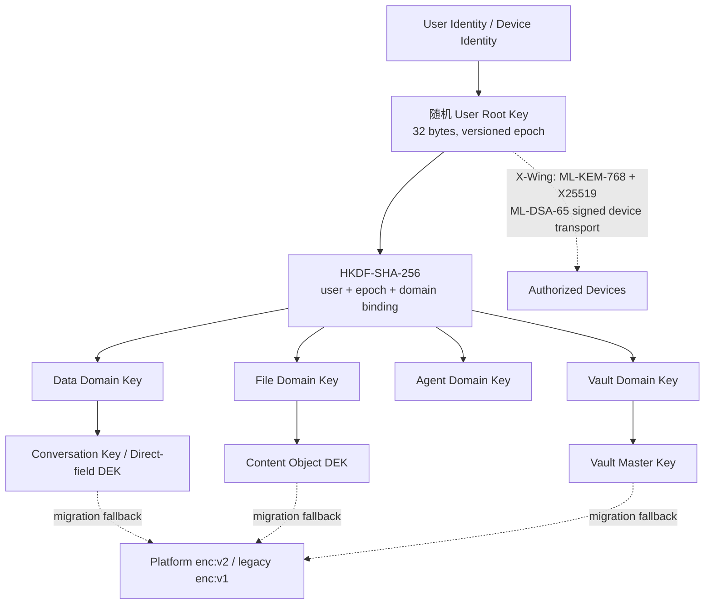

# Athena 密钥派生架构最终验收报告

日期：2026-07-24

环境：本地 development 真实数据与运行时

结论：**工程实现通过；真实数据切换与旧平台密钥退休暂不通过（NO-GO）**

## 1. 最终判断

Athena 适合采用 User Root Key + KDF + Data Key 分层架构。当前实现已经形成
可部署的安全边界：



核心设计符合以下原则：

- URK 是随机持久根密钥，不直接由密码生成；密码变化不会迫使业务密文重加密。
- 密码派生材料或 X-Wing 共享秘密只作为包装密钥，不进入 URK 的域派生函数。
- HKDF 上下文绑定 `authUserId + rootEpoch + domain + suiteId`，Data、File、
  Agent、Vault 域相互隔离。
- 业务数据继续使用随机 Conversation Key、Content DEK、VMK；迁移通常只需
  重包装，不需重写大体积密文。
- 用户域包装使用 AES-256-GCM，并把
  `rootKeyId/rootEpoch/domainKeyVersion/domain/resourceType/resourceId`
  绑定进 AAD。
- 设备同步使用 X-Wing 混合 KEM，并保持 ML-DSA-65 签名和降级拒绝。
- 平台 Key 只保留迁移期 fallback，退休前必须通过覆盖率、设备、Agent、备份、
  零读取观察期和关闭旧写入等全部门禁。

## 2. 本轮完善性优化

### 收口证据

- 所有演练证据必须绑定精确 `keyId`、环境和 `decrypt_only` 状态。
- 生产证据最长有效 7 天，开发默认 24 小时；证据必须晚于观察期起点。
- 旧证据或为 active key 生成的证据不能被复用。
- 敏感恢复数据库和证据目录已加入 `.gitignore`，文件权限保持 `0700/0600`。

### 零读取观察

- observation log 增加随机 observation ID、序列号、前序哈希和记录哈希。
- 缺日志、缺开始标记、记录损坏或哈希链断裂均 fail closed。
- 生产观察期不可缩短到 30 天以下；开发默认 24 小时。

### 覆盖率审计

- 覆盖全部 active 本地用户；未关联 shared identity 的用户现在是独立阻断项。
- `enc:v1` 不再因缺少 keyId 而漏计。
- provider settings backup 改为递归扫描和递归重包装。
- 文档、向量缓存及 LanceDB 同时识别直接和 `payload.encryptedPayload`
  两种包装结构。
- 数据库、文件、provider backup 和 LanceDB 的全域校验会聚合脱敏失败位置，
  返回非零状态，不再只抛出无上下文 AEAD 异常。

### 密钥退休

- 审计 checkpoint 不再成为旧平台 Key 的永久退休障碍：
  - 轮换前先用旧 custody key 验证完整审计链；
  - 再用目标平台 Key 对同一 checkpoint payload 重新签名；
  - 原签名、公钥、算法与 assurance metadata 保存在
    `retiredSignatureHistory`，不作为运行时解密依赖；
  - 全部更新在单一数据库事务中完成，并在提交前用目标 Key 再次验证整条链。
- development 中 7 个依赖 `sdk_2a74325d2f1d` 的历史 checkpoint 已迁移到
  当前 active key；迁移后 47 条 ledger、14 个 checkpoint 全部验证通过，旧
  checkpoint key 的运行时引用为 0。
- env-file provider 的退休是密码学销毁：删除 key material，只保留
  fingerprint、时间和状态 tombstone。
- retired key 无法再由 provider resolve。
- 退休采用 `decrypt_only → retiring → retired` 两阶段状态：
  - 先在 registry 标记 `retiring`；
  - 再销毁 provider material；
  - 最后把 registry 标记为 `retired`。
- 若进程在销毁后中断，下次命令根据 tombstone 对账完成；已退休命令幂等返回。
- Key Custody 在销毁前会再次验证迁移证明与 Phase 4 closure proof，不能由调用方
  绕过。

### 备份恢复门禁

- main DB 和 shared-auth DB 必须真实恢复并通过 SQLite quick check 与外键检查。
- 必须验证指定 closure key 的 custody round trip。
- 新增“所有加密域可读”硬门禁；任何数据库、文档、向量、LanceDB 或 provider
  backup 密文不可读都会使备份证据失败。

## 3. 自动化与密码学验收

| 验收项 | 结果 | 证据 |
|---|---:|---|
| Node 24 安全测试矩阵 | PASS | 29 suites / 197 tests |
| 最终收口专项回归 | PASS | 4 suites / 22 tests |
| 审计签名迁移回归 | PASS | 13 suites / 64 tests |
| 静态检查 | PASS | 修改过的 Key Closure、Rotation、Custody、Evidence 文件 lint 通过 |
| Node/OpenSSL | PASS | Node 24.18.0 / OpenSSL 3.5.7 |
| ML-KEM-768 | PASS | key generation + encapsulation/decapsulation |
| ML-DSA-65 | PASS | runtime capability 与签名互操作 |
| 混合协议 | PASS | 10/10：组合、降级拒绝、破坏拒绝、双签名、Agent、iOS 互操作 |
| 真实 iOS 登录与设备绑定 | PASS | iOS 26.5；P-256 + ML-DSA-65；X-Wing 设备 Key Generation 1 |
| 真实用户 Root 初始化 | PASS | Root Epoch 1；Root 仅保存在设备 Keychain；服务端保存设备 Envelope |
| 真实用户域迁移 | PASS | 99/99：Chat 90、File 9、失败 0；三个迁移 lane 均 completed |
| 用户域专项 E2E | PASS | Chat/File/Vault、enc:v2 fallback、X-Wing、幂等重放、不重写密文 |
| Key Custody 边界审计 | PASS | 1000 个服务端文件；0 finding |
| Crypto Agility 边界审计 | PASS | 1675 个文件；0 finding |
| 数据库恢复 | PASS | main/auth 均物理恢复；quick check OK；0 FK violations |
| Key custody round trip | PASS | 当前目标 key 可恢复并完成 AES-GCM round trip |
| 开发服务 | PASS | frontend 3000、backend 3002、collector 8889 均运行；HTTPS 200 |
| 全加密域可读 | PASS | 883 次尝试，883 成功，0 失败 |

生产镜像与本次本地真实验收均使用 Node 24。本地服务当前为 Node 24.18.0 /
OpenSSL 3.5.7；ML-KEM-768、ML-DSA-65 和 iOS raw ML-DSA-65 互操作均通过。
Node 22 只能作为兼容性测试目标，不能执行 X-Wing/ML-KEM 高风险操作；服务端和
iOS 客户端对此保持 fail closed。

## 4. 真实数据状态

### 用户与认证

| 指标 | 当前值 |
|---|---:|
| main 用户 | 4 |
| shared-auth 用户 | 4 |
| 已关联 shared identity 的 active 本地用户 | 3 |
| 未关联 shared identity 的 active 本地用户 | 0 |
| 已禁用并隔离的未关联本地用户 | 1 |
| 已初始化 URK 的 active shared identity | 1 / 3 |
| 已初始化 URK 的 shared-auth 用户 | 1 / 4 |
| bcrypt 密码凭据 | 2 |
| Argon2id 密码凭据 | 1（33.33%） |
| `legacy_unknown` 凭据 | 1 |

新密码使用 Argon2id v19，参数为 64 MiB、3 iterations、parallelism 1、32-byte
output，并支持受权限保护的 pepper 文件。现有 bcrypt 登录成功后会自动升级；
当前真实管理员用户登录已触发 bcrypt → Argon2id 渐进升级，并完成 Root 初始化和
设备授权；密码仍未作为 Root 或业务数据密钥使用。未发现明文密码存储。原
`legacy_unknown` 且未关联 shared identity 的 `sync-audit` 本地账户已经禁用、
暂停并写入安全审计事件，没有删除其数据；因此它不再属于 active 迁移覆盖范围。

### 真实用户 Root 与用户域包装

当前用户 `userId=4 / authUserId=1`：

- Root 状态：ready，Epoch 1；服务端 Root 审计为 1 个 active epoch、1 个已消费
  设备 Envelope、0 pending/expired Envelope、0 outstanding challenge。
- iOS 客户端已绑定 `request-device-mldsa65-v1` 与
  `vault-xwing-mldsa65-v1`，Vault Key Generation 为 1。
- Chat Conversation Key：90/90 active，`domain=data`。
- Content DEK：9/9 active，`domain=file`。
- 总覆盖率：99/99，pending 0，missing 0，coverage 100%。
- 全部包装保存
  `wrapVersion=athena-user-domain-key-wrap:v1`、`rootKeyId`、
  `rootEpoch=1`、`domainKeyVersion=1` 和 `platformWrapVersion=enc:v2`。
- 三个 migration job（Chat、File、空 Vault lane）均为 `completed`，失败 0。
- iOS 实际迁移显示：发现 99、完成 99、设备材料待处理 0、失败 0。

### 平台 Key 引用

当前 active key：`sdk_6779802534f4`

| 域 | 引用数 | 其中 legacy `enc:v1` |
|---|---:|---:|
| 数据库及审计 checkpoint | 102 | 0 |
| document store | 31 | 31 |
| vector cache | 30 | 14 |
| provider settings backup | 2 | 0 |
| managed environment | 2 | 0 |
| LanceDB | 695 | 642 |
| **合计** | **862** | **687** |

当前 Phase 4 blockers：

- `platformReferences = 862`
- `usersWithoutSharedIdentity = 0`
- `usersWithoutRoot = 2`
- closure key 仍为 `active`，不是 `decrypt_only`
- 观察期尚未开始，hash-chain observation log 不存在
- legacy writes 尚未关闭
- 设备/恢复、Agent/headless、备份恢复证据尚未形成可接受的最终绑定证据

### Provider backup 与 managed env 完整性

全域校验确认：

- database secrets：117/117 可读
- document files：31/31 可读
- vector cache files：30/30 可读
- LanceDB rows：695/695 可读
- provider backup values：5/5 可读
- managed env values：5/5 可读

2026-07-24 已通过本机隐藏输入重新生成 Gate `enc:v2` 包装，并同步 managed env
与 provider backup。完整重启后，Gate 配置解密、全域验证以及总资产、现货账户、
合约账户/持仓、挂单、成交和钱包历史只读探测全部通过。

## 5. 风险评级

### P0：必须在任何旧 Key 退休前处理

1. 当前管理员用户已完成；仍需为另外 2 个 active 用户及其设备初始化 URK、设备
   信封和恢复包。
2. 当前用户 99 个 Chat/File 业务密钥已完成用户域重包装；仍需处理 862 个平台
   引用中的文档、向量、LanceDB、直接字段、审计与系统级密钥。迁移必须继续使用
   batch、checkpoint、幂等键和覆盖率审计。

### P1：迁移后、退休前

1. 轮换平台 Key，使旧 key 进入 `decrypt_only`。
2. 启动 hash-chained 观察期；生产至少持续 30 天。
3. 在观察期末重新生成绑定到同一 decrypt-only key 的三类新鲜证据。
4. 确认所有 Agent、后台 worker、scheduled job、设备同步、恢复包和完整备份恢复
   均通过。
5. 只有覆盖率 100%、全域可读、零读取命中后，才关闭 legacy writes。
6. 最后执行两阶段 crypto-erasure retirement。

### P2：持续治理

- 通过真实用户登录把 bcrypt 渐进升级为 Argon2id，并审计 Argon2id 覆盖率。
- 将本地 keyring 迁移到正式 KMS/HSM/Vault lease provider；外部 provider 也必须
  实现等价的不可恢复销毁和退休对账语义。
- 保持 PQ suite registry、Node 24/OpenSSL 能力探针和混合签名发布证据。

## 6. 推荐迁移顺序

1. 完成 URK、设备信封与恢复包初始化。
2. Chat：只重包装 Conversation Key。
3. File：只重包装 Content DEK。
4. Vault：授权设备解开 VMK 后包装到 Vault domain key。
5. 文档、向量、LanceDB、直接字段：先引入随机 DEK 或分批解密重加密。
6. 持续双读；新写只产生带 `wrapVersion/rootKeyId/domainKeyVersion` 的用户域包装。
7. 达成 100% 后轮换平台 Key；轮换任务同时迁移 audit checkpoint 签名。
8. 旧 Key 进入 decrypt-only 并开始观察期。
9. 重做所有证据、关闭旧写入、两阶段退休旧 Key。

Gate 凭据必须在本机交互终端中隐藏输入，不要粘贴到聊天或命令参数：

```bash
cd /Users/shijie/Desktop/anything-llm/server
yarn gate-credentials:repair --apply --execute --env development
```

该命令会同时更新 managed env 和 provider backup，执行全加密域复验；任一步
失败都会恢复原文件。成功后需要重启 development 服务。

## 7. 不建议修改

- 不要把密码直接作为数据加密密钥，也不要让改密码触发全量数据重加密。
- 不要用 ML-KEM/ML-DSA 替代 AES-GCM 或 HKDF；格密码用于密钥传输与签名边界。
- 不要立即重写 Chat/File/Vault 的大密文；优先重包装随机业务密钥。
- 不要在覆盖率、恢复演练或观察期未通过时删除旧 key material。
- 不要把所有设备、Agent 和 Vault 共用同一派生 key。
- 不要自动删除或覆盖无法解密的 provider backup；必须由凭据所有者重新授权。

## 8. 最终验收状态

**工程架构：GO。** Root/KDF/Domain Key、PQ 设备传输、双读双写、渐进迁移、
覆盖率审计、证据绑定、观察期和 crypto-erasure 退休链路已完成并通过自动化测试。

**当前管理员用户数据切换：GO。** 真实 iOS 设备已完成 PQ 客户端绑定、Root
Epoch 1 初始化以及 99/99 Chat/File 密钥重包装；pending 0、missing 0、失败 0。

**全局 development 数据切换：NO-GO。** 全加密域现已 883/883 可读，未关联
active 用户已清零，历史 checkpoint 已完成安全重签；但真实数据仍有 862 个当前
active 平台 Key 引用，且另外 2 个 active shared identity 尚未初始化 URK。

**旧平台 Key 退休：NO-GO。** 这是门禁的正确行为。当前未关闭 legacy writes，
未开始观察期，也未销毁任何现用 key material。
