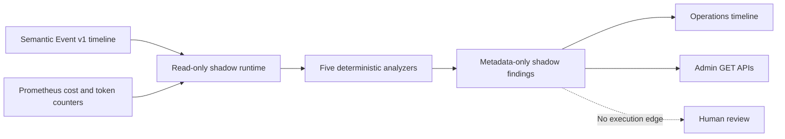

# Phase 3: Operations Agents in Shadow Mode

## Scope

Athena runs five Operations Agents as read-only observers:

| Agent       | Responsibility                                         | Production actions |
| ----------- | ------------------------------------------------------ | ------------------ |
| Monitoring  | Detect incident candidates                             | Never              |
| RCA         | Rank up to three evidence-backed root-cause candidates | Never              |
| Performance | Detect timeout and latency regressions                 | Never              |
| Security    | Detect metadata-only security anomalies                | Never              |
| Cost        | Detect model token and cost window regressions         | Never              |

Every registered agent has `mode=shadow`, `actionPolicy=observe_only`, and
`canExecuteActions=false`. Findings contain human-review advisories only. The
runtime has no Action Catalog, shell, deployment, database mutation, or repair
executor dependency.

## Data flow



The first scan establishes Prometheus counter baselines. Cost analysis uses
subsequent deltas, so process startup totals cannot create a false cost finding.
Repeated findings are deduplicated by a stable finding ID before publication.

## Historical incident corpus

The versioned corpus is stored at
`server/utils/operations/evaluation/incidents-v1.json`. It includes:

- Incidents from Athena's distributed architecture defect ledger.
- A tool timeout regression fixture.
- A security disaster-recovery drill reference.
- A clearly labeled cost fault-injection case because no truthful historical
  cost incident exists yet.
- Healthy and benign controls for false-positive measurement.

The public corpus endpoint returns provenance and case identifiers only. Raw
observations and expected labels remain server-side evaluation fixtures.

## Evaluation metrics

- **Recall**: detected incident cases divided by expected incident cases.
- **False-positive rate**: control cases with any finding divided by all control
  cases.
- **RCA Top-3 hit rate**: incident cases whose expected root cause appears in
  the first three RCA candidates divided by RCA-labeled incident cases.
- **Evidence completeness**: expected evidence references recovered divided by
  all expected evidence references.

Prometheus exports:

- `athena_operations_shadow_agent_runs_total`
- `athena_operations_shadow_findings_total`
- `athena_operations_shadow_evaluation`

The initial deterministic v1 corpus is a regression baseline, not proof of
production accuracy. New real incidents must be added with immutable provenance
before using these metrics as a promotion gate.

## Read-only APIs

All routes require an authenticated administrator and return
`Cache-Control: no-store`:

- `GET /api/operations/shadow-agents`
- `GET /api/operations/evaluations/latest`
- `GET /api/operations/evaluations/corpus`

No POST, PUT, PATCH, or DELETE route is exposed for Operations Agents.

## Configuration

Shadow mode is fail-closed and disabled by default:

```dotenv
ATHENA_OPERATIONS_SHADOW_AGENTS_ENABLED=false
ATHENA_OPERATIONS_SHADOW_INTERVAL_MS=60000
ATHENA_OPERATIONS_SHADOW_LOOKBACK_MS=900000
ATHENA_OPERATIONS_SHADOW_COST_THRESHOLD_MICROS=25000000
ATHENA_OPERATIONS_SHADOW_TOKEN_THRESHOLD=5000000
```

The AI Operations compose overlay enables shadow collection only after the
Operations Plane dependencies are configured. Enabling it does not grant any
production mutation capability.

## Promotion boundary

This phase cannot be promoted to automatic remediation. A future controlled
automation phase requires a separate reviewed Action Catalog, risk model,
dry-run contract, approval authority, rollback contract, and immutable audit
record. None of those capabilities are linked to the shadow runtime.
