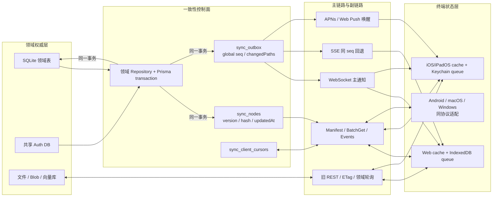

# Athena 统一跨设备状态树现阶段最终报告

报告日期：2026-07-18

## 结论

本轮已经把 Sync V2 建成现有架构之上的统一同步控制面，并完成 Web 与 iOS/iPadOS 协议实现。它不复制业务正文，也没有替换 REST、聊天生成 SSE、Agent WebSocket、APNs、ETag 或领域缓存。业务表仍是权威数据源；状态树负责版本、Hash、可见范围、事件游标和缓存失效；SQLite 事务 Outbox 把领域写入与同步事件绑定在同一事务中。

当前可运行状态为：服务端启用 12 个同步域，数据库中 261 个节点，186 个权威投影通过只读审计，0 缺失、0 Hash 不一致、0 权限投影冲突、0 Outbox 积压。Web 具备缓存先显、摘要 manifest、增量补拉、可靠 ACK、SSE 回退、加密离线队列与冲突中心；iOS/iPadOS 具备相同描述符、受保护缓存、Keychain 游标和受保护 mutation queue，并已在 iPhone 17 Simulator 完成编译及 4 项目标测试。

## 当前架构



实时传输和一致性校验被明确分开：WebSocket/SSE/APNs 只通知“哪个节点到了哪个版本/游标”；客户端通过 manifest、batchGet、事件补拉和定期 Hash 校验确认缓存内容。收到通知不等于 ACK，只有节点被读取、应用并可靠持久化后才推进 `lastAppliedSeq`。

## 已落地的数据流

写入路径：领域 API 校验权限和 `baseVersion`，Repository 在一个 Prisma transaction 内写业务表、递增 `sync_nodes.stateVersion`、更新 SHA-256、追加带全局 `seq` 的 Outbox。dispatcher 双发到现有 Broadcast Center、Sync V2 SSE 与 APNs 唤醒；旧事件和旧 API 保留。

启动路径：客户端先恢复允许 stale-while-revalidate 的本地缓存，然后携带本地 `manifestHash` 拉 manifest。摘要相同则服务器返回空节点清单和新 checkpoint；摘要变化才返回完整可见描述符。客户端仅水合 `eager` 节点，随后从本地游标补拉事件、建立 WebSocket，并在后台抽样 Hash。`lazy` 节点在事件到达、页面进入或定期抽检时按节点读取。

断线路径：WebSocket 断开后 Web 自动切到消费同一 Outbox `seq` 的 SSE；恢复连接前先走 `/events?after=`。iOS 由 APNs checkpoint 唤醒后执行同一补拉。事件超过 30 天保留期时返回 `requiresFullSync`，客户端从新 manifest checkpoint 重建 eager 节点。

离线路径：`dirty`、尝试次数、依赖和失败原因只存在客户端加密队列。mutation 带 `mutationId`、`baseVersion`、operation 和 payload；同节点串行、跨节点并行。安全、权限、账务、聊天发送、Agent/任务启动仍拒绝离线重放。

## 节点树与一致性模型

| 节点类别                                     | 当前模型                           | 水合/通知                      | 当前状态                                           |
| -------------------------------------------- | ---------------------------------- | ------------------------------ | -------------------------------------------------- |
| `users/{id}/profile`                         | version + hash                     | eager，实时失效                | 已物化                                             |
| `users/{id}/preferences/{namespace}/{scope}` | version + hash + Merge Patch       | 启动白名单 eager，其余 lazy    | 已物化 41 个；Reader/草稿等页面态不阻塞启动        |
| `users/{id}/security/policies`               | version + hash，验证后生效         | eager，实时                    | 已物化                                             |
| `security/clients`、`security/passkeys`      | version + hash，敏感字段排除       | lazy，实时失效后重读安全 API   | 已物化                                             |
| `security/sessions`                          | event cursor + authority revision  | lazy / security-revalidate     | 共享 Auth DB 权威；Outbox 通知并周期对账           |
| `users/{id}/entitlements`                    | version + hash，验证后生效         | eager，实时                    | 已物化                                             |
| `users/{id}/notifications`                   | event cursor                       | lazy，唤醒/按需                | 已物化的是 Web Push 能力，不是通知收件箱           |
| `users/{id}/integrations`                    | version + hash                     | lazy，按需                     | 仅注册；现有连接器不是安全的用户级权威             |
| `users/{id}/memory/candidates`               | event cursor                       | lazy，延迟合并                 | 已物化                                             |
| `memory/structured`、`memory/persona`        | version + hash                     | lazy，按需/定时校验            | 已物化                                             |
| `users/{id}/workspaces/index`                | version + hash                     | eager，实时                    | 已物化                                             |
| `workspaces/{id}/metadata`                   | version + hash                     | eager，实时，可离线            | 已物化                                             |
| `members`、`permissions`                     | version + hash，领域 API 权威校验  | lazy，成员/权限页面按需        | 已物化；客户端不以缓存正文授予权限                 |
| `workspaces/{id}/threads/index`              | version-only                       | eager，实时                    | 已物化；投影按用户授权过滤                         |
| `workspaces/{id}/documents`                  | version + hash                     | lazy，实时/按需                | 已物化；仅元数据和处理状态                         |
| `threads/{id}/metadata`                      | version + hash                     | lazy，实时，可离线             | 已物化                                             |
| `threads/{id}/messages`                      | append/edit/delete event cursor    | lazy，实时 + 增量历史 API      | 已物化；不 Hash 整个消息列表                       |
| `read-state`                                 | monotonic cursor                   | lazy，延迟合并                 | 协议已注册，暂无服务端权威                         |
| `drafts`                                     | version merge；协同编辑时才用 CRDT | lazy，可离线                   | 协议已注册，暂无服务端权威                         |
| `attachments`                                | event cursor + Blob 引用           | lazy，按需                     | 协议已注册；Blob 不入树                            |
| `cognition`、`agents`、`meetings`            | append-only event cursor           | lazy，领域流为主、Sync V2 修复 | 已物化                                             |
| `tasks`、`workflows`                         | event cursor                       | lazy                           | 仅注册；现有 scheduled jobs 无安全 workspace owner |

运行库中的 261 个节点由 68 个消息游标、68 个线程元数据、41 个用户偏好，以及 profile、安全、记忆、工作区、文档、认知、Agent、会议、通知能力和权益节点组成。

密码、私钥、API Key、OAuth token、连接器 Secret、LLM token 流、行情 tick、音视频流、原始 Blob、文档正文和向量数据不进入普通状态树。

## 冲突与幂等策略

- `updatedAt` 只由服务器生成，用于展示、排序和审计；冲突真相是 `stateVersion`、事件 cursor 或领域逻辑时钟。
- mutation 使用 `If-Match` 与 `Idempotency-Key`。同一个 mutation ID 与 canonical request Hash 绑定；完全相同的重试返回原结果，不同语义复用返回 409。
- 只有服务器保留从 `baseVersion + 1` 到当前版本的完整 Outbox 路径，且 `changedPaths` 不相交时，才自动 rebase。
- 同字段并发进入客户端冲突中心，保留本地值、服务端值、当前描述符和显式重试入口，不静默覆盖。
- 消息发送使用 `clientTurnId` 幂等，编辑使用 `messageVersion`，删除写 tombstone；长线程按 cursor/ETag/分页增量读取。
- 同版本不同 Hash 触发缓存清除、节点重新读取和异常计数，客户端不能自行升版本。

## 公共协议与数据库

已提供：

```text
GET   /api/sync/v2/manifest?manifestHash=...
POST  /api/sync/v2/nodes:batchGet
GET   /api/sync/v2/events?after={seq}
GET   /api/sync/v2/stream?after={seq}
POST  /api/sync/v2/cursor
POST  /api/sync/v2/mutations:batch
PATCH /api/sync/v2/nodes/{nodeKey}
WS    /api/realtime/broadcast
```

WebSocket 支持原子 `replaceSubscriptions`；SSE 使用同一 Outbox sequence 并兼容 `Last-Event-ID`；APNs 只携带唤醒原因和 checkpoint。数据库已增加 `sync_nodes`、`sync_outbox`、`sync_client_cursors`，并扩展 mutation receipt 的 base/result version、request Hash、结果与过期时间。状态树只保存同步元数据，业务正文仍由领域 Repository 读取。

## 实测性能

完整测试轮以 `npm run sync-v2:benchmark` 对同一份开发 SQLite 权威数据做只读比较。旧路径模型包含工作区列表、逐工作区详情、逐工作区线程列表和最近线程历史；Sync V2 包含 manifest、eager 节点批拉与事件补拉。

| 口径               | 冷启动改善 | 暖启动改善 |
| ------------------ | ---------: | ---------: |
| 活跃账户请求数     |    -77.78% |    -85.19% |
| 活跃账户业务字节   |    -58.16% |    -99.74% |
| 活跃账户 gzip 字节 |    -58.78% |    -98.82% |
| 全账户请求数       |    -58.62% |    -72.41% |
| 全账户业务字节     |    -51.34% |    -99.49% |
| 全账户 gzip 字节   |    -49.49% |    -97.65% |

真实 HTTPS 端点对拥有 221 个可见节点的账户返回：完整 manifest 44,339 字节，摘要命中后 212 字节，单次响应缩小 99.52%。字段收紧前完整 manifest 为 66,455 字节，本轮额外减少 33.28%。

最终代码下本机各 20 次暖请求样本中，完整 manifest p95 为 31.20 ms，摘要 manifest p95 为 24.24 ms，下降 22.31%。摘要仍会重新查询可见节点并计算权限敏感 Hash，所以本轮主要收益是请求扇出和网络载荷，而不是宣称服务器计算降到 O(1)。冷同步的 eager 投影读取也比旧导航 SQL 更重；它通过少请求和少传输换取统一缓存基线。生产 p95 TTI 的 30% 目标必须在灰度真实设备遥测后验收，本报告不把模型基准冒充真实用户 TTI。

聊天增量 Hash Chain 使用隔离真实 SQLite 对 10、100、1000 条历史分别执行 120 次追加：p95 为 0.800、0.679、0.897 ms。1000 条相对 10 条只劣化 12.125%，满足不超过 20% 的门槛；360 次追加均未触发完整 rebuild，最终 2508 条 chat/metadata 0 缺失、0 断链。由此，普通 append 已从随历史长度增长的全链重建变成链尾查询加增量 upsert；编辑、删除、移动、轮换和审计修复仍有意保留 rebuild 副链路。

WorkspaceChat 确定性压力模型中，shell 工作量下降 95.6%，首屏消息/路由切换下降 94.2%，merge 下降 91.0%，最长任务下降 91.2%，mounted DOM 下降 98%。隔离本地 production 浏览器样本中，工作区首线程 shell 约 8.1 ms、无 long task、关键 HTTP 失败为 0；该样本用于链路正确性和明显回退检查，不代替真实用户 TTI 灰度数据。

## 验证结果与缺陷闭环

按照“完整轮只记录、结束后批量修复、之后只做定向回归”的规则执行：首次完整轮发现 D01-D11，随后全部关闭，未重新运行全量套件。

- 服务端：Sync V2 核心定向套件 14/14；mutation 4/4；聊天加密、data access、passkey、thread move、client identity 邻接回归通过。根 Jest 收集边界现在只包含 202 个源码测试文件、0 个 `dist-desktop` 重复路径。
- Web：原失败集及相邻用例 23/23；目标 ESLint/Prettier、Vite production build 与构建产物安全检查通过。事件按页面/25 ms 微批去重，节点批拉后才一次提交 descriptor 与可靠 ACK。
- iOS/iPadOS：iPhone 17 Simulator 编译通过，`NativeSyncV2ProjectionTests` 4/4；这证明目标投影/批处理路径可编译并通过单测，不宣称已完成登录态 iOS E2E。
- 安全：security hardening audit 扫描 331 条路由为 0 findings；resource communication audit 为 0 新增、0 blocked；生产 strict validator 保持 fail-closed。
- 真实开发链路：HTTPS `3000/3002`、鉴权 REST、SSE ready、WSS ready/replaceSubscriptions/pong 通过。
- 真实生产链路：以短期强随机配置启动 HTTPS `3001` 与 collector `8888`；登录页、工作区、线程切换及 Crypto Center 关键 HTTP 失败均为 0，带 Origin 的主资源为 200。测试后生产已停止。
- 鉴权客户端存储：隔离 QA 身份下 localStorage 0、IndexedDB 0，sessionStorage 只有 token/user，0 findings；QA 用户与工作区已删除，`multi_user_mode=false`。
- 运行库审计：261 nodes、186 projections、0 inaccessible、0 missing payload、0 Hash mismatch、0 projection conflict、0 non-hash-node Hash、0 pending Outbox。
- 最终轻量门禁：`git diff --check`、关键 JavaScript/Shell 语法和 Prisma schema validate 通过。

完整轮后的本地开发专项又使用“金钱心理学”工作区的 3 份真实解析文档完成 Reader UI 闭环：状态树 metadata 缓存先恢复，进入工作区文档页时才通过领域 API 懒加载 1 次文档列表，3/3 文档可见；选择器打开和历史重开都只产生 1 次 `from-workspace` 200 并成功渲染正文。历史重开修复前会先产生 2 次临时 Reader-ID 404，并在恢复副链路中累计 7 次 `from-workspace` 尝试；修复后 Reader 领域请求由 9 次降到 1 次（-88.9%），且不把文档正文或完整列表塞入状态树。同步冲突中心也可折叠，测试没有替用户选择冲突值。

这项证据覆盖真实开发数据、真实 HTTPS 和浏览器交互，但仍不等同于 production 灰度账号或 iOS 登录态 E2E；生产 p95 和跨设备真实冲突率仍按发布阶段遥测验收。

## 当前风险与后续动作

架构控制面已经完整，但以下事项必须保持诚实边界：

1. 当前 dispatcher 是单实例 memory broadcast。多实例部署前需要实现 Redis Streams 或 NATS transport adapter；这不改变客户端协议。
2. Auth DB 中的通行密钥与环境 DB Outbox 不能跨 SQLite 原子提交。当前采用 Auth 写入为权威、即时 reconcile 为主补偿、manifest/Hash 为副修复链路。
3. Android、macOS 和 Windows 目前是协议可接入，不是原生客户端已经交付。Windows 本地独立 SQLite 仍是设备隔离模式，只有远程权威服务模式才能跨设备。
4. 可枚举会话已由共享 Auth DB Session V2 补齐；通知收件箱、用户级连接器、workspace-owned task/workflow、服务端草稿/已读权威仍不存在，在领域模型建立前不应伪造空节点。
5. 协作文档正文需要 OT/CRDT 或操作日志；高频消息、流式 token、行情和媒体流继续走领域通道，状态树只做一致性控制和修复。
6. 下一发布动作应是影子观测、Web 小流量、iOS TestFlight、生产 p95/失败率验收；旧接口连续两个稳定版本且至少 30 天无调用后再下线。

回滚只需关闭服务端/客户端/领域 feature flag；旧读取路径仍在，状态树和 Outbox 表保留，不执行反向删除。
