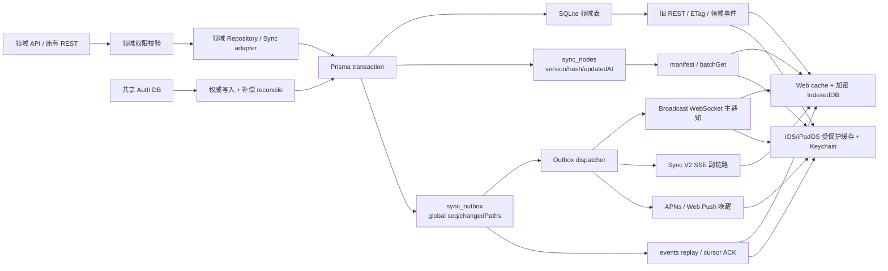

# Athena Sync V2 全链路完整性评估

评估日期：2026-07-18

## 评估结论与测试门禁

本轮完成了服务端、Web、iOS/iPadOS、数据库、缓存、实时通知、离线队列、权限和运维回滚边界的静态闭环复核。结论为：**架构门禁 PASS，可以冻结实现并进入一次完整测试阶段**。

通过不代表把所有业务数据塞进状态树，而是下列边界已经闭合：

1. 领域表继续作为业务权威；`sync_nodes` 只保存版本、Hash、更新时间、删除标记和访问范围，`sync_outbox` 只保存可恢复事件。
2. 已接入领域写入在同一 Prisma transaction 内提交业务数据、节点版本与 Outbox；跨共享 Auth DB 的写入使用显式补偿 saga，不伪造跨库原子性。
3. Web 和 iOS/iPadOS 都先恢复允许 stale-while-revalidate 的受保护缓存，再校验 manifest、批拉缺失 payload、补拉 cursor，最后进入实时通知。
4. descriptor 与 payload 可用性分开记录；只有版本、没有正文时会强制 `knownVersion=0` 补拉，mutation receipt 不会让旧 payload 冒充新版本。
5. WebSocket 为低延迟主通知；SSE、APNs、REST cursor、manifest、定期 Hash、聊天 ETag/指纹和旧领域读取构成独立副链路。通知接收与一致性 ACK 明确分离。
6. Web 节点归档和 mutation queue 必须使用 AES-GCM；加密不可用时拒绝离线排队，不降级为明文。iOS 使用受保护归档与 Keychain 队列。
7. 成员、权限、安全、会话和权益投影不能凭缓存授予权限；manifest、batchGet、events、dispatcher 和最终领域 API 都重新鉴权。
8. 偏好自动 rebase 在事务内读取最新正文后应用 Merge Patch；只有完整版本历史且 changedPaths 不相交时允许自动合并。
9. SSE 内联回放超过一页时，客户端通过同一 Outbox cursor 转入 REST 分页补齐，不会跨过突发事件。
10. 注销和账号切换会按 ownerScope 清除 descriptor、节点归档、cursor、失败队列和领域缓存，再销毁本地缓存密钥。

以下是有意保留的边界，不是测试阻断项：

- 单实例使用 memory broadcast；多实例前必须实现 Redis Streams/NATS adapter。
- passkey 和共享身份库使用权威写入加补偿/reconcile，不能跨 SQLite 宣称原子事务。
- integrations、tasks/workflows、read-state、drafts、attachments 仅注册协议模型；在稳定且可鉴权的领域权威出现前不物化空节点。
- sessions 已由共享 Auth DB `auth_sessions` 提供可枚举权威，通过 lazy `security-revalidate` 节点联动；状态树只传失效事件和来源修订，不缓存令牌，也不替代请求时 Session 权威验证。
- Android、macOS、Windows 已可复用协议，但本轮交付客户端是 Web 与 iOS/iPadOS；Windows 本地 SQLite 模式仍保持设备隔离。

## 当前实际架构

完整写入链路为：领域鉴权 → Repository → 单库事务写领域表 → `stateVersion` 递增/Hash 更新 → Outbox 全局 `seq` → dispatcher → WS/SSE/APNs → 客户端按节点 batchGet → 领域缓存投影 → 持久化 descriptor/payload → cursor/ACK。

完整恢复链路为：本地受保护缓存先显 → manifest 权限与版本校验 → eager payload 缺失补拉 → `/events?after=` 分页 → WS 主链；主链断开后 SSE 接管，SSE 页数超限再由 REST cursor 补齐。周期 Hash 只负责漂移检查，不承担实时消息传输。

## 领域接入矩阵

| 领域                          | 权威与模型                                        | 事务/补偿接入                                               | 客户端行为                           | 门禁结论           |
| ----------------------------- | ------------------------------------------------- | ----------------------------------------------------------- | ------------------------------------ | ------------------ |
| Profile                       | 环境用户表；version+hash                          | 主写事务接入；共享 Auth 失败显式补偿                        | Web/iOS 直投影，安全字段保留认证权威 | 通过               |
| Preference                    | user_state_preferences；version+hash+Merge Patch  | 事务内读取最新值、版本检查和 Outbox                         | 启动白名单直投影，其余 lazy          | 通过               |
| Workspace index/metadata      | workspace/workspace_users；version+hash           | create/update/delete/membership 已接入                      | Web/iOS 直投影并清理被撤权缓存       | 通过               |
| Members/permissions           | workspace_users；version+hash                     | 所有模型入口接入                                            | 仅管理员可读；客户端只作复验触发     | 通过               |
| Thread index/metadata         | index version-only；metadata version+hash         | create/update/delete/archive/restore/move/自动标题接入      | Web/iOS 直投影                       | 通过               |
| Chat messages                 | 事件日志+cursor+historyRevision                   | append/edit/delete 与 Outbox 同事务；append Hash Chain 增量 | 增量历史/ETag，整表不 Hash           | 通过               |
| Documents                     | metadata version+hash；status event cursor        | 文档写与处理状态稳定边界接入                                | 元数据按需；处理状态只触发失效       | 通过               |
| Security clients              | version+hash                                      | 注册/撤销接入                                               | 只触发认证 API 重读                  | 通过               |
| Passkeys                      | Auth DB 权威+reconcile                            | 跨库补偿副链路                                              | 只触发认证 API 重读                  | 通过，保留跨库边界 |
| Sessions                      | event cursor                                      | 未物化                                                      | 无可枚举权威时不进入树               | 有意暂缓           |
| Memory                        | candidate cursor；structured/persona version+hash | 稳定用户可见写边界接入                                      | 敏感正文不进普通缓存                 | 通过               |
| Cognition/Agent/Meeting       | append-only event cursor                          | 稳定创建/完成/审计边界接入                                  | 领域流为主，Sync V2 修复             | 通过               |
| Notifications                 | capability cursor                                 | Web Push 能力字段接入                                       | 不是通知收件箱                       | 通过，边界明确     |
| Entitlements                  | version+hash                                      | 权威字段接入                                                | 必须认证重读后生效                   | 通过               |
| Integrations                  | version+hash                                      | 未物化                                                      | Secret/token 不入树                  | 有意暂缓           |
| Tasks/workflows               | event cursor                                      | 未物化                                                      | 缺少可靠 workspace owner             | 有意暂缓           |
| Read state/drafts/attachments | monotonic/version-merge/cursor                    | 未物化                                                      | 等待稳定领域权威                     | 有意暂缓           |

## 已关闭的原阻断项

- Web 增加 ownerScope 分区的加密节点 archive；manifest 只有在 payload 持久化和领域投影成功后才提交。
- Web/iOS 在 descriptor 已知但 payload 缺失时强制补拉；同版本异 Hash 拒绝应用并进入修复。
- profile、preference、workspace/thread 投影成功后只抑制对应 legacy 重读，视觉 patch 与安全复验继续执行。
- Web 导航与偏好 hydration、iOS workspace bootstrap 都等待同一 Sync V2 启动主链，真正 miss 才调用领域 REST。
- workspace membership 与 thread archive/restore/move/title 旁路已纳入事务 Outbox。
- 偏好不再以客户端时间戳作为 Sync V2 冲突真相；时间戳只保留给旧服务器兼容路径。
- 共享 Auth 复制失败会生成关联原 mutation 的补偿事件；同幂等键重放返回冲突，不会把被回滚写入报告成成功。
- Web/iOS 事件微批、节点去重、单批 descriptor/archive 提交和可靠 ACK 已闭合。
- Web 与 iOS 都有周期 Hash 抽检；聊天另保留 history fingerprint/ETag 修复副链路。

## 测试执行约束

从本文件门禁 PASS 起冻结实现，开始一次完整测试矩阵。完整轮期间只登记缺陷，不修改代码。完整轮结束后统一修复；此后只运行缺陷定向测试、受影响邻接回归和一次轻量最终证据检查，不再重复整套全量/压力/极限测试。

完整轮覆盖：静态/单元/事务注入、Web build/lint、iOS build/unit、真实 HTTPS 与登录态链路、WS/SSE/APNs/REST 主副链切换、离线与账号切换、长时间断线、乱序/重复/游标过期、权限撤销、Hash 漂移、批量事件、聊天长线程、数据库和网络故障、冷暖启动、并发/压力/极限数据量和回滚开关。
