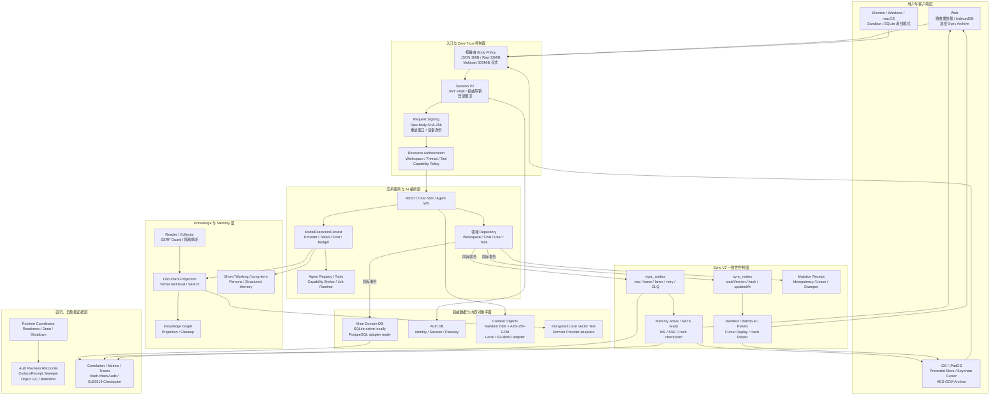

# Athena v2.3 最终架构封板与完善性巡视报告

报告日期：2026-07-21
评审范围：Web、iOS/iPadOS、Desktop、API、Auth、AI/Agent、Knowledge、Memory、Chat、内容对象、Sync V2、Realtime、数据库、安全、可观测性、运行治理与维护 CLI。
结论口径：代码仓库与本机真实开发数据的最终门禁；不把尚未执行的外部生产部署包装成已完成事实。

## 1. 执行结论

Athena v2.3 的仓库级、协议级和本机运行级架构升级已经闭环。系统没有推倒重写原有 REST、Chat SSE、Agent WebSocket、APNs/Web Push、领域表和客户端缓存，而是在其上增加了可独立回滚的一致性控制面、安全边界、内容对象平面、分布式适配层和自愈运行面。

本轮最终巡视关闭了 7 个最后阶段缺陷：Sync Outbox 生命周期耦合、PostgreSQL 方言残留、跨设备单调游标竞态、数据异常静默降级、供应链门禁瞬态失败、只读 CLI 仍可能触碰 SQLite、Chat 迁移缺少磁盘容量前置保护。最终完整矩阵未发现新的产品缺陷。

最终状态分为三层：

- **已完成并由本机真实证据验证**：统一状态树和 Outbox、客户端批量同步与可靠 ACK、Chat 增量 Hash Chain、加密内容对象、Session/权限/签名链、数据访问错误语义、审计账本、运行时协调、自愈任务、SQLite/PostgreSQL 方言边界、NATS/S3/KMS 等适配接口、Web/iOS/Desktop 回归。
- **代码已就绪但仍需外部环境验收**：真实 PostgreSQL cutover、NATS 多实例、S3/MinIO 故障演练、OTel/Prometheus 长期运行、不可变外部审计归档和跨区域灾备。
- **被安全门禁主动阻止**：生产 Chat 约 1.01 GB 主库当前只有约 1.32 GB 可用空间，而安全迁移需要约 2.55 GB。迁移器正确返回 `executeReady=false`，没有写入生产库。应先提供至少 3 GB 可用空间，再执行有备份的显式迁移。

因此，“架构升级完成”在本报告中指代码、协议、迁移工具、安全门禁和本机验证全部封板；不等同于已经替用户完成外部云基础设施或生产数据切换。

## 2. 最终全链路蓝图

## 3. 以用户使用为起点的精准闭环

### 3.1 登录与启动

1. 请求在进入业务前由路由级大小、格式和超时策略约束；超限请求以稳定 413 失败，不分配大型业务对象。
2. 密码、Passkey、ZK/OPAQUE、邀请和 SSO 最终统一为服务端 Session。JWT 只携带会话与身份引用，不携带密码材料。
3. 安全操作读取权威 Session；普通请求允许最长 5 秒正向缓存。退出、设备吊销和封禁清理缓存并进入会话修订对账。
4. Web/iOS 立即恢复允许 stale-while-revalidate 的加密缓存；安全、权限、会话和权益节点在服务端验证前不能授予能力。
5. 客户端读取可见 Manifest，批量比较本地 descriptor，只 BatchGet 变化节点；热点和当前路由优先 hydration，冷节点懒加载或后台预取。
6. 客户端从最后可靠持久化的 Outbox cursor 补拉事件，再建立 WS；SSE、Push、启动校验、定时 Hash 与领域 ETag 是恢复副链路。

### 3.2 Chat、附件、AI 与知识检索

1. 附件通过 staging/multipart 流式进入内容对象层，校验 checksum 后使用随机对象 DEK 做 AES-256-GCM 加密，DEK 由 Key Custody 封装。
2. 对象 ready 后，Chat 事务只建立引用。普通历史分页不读取附件正文，下载时重新验证账户、Workspace、Thread 和 Chat 权限，并支持 Range/ETag。
3. 用户消息进入领域 Repository；AI 路径通过 ModelExecutionContext 统一观察模型、Token、成本、预算、工具和延迟，但保留 Chat、Agent、Reader、Cognition 各自的流式语义。
4. RAG 只从授权 Workspace 的文档、向量和图谱投影取回上下文；本地文档、向量缓存和 LanceDB 文本已加密。
5. 新 Chat 在同一事务内写入业务行、增量 Hash Chain metadata、Sync 节点版本/Hash 和 Outbox。正常 append 为 O(新增消息数)，编辑/删除/密钥轮换保留范围或全链修复副链路。
6. Token 继续通过 Chat SSE 实时返回；完成通知只带 ID、版本、cursor 和对象引用，不把 Blob、密钥或原始 Token 流塞进状态树。

### 3.3 跨设备写入、冲突与恢复

1. Mutation 携带 `mutationId`、`Idempotency-Key`、`baseVersion`、`changedPaths`、操作类型和依赖 ID。
2. Mutation Receipt lease 防止重试产生重复副作用；业务写、节点版本、Hash 和 Outbox 共享主库事务，任何一步失败整体回滚。
3. Outbox 使用全局单调 seq、claim lease、同节点顺序 lane、独立节点有界并行、指数重试和 DLQ；毒事件不会阻塞全队列。
4. Web/iOS 将 25 ms/100 条实时事件微批去重，同一节点只保留最高版本；每 100 节点批量读取，一批只提交一次 descriptor/archive。
5. ACK 表示业务缓存、descriptor、加密 Archive 和 cursor 全部可靠落盘，不是“消息刚收到”。处理失败不推进 cursor，恢复后幂等重放。
6. 后续 changedPaths 不相交时自动 rebase；同字段冲突进入冲突中心。已读 cursor 由数据库原子单调字段保证只前进不回退，删除使用 tombstone。
7. Auth DB 与 Main Outbox 无法单事务提交，因此使用不含 token 和 lastSeen 的 Session 集合修订指纹、幂等 Outbox 通知和周期分页对账恢复漏发。

## 4. 状态、消息与数据权威边界

| 类别 | 权威位置 | Sync V2 角色 | 实时/恢复方式 |
| --- | --- | --- | --- |
| Profile、设置、Workspace 元数据 | 领域表 | version + hash 节点 | WS 主通知；Manifest/BatchGet 修复 |
| 安全、Session、权限、权益 | Auth/领域表 | 只读安全节点，不由旧缓存授权 | 权威读取 + WS/Push 唤醒 + 启动校验 |
| Chat 消息 | Chat 行与消息事件语义 | metadata/version/cursor，不 Hash 整个列表 | Chat SSE + thread cursor + 增量历史 |
| 已读位置 | 专用单调 cursor | 版本化投影 | 原子 max cursor + Outbox |
| 草稿/普通离线设置 | 客户端加密 mutation queue | baseVersion + patch | 在线重放与冲突中心 |
| 文档元数据/权限/标签 | 领域表 | version + hash | 节点通知和按需拉取 |
| 解析、索引、批处理状态 | 任务/事件记录 | event cursor | 增量事件 + 定时校验 |
| 附件、Blob、超大 Tool 输出 | 内容对象/对象存储 | 仅保存引用和处理状态 | 按需授权读取 |
| AI Token 流、行情 tick、音视频 | 专用实时链路 | 不进入普通状态树 | SSE/WS/媒体协议 |
| 密码、私钥、OAuth/API Secret | Key Custody/Secret Provider | 永不进入状态树 | 权威用途调用，不广播正文 |

`dirty`、失败次数、离线队列和未提交草稿只属于客户端本地同步状态；`updatedAt` 只用于排序和审计，冲突真相始终是服务端版本、事件 cursor 或领域逻辑时钟。

## 5. 最终完善性修复

| ID | 已关闭问题 | 最终结果 |
| --- | --- | --- |
| SEAL-D01 | Outbox dispatcher 与客户端 Sync 开关耦合 | 内部 shadow/active 生命周期独立；seq 705 已排空，pending/retry/claim/DLQ 全 0 |
| SEAL-D02 | PostgreSQL 路径残留 SQLite 方言 | 统一 Schema Introspection、迁移所有权和方言边界；PG Schema 验证通过 |
| SEAL-D03 | 加密状态上的 read cursor 竞态 | 独立 `monotonicCursor` + 原子 UPSERT；跨设备只增不减 |
| SEAL-D04 | DB/Key Custody 异常被伪装为空值 | 权威故障统一为 `ModelDataAccessError`/503；机械审计 0，保留 4 个合法输入级 fail-closed |
| SEAL-D05 | 供应链远端瞬态错误直接阻断 | 仅对传输故障做有界指数重试；策略错误仍 fail-closed，尝试次数可审计 |
| SEAL-D06 | “只读” CLI 仍可能触碰 SQLite | Main/Auth/Inspector 使用 `mode=ro`，不建目录、不写 PRAGMA；生产 dry-run 文件完全未变 |
| SEAL-D07 | 1 GB Chat 迁移缺少磁盘容量保护 | 备份 + rewrite + 512 MiB 预留预算；容量不足时在写入前拒绝 |

最终健康探针曾出现一次 404 假阳性：Node 探针没有发送 `Accept: text/html`，Vite 按规范未执行 SPA fallback。按真实浏览器语义复测，Web、API ping、liveness、readiness 和 Collector 全部返回 200；这不是产品回归。

## 6. 性能与容量结果

### 6.1 Sync V2

| 真实开发数据口径 | Legacy | Sync V2 | 改善 |
| --- | ---: | ---: | ---: |
| 活跃账户暖启动请求 | 27 | 4 | -85.19% |
| 活跃账户暖启动业务字节 | 209,431 | 558 | -99.73% |
| 活跃账户暖启动 gzip | 33,132 | 418 | -98.74% |
| 活跃账户冷启动请求 | 27 | 6 | -77.78% |
| 活跃账户冷启动业务字节 | 209,431 | 89,615 | -57.21% |
| 活跃账户冷启动 gzip | 33,132 | 14,893 | -55.05% |

全部四个账户口径的暖启动请求下降 72.41%、业务字节下降 99.47%、gzip 下降 97.48%。空账户 Manifest 有固定开销，因此单个空账户不应被用来代表实际 Workspace 用户收益。

### 6.2 Chat 写入与内容对象

最终增量链基准各使用 5 个隔离 replicate、每组 120 次测量：

| 历史消息 | 稳健 p95 | 增量追加 | rebuild fallback |
| ---: | ---: | ---: | ---: |
| 10 | 0.244 ms | 600 | 0 |
| 100 | 0.254 ms | 600 | 0 |
| 1,000 | 0.251 ms | 600 | 0 |

1,000 条相对 10 条 p95 仅增长 2.732%，远低于 20% 门槛；8,838 条基准消息 metadata 缺失 0、断链 0。真实开发数据的 Chat prompt/response 为 1,038/1,038 加密，metadata 为 1,038/1,038，断链 0。

开发库既有对象外置结果把 Main SQLite 从 1,007,104,000 B 降至 84,914,176 B，减少 91.57%；Thread fork 复制引用而不是对象字节。生产库尚未执行本轮物理迁移，原因是容量门禁主动阻止不安全写入。

### 6.3 Web 与数据访问

- 初始入口：826,972 B raw / 235,013 B gzip，低于 1.2 MiB / 350 KiB 门槛。
- 最大已审批懒加载 Chunk：1,723,025 B，低于 2 MiB 硬门槛。
- 数据访问门禁扫描 699 个文件：绕过 0、错误语义遗漏 0。
- 数据安全目录覆盖 52 个领域；Key Custody 边界扫描 929 个文件，发现 0。
- 模块边界扫描 3,477 个文件、11,347 个本地依赖，错误和警告均为 0。

### 6.4 规模判断

| 规模 | 当前建议拓扑 | 主要瓶颈与动作 |
| --- | --- | --- |
| 100 用户 | 单实例 API + SQLite/local/memory 可运行 | 重点观察 AI 成本、Chat 对象增长和备份窗口 |
| 1,000 用户 | PostgreSQL + S3/MinIO；可保持单 Gateway | 连接池、对象带宽、Outbox 延迟和 Provider 限流 |
| 10,000 用户 | PostgreSQL 池化 + NATS 多实例 + 独立 Worker/Gateway | 分区、消费者 lag、AI 预算、向量 Provider 容量 |
| 100,000 用户 | 租户/Workspace 分片、区域化数据面、专用 SLO 与灾备 | 需要容量模型和分片演练，不能用单机压测冒充证明 |

## 7. 安全、隐私与自我运维

- **身份**：服务端 Session、JWT sid/jti、Passkey/ZK/SSO 汇聚、吊销缓存上限、持久化登录限流和 dummy bcrypt。
- **授权**：Workspace/Thread/文件/Chat/工具均执行资源级检查；通知和补拉时重新验证受众权限。
- **加密**：Chat、文档、向量缓存、LanceDB 文本、Vault、客户端 Archive 和对象内容均使用既有 Key Custody 边界；没有修改、轮换或输出密钥。
- **完整性**：请求正文摘要与设备签名、Chat Hash Chain、安全审计 SHA-256 链和 Ed25519 周期检查点各自服务不同威胁，不用时间戳代替权威版本。
- **Collector**：SSRF 私网/元数据地址阻断、重定向/DNS 复核、流式限制、任务隔离、并发背压和 fail-closed 解析器。
- **Agent/插件**：能力清单、短期凭据、网络/文件/成本/工具分级和进程边界；高风险生产工具仍要求容器化执行环境。
- **运行治理**：HTTP ready 后启动后台组件；SIGTERM 先摘 readiness，再停止接流、依赖顺序 drain，最后断开数据库。Outbox、Receipt、Auth 修订、对象 GC 和保留策略都有周期修复器。
- **可观测性**：API→Repository→DB→Outbox→Transport→Gateway→客户端 ACK 保留 correlation 边界；本地指标与 Hash-chain ledger 已验证，外部 OTel/SIEM 长期证据仍需部署环境验收。

## 8. 最终完整门禁

| 门禁 | 最终结果 |
| --- | --- |
| Server + Collector Jest | 269/269 suites，1,417/1,417 tests |
| Web Node | 396/396 tests |
| iOS/iPadOS | iPhone 17 Simulator，102/102 tests |
| Desktop | 5/5 tests；browser isolation 与签名更新审计 0 finding |
| Lint / 数据语义 | Server、Frontend、Collector 全通过；DB error audit 0 |
| Frontend build | Production build、Crypto output、Bundle budget 全通过 |
| PostgreSQL | 生成 Schema 与 Prisma validate 通过 |
| 数据库 | Main/Auth `quick_check=ok`，foreign key violation=0 |
| Sync V2 | 263 nodes、186 projections；权限/正文/Hash/投影冲突均 0 |
| Outbox | latest seq 705；pending/retrying/claimed/DLQ 均 0 |
| Chat Hash Chain | 1,038/1,038 metadata；missing=0，invalid=0 |
| 安全账本 | 24 entries、7 checkpoints、链有效 |
| Security hardening | 341 routes，0 finding |
| Supply chain | 可达 Critical=0；有界重试测试 3/3；真实三组件门禁通过 |
| Runtime | Web、API ping/live/ready、Collector 均 HTTP 200 |
| Secret invariance | 8 个受保护文件内容、mtime、权限全部未变 |
| Git hygiene | `git diff --check` 通过 |

供应链原始依赖树仍报告 Server 114、Collector 40、Frontend 11 个 High advisory 命中；门禁按“可达性、隔离措施和已审批到期策略”判定，可达 Critical 为 0。它们不是永久豁免，仍应由依赖升级计划持续清零。

## 9. 尚未执行的外部与生产动作

以下项目不是本轮代码缺陷，但在宣称“生产分布式完成”前必须补齐：

1. **生产 Chat 物理迁移**：当前数据库 1,007,628,288 B、可用空间约 1,316,147,200 B、安全预算约 2,552,127,488 B。先扩容至至少 3 GB 可用空间，再以显式环境、`--execute` 和已验证备份执行；迁移后重跑 Chat Hash Chain 与 DB 完整性审计。
2. **Docker-capable staging**：本机没有 Docker CLI，必须在 CI/预发布环境验证 Compose、Collector sandbox、PostgreSQL、NATS、S3/MinIO 的真实网络分区、重启和容量故障。
3. **外部证据**：签名边缘入口、长期 OTel/Prometheus 指标、SIEM/WORM 归档、跨区域恢复目标和真实灾备演练需要由拥有相应基础设施的环境生成，不得由本地代码伪造。
4. **分布式切换**：按 shadow→CDC 追平→有界写屏障→cutover→7 天 reverse-shadow 顺序执行。云端配置禁止静默退回 SQLite/memory；桌面离线模式明确继续使用它们。
5. **旧客户端退出**：只有在连续两个稳定版本且至少 30 天无调用后，才下线 legacy 全量读取和冗余轮询。

## 10. 最终评价

Athena 当前已经从“功能丰富的单机 AI 应用”演进为具有清晰业务权威、一致性控制面、内容对象平面、分布式适配、Zero-Trust 入口、可靠客户端持久化和自愈运行机制的平台型架构。它领先的部分不是堆叠技术名词，而是明确区分了：

- 业务状态与同步元数据；
- 实时通知与一致性校验；
- 客户端 dirty 状态与服务端权威版本；
- Chat/协作事件语义与普通对象 Hash；
- Outbox 事务事实与 NATS 传输；
- 本地离线模式与云端分布式模式。

仓库级封板结论为 **PASS**。生产发布结论为 **CONDITIONALLY READY**：可在补齐 Chat 迁移磁盘空间、Docker-capable staging 和外部可观测/灾备证据后进入受控灰度，不应跳过这些门禁直接宣称全量分布式上线。

## 11. 发布说明

- 本报告与代码发布目标为 `codex/v2.3` 分支。
- 已存在的不可变 `v2.3` 标签指向更早发布点，本轮不得强制移动；如需为本轮重新建立正式版本标签，应创建后续补丁版本，例如 `v2.3.1`。
- 发布快照排除真实数据库、密钥、运行缓存、测试临时目录、灾备数据库副本和截图产物。
